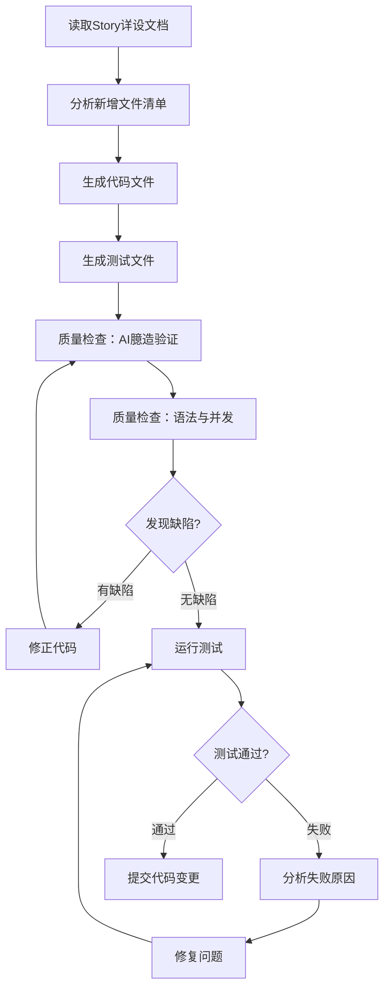

# 代码生成与质量闭环 Skill

基于设计文档和Story详设，完成代码生成、质量检查、DT测试验证、问题修复的自闭环流程。

## 何时使用

- Story详设完成后，开始实现代码
- 需要确保代码质量和测试通过
- 实现新功能模块的完整开发流程

---

## 工作流程概览



---

## 阶段一：代码生成

### 1.1 输入准备

**必需输入**：
- Story详设文档（`Story-X_*.md`）
- 主设计文档（可选，用于上下文参考）

**读取顺序**：
1. 读取Story详设文档的"新增文件详细设计"章节
2. 读取"开发任务清单"获取文件列表
3. 读取现有代码仓结构，确认文件路径和语言类型（Go/Java）

### 1.2 语言识别

根据目标模块识别语言类型：

| 模块 | 语言 | 代码路径 |
| --- | --- | --- |
| **GIDS** | Go | `GlobalInstanceDeliverService/src/` |
| **BGW** | Java | `BrowserGateway/src/main/java/` |
| **MC** | Go | `mobile/src/` |
| **browser-proxy** | Python | `browser-proxy/browser_proxy/` |

### 1.3 代码生成规则

#### 必须复用现有代码

| 检查项 | 操作 |
| --- | --- |
| **导入路径** | 使用`grep`搜索现有import路径，确认存在后再使用 |
| **方法调用** | 使用`grep`搜索方法名，确认签名匹配 |
| **配置项** | 复用现有环境变量/常量，不新建配置 |
| **服务地址** | 使用CSE服务发现（`cse://ServiceName/path`），不硬编码IP |

#### 必须符合现有代码风格

| 检查项 | 检查方法 | 示例 |
| --- | --- | --- |
| **main.go启动风格** | 对比现有初始化调用方式，必须一致 | `service.StartXXX()`而非`xxx := NewXXX(); go xxx.Start()` |
| **函数命名风格** | 对比现有函数命名，统一使用`Start/Init/New`前缀 | `StartMasterElection()`与`StartRefreshConfigTask()`一致 |
| **单例初始化方式** | 对比现有单例模式，使用`sync.Once`或直接函数调用 | 参考现有service的初始化方式 |
| **goroutine启动方式** | 对比现有后台任务启动方式，是否需要`go`前缀 | `go dao.EnsureConnectGaussDB()`风格 |

**main.go风格一致性检查示例**：

```markdown
| 现有服务 | 启动方式 | 风格特点 |
| --- | --- | --- |
| dao.EnsureConnectGaussDB() | `go dao.EnsureConnectGaussDB()` | goroutine后台任务 |
| service.StartRefreshConfigTask() | 直接调用 | 无需创建实例 |
| service.StartSendingEventLogPeriod() | 直接调用 | 无需创建实例 |
| scheduler.StartDataCleanupScheduler() | 直接调用 | 无需创建实例 |

**结论**：新增服务应采用`service.StartXXX()`风格，而非`xxx := NewXXX(); go xxx.Start()`
```

**风格修正示例**：

```go
// 问题代码：风格不一致
electionService := service.NewMasterElectionService()
go electionService.Start()

// 正确代码：与现有风格一致
go service.StartMasterElection()
```

#### 代码质量基线（Go）

| 要求 | 标准 |
| --- | --- |
| **单例初始化** | 使用`sync.Once`保护 |
| **context参数** | 使用`context.TODO()`而非`nil` |
| **错误处理** | 所有error返回值必须检查处理 |
| **资源释放** | HTTP Body、File、Request必须defer Close |

#### 代码质量基线（Java）

| 要求 | 标准 |
| --- | --- |
| **单例初始化** | Spring `@Component` 单例，无需额外锁 |
| **空值检查** | 调用可能为null的对象前判空 |
| **资源释放** | 线程池`@PreDestroy` shutdown |
| **定时任务** | 使用`ScheduledExecutorService`而非`@Scheduled` |

### 1.4 文件生成模板

**Go文件模板**：
```go
//go:build !custom
// +build !custom

package xxx

import (
    "context"
    "sync"
)

var instance *xxxServiceImpl
var once sync.Once

func NewXXXService() XXXService {
    once.Do(func() {
        instance = &xxxServiceImpl{}
    })
    return instance
}
```

**Java文件模板**：
```java
package com.huawei.xxx;

import org.springframework.stereotype.Component;
import javax.annotation.PostConstruct;
import javax.annotation.PreDestroy;

@Component
public class XxxServiceImpl implements XxxService {
    
    @PostConstruct
    public void init() {
        // 初始化逻辑
    }
    
    @PreDestroy
    public void destroy() {
        // 清理逻辑
    }
}
```

**测试文件模板（Go）**：
```go
package xxx

import (
    "os"
    "testing"
    
    "github.com/stretchr/testify/assert"
)

func TestXXX_Success(t *testing.T) {
    // 测试代码
}
```

**测试文件模板（Java）**：
```java
package com.huawei.xxx;

import org.junit.Test;
import static org.junit.Assert.*;

public class XxxServiceImplTest {
    
    @Test
    public void testXxxSuccess() {
        // 测试代码
    }
}
```

---

## 阶段二：质量检查

### 2.1 检查清单

| 检查项 | 检查方法 | 优先级 |
| --- | --- | --- |
| **导入路径验证** | `grep -r "导入路径" --include="*.go"` 确认存在 | 高 |
| **方法存在验证** | `grep -r "func 方法名" --include="*.go"` 确认签名 | 高 |
| **代码风格一致性** | 对比main.go现有初始化风格，确保一致 | **高（新增）** |
| **未使用变量** | 人工检查每个变量是否被引用 | 高 |
| **context传nil** | 人工检查ContextDo调用 | 中 |
| **单例无锁保护** | 人工检查sync.Once使用 | 高 |

**代码风格一致性检查步骤**：

1. 读取目标文件（如main.go），分析现有初始化方式
2. 列出现有服务的启动风格表格
3. 对比新增服务的启动方式是否一致
4. 如不一致，提供修正方案并更新代码

### 2.2 检查报告格式

```markdown
## 代码质量检查报告

### 2.2.1 AI臆造检查

| 检查项 | 结果 | 说明 |
| --- | --- | --- |
| 臆造导入路径 | ✅/❌ | 列出所有导入，逐个grep验证 |
| 臆造方法调用 | ✅/❌ | 列出所有方法调用，逐个grep验证 |

### 2.2.2 代码风格一致性检查（新增）

| 现有服务 | 启动方式 | 风格特点 |
| --- | --- | --- |
| dao.EnsureConnectGaussDB() | `go dao.EnsureConnectGaussDB()` | goroutine后台任务 |
| service.StartRefreshConfigTask() | 直接调用 | 无需创建实例 |
| scheduler.StartDataCleanupScheduler() | 直接调用 | 无需创建实例 |

| 新增服务 | 当前实现 | 是否一致 | 修正建议 |
| --- | --- | --- | --- |
| MasterElection | `xxx := NewXXX(); go xxx.Start()` | ❌ 不一致 | 改为`go service.StartXXX()` |

### 2.2.3 其他检查

| 检查项 | 结果 | 说明 |
| --- | --- | --- |
| 未使用变量 | ✅/❌ | 检查每个变量是否被引用 |
| context传nil | ✅/❌ | 检查ContextDo调用 |
| 单例无锁保护 | ✅/❌ | 检查sync.Once使用 |
```

### 2.3 修正流程

**发现缺陷后**：
1. 记录缺陷详情（文件、行号、问题类型）
2. 提供修正代码片段
3. 更新代码文件
4. 重新执行质量检查

**修正闭环条件**：所有高严重度缺陷修正完成

---

## 阶段三：DT测试验证

### 3.1 测试执行命令

```bash
# 运行单元测试
go test -v ./src/service/...

# 运行DT测试
go test -v ./src/service/... -run TestDT
```

### 3.2 测试验证清单

| 测试类型 | 验证项 | 通过标准 |
| --- | --- | --- |
| **UT测试** | 所有单元测试用例通过 | assert.NoError() / assert.Equal() |
| **DT测试** | 集成测试流程通过 | 端到端流程验证 |

### 3.3 测试失败处理

**分析步骤**：
1. 查看测试日志，定位失败断言
2. 分析失败原因（Mock配置、逻辑错误、边界条件）
3. 修正代码或测试用例
4. 重新运行测试

**修正闭环条件**：所有测试用例通过

---

## 阶段四：提交代码变更

### 4.1 提交前检查

```bash
# 检查所有变更文件
git status

# 检查变更内容
git diff
```

### 4.2 提交Commit

**Commit信息格式**：
```
Story-X：{Story名称} - {主要功能描述}

- 新增XXX服务实现
- 新增XXX测试用例
```

**示例**：
```bash
git add src/service/snmp_alarm_service.go
git add src/service/snmp_alarm_service_test.go
git add src/dao/alarm_event_dao.go

git commit -m "Story-5：GIDS SNMP告警上报 - 实现FM回调后SNMP上报

- 新增snmp_alarm_service.go：组装SNMP请求，上报至SFMU
- 新增alarm_event_service.go：封装DAO + RWMutex保护
- 新增alarm_event_dao.go：告警事件DB操作
- 新增测试文件：UT/DT测试用例"
```

### 4.3 Commit信息规范

| 要素 | 内容 | 示例 |
| --- | --- | --- |
| **Story标识** | Story-X | Story-5 |
| **Story名称** | Story详设中的名称 | GIDS SNMP告警上报 |
| **功能描述** | 本次变更的核心功能 | 实现FM回调后SNMP上报 |
| **文件清单** | 主要新增/修改文件 | 新增snmp_alarm_service.go |

---

## 自闭环规则

| 触发条件 | 处理动作 |
| --- | --- |
| **质量检查发现缺陷** | 自动修正代码，重新检查 |
| **测试用例失败** | 分析原因，修正代码，重新执行 |

**闭环终止条件**：
- 所有高严重度缺陷修正完成
- 所有测试用例通过

---

## 注意事项

1. **只生成代码文件**：不生成验收报告等文档，避免文档混乱
2. **优先复用现有代码**：不新建导入路径、配置项、方法
3. **代码风格必须一致**：对比main.go现有初始化风格，确保新增代码风格一致
4. **质量检查立即执行**：代码生成后立即检查，避免缺陷累积
5. **每次修正后重新检查**：确保闭环完整
6. **变更文件只能在对应代码仓提交**：跨仓变更需分别提交git commit