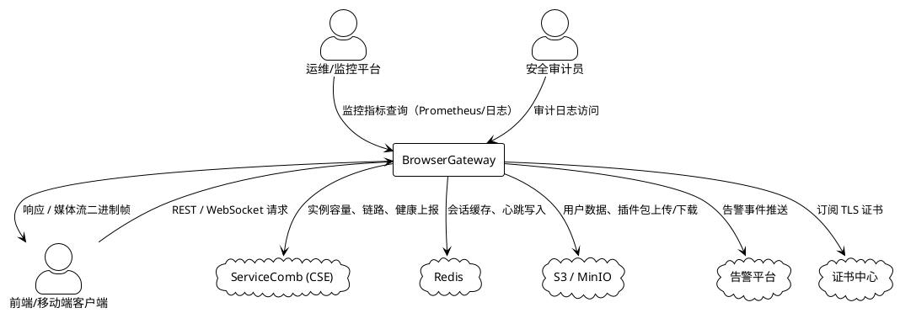
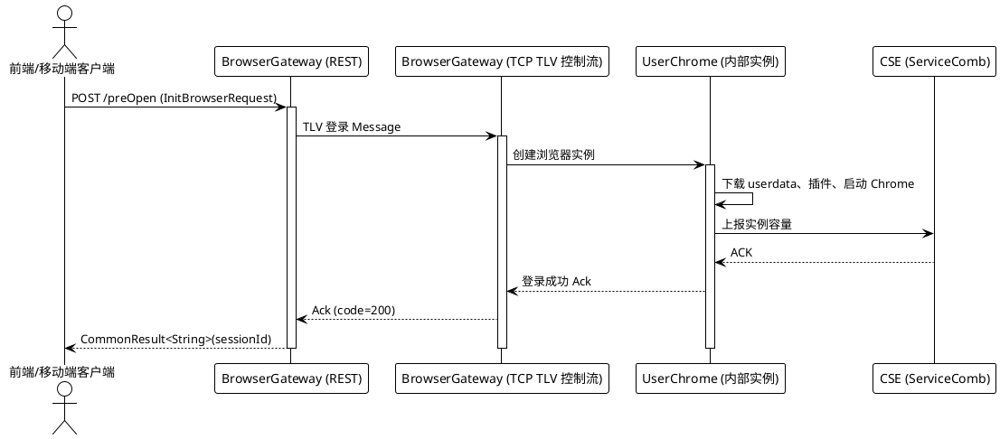
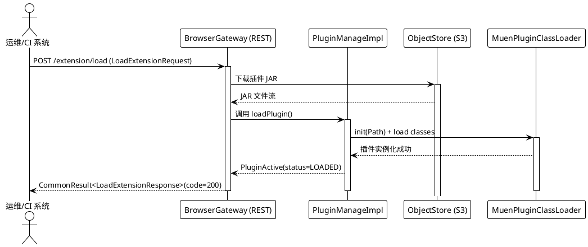
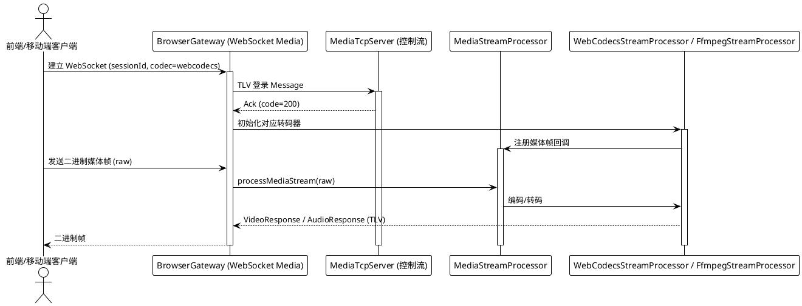
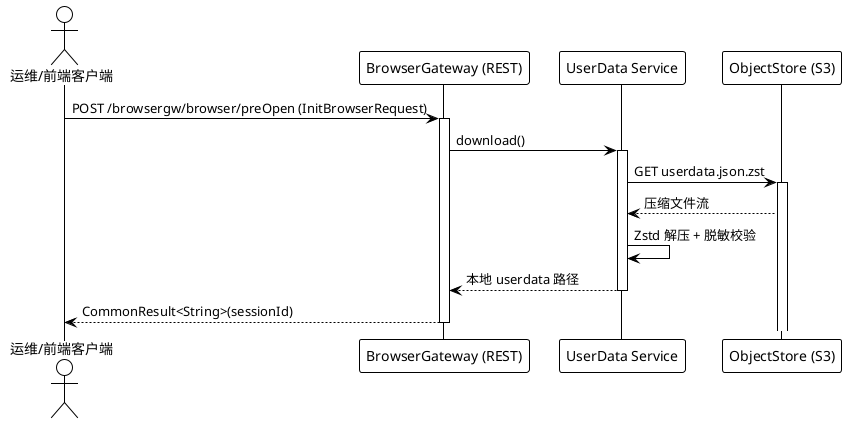
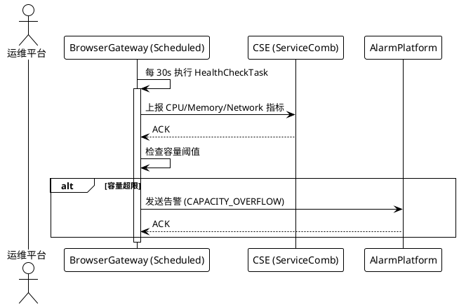
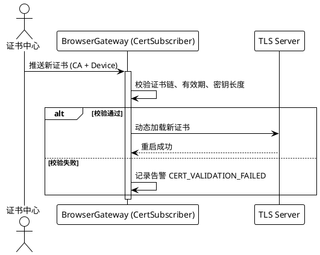

# BrowserGateway 规格说明书

> **文档目的**：本规格说明书（Specification）聚焦于 *BrowserGateway* 对外呈现的业务行为、规则与约束，供产品经理、测试人员、业务方以及 AI 使用。所有实现细节（类、数据库、缓存、选型等）已严格剔除。

---

## 第1章：组件定位

### 1.1 核心职责
**本组件负责** 为终端用户 **创建、管理、监控浏览器会话**，并 **统一提供 REST、TCP TLV、WebSocket 接口**。
R
>（不超过 50 字）

### 1.2 核心输入

| 输入来源 | 内容概要 | 数据对象 |
|----------|----------|----------|
| 前端/移动端（HTTP） | 调用 `/browsergw/**` 创建/删除实例、管理插件 | `InitBrowserRequest`、`DeleteUserDataRequest`、`LoadExtensionRequest` |
| 前端/移动端（WebSocket） | 建立媒体流或插件代理的双向通道 | `imeiAndImsi`（路径参数），媒体配置查询参数 |
| 浏览器实例（TCP TLV） | 登录、心跳、业务指令（控制流） | TLV `Message`（登录/心跳/业务） |
| 浏览器实例（TCP TLV） | 登录、心跳（媒体流） | TLV `Message`（媒体登录/心跳） |
| 定时任务调度器 | 触发健康检查、容量上报、失效资源清理 | 无显式对象（内部调度信号） |
| 证书中心（订阅） | TLS 证书更新通知 | 证书内容（CA、Device） |

### 1.3 核心输出

| 输出目标 | 内容概要 | 数据对象 |
|----------|----------|----------|
| 调用方（HTTP） | REST 接口的统一响应 | `CommonResult<T>`（code、message、data） |
| 调用方（WebSocket） | 实时媒体二进制帧或插件消息 | `VideoResponse` / `AudioResponse`（TLV 编码） |
| 下游服务 CSE | 实例容量、链路、健康状态上报 | `ReportConfig` 中的上报结构 |
| 对象存储 S3/MinIO | 用户数据（脱敏、压缩后） | `userdata.json.zst`（文件） |
| 告警平台 | 关键异常的结构化告警 | `AlarmEvent`（alarmCode、eventMessage） |
| 证书中心 | TLS 服务器重启完成通知（内部） | 无显式对象 |
| 监控系统 | 监控指标、日志、链路追踪 | 统一日志格式、Prometheus 指标（如 `gateway_cpu_usage`） |

### 1.4 职责边界

| 不负责的事项 | 说明 |
|--------------|------|
| 浏览器内部页面渲染逻辑 | 仅通过 Chrome/Playwright 驱动，渲染细节由浏览器自行完成 |
| 持久化关系型数据 | 所有持久化均使用对象存储（S3）或缓存（Redis），不涉及 RDBMS |
| 业务业务层业务决策 | 如业务计费、用户身份校验，由上层业务系统完成 |
| 网络层底层协议实现细节 | TLV 编解码、Netty 配置属于实现层，外部仅感知消息语义 |
| 证书签发流程 | 证书的签发与管理由证书中心负责，Gateway 只负责订阅与热更新 |
| 资源调度与弹性伸缩 | 由 ServiceComb（CSE）和容器平台负责，Gateway 只上报容量信息 |

---

## 第2章：领域术语

**BrowserGateway**
: 系统网关层组件，负责浏览器会话的创建、生命周期管理、数据上报、健康监控以及告警推送。

**用户会话**
: 从前端发起的浏览器实例创建到实例关闭的完整业务生命周期。

**预打开（Pre‑Open）**
: 创建浏览器会话但不立即加载页面，仅返回登录凭证供后续使用的操作。

**插件（Extension）**
: 通过对象存储下载的 JAR 包，运行时动态加载到浏览器实例的功能扩展。

**TLV（Type‑Length‑Value）**
: 控制流与媒体流使用的二进制协议格式，包含消息类型、长度和负载。

**WebSocket 媒体转发**
: 将浏览器渲染的音视频流实时推送给客户端的双向 WebSocket 通道，支持 WebCodecs 与 FFmpeg 两种实现方式。

**健康检查**
: 定时采集 CPU、内存、网卡等指标并向 CSE 上报的监控任务。

**容量上报**
: 向 ServiceComb（CSE）报告当前已使用的浏览器实例数及链路信息的行为。

**告警（Alarm）**
: 当关键异常（如插件加载失败、资源超限、TLS 证书异常）发生时，向告警平台发送的结构化事件。

**TLS 证书动态订阅**
: 通过证书中心的推送实时获取最新的 TLS 证书并在不下线的情况下热更新网关的 TLS 服务器。

**Zstd 压缩**
: 使用 Zstandard 算法对用户数据进行高效压缩，以降低网络传输成本。

**脱敏（Data Slimming）**
: 在上传用户数据前，剔除或掩码敏感信息（如 Cookie、登录凭证）的处理过程。

**心跳 TTL**
: 心跳超时阈值，超过该阈值视为会话失效并触发资源回收。

**全局异常捕获**
: 捕获所有未被业务代码捕获的异常，并统一返回错误结构的机制。

---

## 第3章：角色与边界

### 3.1 核心角色

| 角色 | 职责描述 |
|------|----------|
| 前端/移动端客户端 | 发起 REST 调用、建立 WebSocket 连接、消费媒体流、提交插件操作指令。 |
| 运维/监控平台 | 观察健康检查指标、容量上报、告警信息，进行故障定位与容量规划。 |
| 安全审计员 | 审计 TLS 证书更新日志、告警记录以及用户数据脱敏过程。 |

### 3.2 外部系统

| 系统 | 交互内容描述 |
|------|--------------|
| ServiceComb（CSE） | 注册网关实例、上报容量、链路信息、健康状态。 |
| Redis | 缓存用户会话、心跳、实例元数据。 |
| S3 / MinIO | 持久化用户数据（userdata）以及插件包。 |
| 告警平台 | 接收结构化告警事件（插件加载失败、资源超限、TLS 证书异常）。 |
| 证书中心 | 推送 TLS 证书更新信息。 |

### 3.3 交互上下文

*图中仅展示外部角色与系统的交互方向与简要说明，未出现内部模块、数据库或缓存实现细节。*

---

## 第4章：DFX约束

### 4.1 性能

| 约束 | 量化指标 |
|------|----------|
| REST 接口响应时间 | **≤ 200 ms**（99% 请求） |
| WebSocket 媒体帧延迟 | **≤ 150 ms**（端到端） |
| TLV 控制流心跳间隔 | **≤ 5 s**（心跳发送） |
| 并发会话上限 | **TODO: 待定义**（依据机器规格） |
| 单实例 CPU 使用率 | **≤ 80%**（持续 5 min） |

### 4.2 可靠性

| 约束 | 量化指标 |
|------|----------|
| 系统可用性（SLA） | **≥ 99.9%**（月度） |
| 故障恢复时间（MTTR） | **≤ 30 s**（单实例重启） |
| 心跳超时判定 TTL | **30 s**（配置 `heartbeatTtl`） |
| 数据一致性 | 用户数据上传后 **强一致**（上传成功即可读取） |
| 告警送达时效 | **≤ 5 s**（告警平台接收） |

### 4.3 安全性

| 约束 | 量化指标 |
|------|----------|
| 接口认证方式 | **OAuth2 Bearer Token**（统一校验） |
| 敏感数据传输加密 | **TLS 1.2+**（双向认证） |
| 用户数据脱敏 | 必须在上传前完成 **100%** 脱敏（字段过滤规则） |
| 证书更新验证 | 证书签名链校验 **≥ 2048 bit RSA** |
| 审计日志保留 | **≥ 90 天**（符合合规要求） |

### 4.4 可维护性

| 约束 | 量化指标 |
|------|----------|
| 监控指标 | 必须上报 `gateway_cpu_usage`、`gateway_memory_usage`、`gateway_active_sessions`、`gateway_error_rate` |
| 日志格式 | JSON 单行，字段包括 `timestamp、level、component、traceId、message` |
| 链路追踪 | 必须在每个请求链路注入 `traceId`（OpenTelemetry） |
| 自动化健康检查频率 | **每 30 s**（`HealthCheckTask`） |
| 日志轮转周期 | **每日**（`BrowserProxyLogDump`） |

### 4.5 兼容性

| 约束 | 量化指标 |
|------|----------|
| API 兼容策略 | 新增字段必须 **向后兼容**（旧客户端可忽略），删除字段需提前 **1 版**（deprecation） |
| 数据迁移 | 旧版 userdata 必须在 **首次登录** 前完成 **脱敏+压缩** 并迁移至新路径 |
| TLS 证书热更新 | 必须在 **不下线** 的情况下完成证书切换，最长不可用时间 **≤ 2 s** |
| 版本号标识 | 所有对外接口必须在响应头 `X-API-Version` 中返回当前版本号 |

---

## 第5章：核心能力

> 按业务功能模块划分，每个模块包含 **业务规则**、**交互流程**（PlantUML 时序图）和 **异常场景**。

### 5.1 浏览器会话管理

#### 5.1.1 业务规则

1. **预打开会话规则**：必须在收到合法 `InitBrowserRequest` 后创建浏览器实例并返回登录凭证。
    - 验收条件：`POST /browsergw/browser/preOpen` → 返回 `code=200` 且 `data` 包含 `sessionId`。

2. **会话心跳规则**：必须每 `heartbeatTtl`（30 s）内收到一次 TLV 心跳，否则视为失效。
    - 验收条件：TLV 心跳间隔 > 30 s → `BrowserCloserTask` 关闭对应实例。

3. **会话删除规则**：用户调用删除接口后必须同步清理本地与对象存储的 userdata。
    - 验收条件：`DELETE /browsergw/browser/userdata/delete` → 返回 `code=200`，S3 中对应对象不存在。

4. **禁止并发同一用户多实例**：同一 `imei+imsi` 在同一时间只能拥有 **一个** 活跃会话。
    - 验收条件：第二次 `preOpen` 请求 → 返回 `ResultCode.FAIL` 并提示 “已有活跃会话”。

#### 5.1.2 交互流程

#### 5.1.3 异常场景

1. **异常场景名称**：登录 TLV 消息格式错误
    - 触发条件：客户端发送的 TLV `Message` 缺少必填字段 `imei`。
    - 系统行为：`ControlTcpServerHandler` 记录错误日志并返回 `Ack`（code=400）。
    - 用户感知：REST 接口返回 `ResultCode.VALIDATE_ERROR`，提示 “登录信息不完整”。

2. **异常场景名称**：心跳超时导致会话被强制关闭
    - 触发条件：30 s 内未收到对应 `sessionId` 的心跳 TLV。
    - 系统行为：`BrowserCloserTask` 调用 `UserChrome.closeInstance()`，释放资源并上报告警。
    - 用户感知：WebSocket 连接被服务器主动关闭，客户端收到 `close` 帧并显示 “会话已失效”。

3. **异常场景名称**：对象存储上传失败（网络波动）
    - 触发条件：`UserData.upload()` 在执行 `ZstdUtil.compressJson` 后调用 S3 上传返回错误。
    - 系统行为：记录错误日志，重试 3 次后仍失败则返回 `ResultCode.FAIL` 并触发告警。
    - 用户感知：REST 返回 `ResultCode.FAIL`，提示 “用户数据上传失败”。

---

### 5.2 插件（Extension）管理

#### 5.2.1 业务规则

1. **插件加载规则**：必须在插件 JAR 下载、解压完成后才能标记为 “已加载”。
    - 验收条件：`POST /browsergw/extension/load` → 返回 `code=200` 且 `PluginActive.status = LOADED`。

2. **插件热更新规则**：当同名插件新版本到达对象存储时，必须在 **不影响已有会话** 的前提下完成热更新。
    - 验收条件：新版本插件上传后，调用 `loadExtension` → 老实例仍保持运行，新实例使用新插件。

3. **插件状态查询规则**：必须实时返回插件的当前状态（已加载、加载中、失败）。
    - 验收条件：`GET /browsergw/extension/pluginInfo` → 返回 `PluginActive.status` 与实际加载状态一致。

4. **禁止未签名插件加载**：禁止加载未通过 SHA256 校验的插件文件。
    - 验收条件：插件文件校验失败 → 返回 `ResultCode.VALIDATE_ERROR`，插件状态保持 `FAILED`。

#### 5.2.2 交互流程

#### 5.2.3 异常场景

1. **异常场景名称**：插件下载超时
    - 触发条件：从 S3 拉取插件 JAR 超过 10 s。
    - 系统行为：记录错误日志，返回 `ResultCode.FAIL`，并发送告警 `PLUGIN_DOWNLOAD_TIMEOUT`。
    - 用户感知：REST 返回 `ResultCode.FAIL`，提示 “插件下载超时”。

2. **异常场景名称**：插件解压失败（文件损坏）
    - 触发条件：解压 JAR 时抛出 `IOException`。
    - 系统行为：标记插件状态为 `FAILED`，记录告警 `PLUGIN_DECOMPRESS_ERROR`。
    - 用户感知：`GET /extension/pluginInfo` 返回 `status=FAILED`，并在 UI 中提示 “插件加载失败”。

3. **异常场景名称**：插件加载冲突（同名不同版本）
    - 触发条件：已有同名插件正在运行，新加载请求的版本号不同。
    - 系统行为：拒绝加载并返回 `ResultCode.FAIL`，告警 `PLUGIN_VERSION_CONFLICT`。
    - 用户感知：REST 返回错误码，提示 “插件版本冲突”。

---

### 5.3 媒体流实时转发

#### 5.3.1 业务规则

1. **媒体流登录规则**：必须在收到媒体 TLV 登录后，才能接受后续媒体二进制帧。
    - 验收条件：`MediaTcpServerHandle` 接收登录 TLV → 返回 `Ack`（code=200）后，客户端开始发送媒体帧。

2. **WebSocket 媒体推送规则**：必须在 WebSocket 连接建立后，以 **TLV 编码** 的 `VideoResponse` / `AudioResponse` 推送媒体帧。
    - 验收条件：客户端收到连续的二进制帧且帧间间隔 ≤ 150 ms。

3. **转码模式选择规则**：当客户端请求 `codec=webcodecs` 时，必须使用 `WebCodecsStreamProcessor`；否则使用 `FfmpegStreamProcessor`。
    - 验收条件：查询参数 `codec=webcodecs` → 实际使用 `WebCodecs` 实现；未指定或 `ffmpeg` → 使用 FFmpeg。

4. **禁止未授权媒体访问**：未通过 REST 登录获取有效 `sessionId` 的 WebSocket 连接必须被拒绝。
    - 验收条件：非法 `sessionId` → WebSocket 立即关闭并返回错误码 401。

#### 5.3.2 交互流程

#### 5.3.3 异常场景

1. **异常场景名称**：媒体帧解码错误（FFmpeg 异常）
    - 触发条件：`FfmpegStreamProcessor` 在转码过程中抛出 `RuntimeException`。
    - 系统行为：记录错误日志，发送告警 `MEDIA_TRANSCODE_ERROR`，关闭对应 WebSocket。
    - 用户感知：WebSocket 连接被服务器关闭，客户端显示 “媒体流异常”。

2. **异常场景名称**：WebSocket 心跳超时
    - 触发条件：30 s 内未收到客户端发送的心跳帧。
    - 系统行为：关闭 WebSocket 连接并上报 `MEDIA_HEARTBEAT_TIMEOUT`。
    - 用户感知：客户端收到 `close` 帧，提示 “媒体连接已超时”。

3. **异常场景名称**：不支持的转码模式请求
    - 触发条件：查询参数 `codec=unsupported`。
    - 系统行为：返回 HTTP 400 错误，日志记录 `UNSUPPORTED_CODEC`。
    - 用户感知：REST 返回错误码，提示 “不支持的转码模式”。

---

### 5.4 用户数据持久化（上传/下载）

#### 5.4.1 业务规则

1. **脱敏压缩规则**：必须在上传前对 userdata 进行脱敏并使用 Zstd 压缩。
    - 验收条件：`UserData.upload()` 完成后，S3 中存储的文件后缀为 `.zst`，且文件内容不包含敏感关键字。

2. **下载解压规则**：必须在浏览器实例启动前下载并解压对应的 Zstd 文件。
    - 验收条件：`UserData.download()` 成功后，本地目录出现完整的 `userdata` 文件结构。

3. **删除规则**：用户注销或调用删除接口后，必须同步删除本地与对象存储的 userdata。
    - 验收条件：`DELETE /browsergw/browser/userdata/delete` → S3 中对应对象不存在，且本地目录已清空。

4. **禁止明文存储**：任何用户数据在对象存储中必须保持压缩后状态，禁止明文上传。
    - 验收条件：对象存储查询到的文件大小 < 原始文件大小的 30%（压缩率 ≥ 70%），且文件后缀为 `.zst`。

#### 5.4.2 交互流程

#### 5.4.3 异常场景

1. **异常场景名称**：脱敏规则未生效（敏感字段泄露）
    - 触发条件：`UserdataSlimmer.slimInplace` 未能过滤 `password` 字段。
    - 系统行为：记录安全审计日志，阻止上传并返回 `ResultCode.VALIDATE_ERROR`。
    - 用户感知：REST 返回错误提示 “用户数据包含敏感信息”。

2. **异常场景名称**：压缩文件损坏导致下载解压失败
    - 触发条件：`ZstdUtil.decompressJson` 抛出 `ZstdException`。
    - 系统行为：记录错误日志，返回 `ResultCode.FAIL`，触发告警 `USERDATA_DECOMPRESS_ERROR`。
    - 用户感知：浏览器启动失败，前端提示 “用户数据加载异常”。

3. **异常场景名称**：对象存储不可用（网络故障）
    - 触发条件：S3 返回 503 错误。
    - 系统行为：重试 3 次后仍失败，返回 `ResultCode.FAIL` 并上报告警 `OBJECT_STORE_UNAVAILABLE`。
    - 用户感知：REST 返回错误码，提示 “服务暂不可用”。

---

### 5.5 监控、容量上报与告警

#### 5.5.1 业务规则

1. **健康检查上报规则**：必须每 30 s 将 CPU、内存、网卡使用率上报至 CSE。
    - 验收条件：`HealthCheckTask` 执行后，CSE 接收到最新的指标数据。

2. **容量上报规则**：必须在每次实例创建或销毁后立即上报当前已使用的浏览器实例数。
    - 验收条件：`ChromeSetImpl.reportUsed()` 调用后，CSE 中的 `usedInstances` 与实际数目一致。

3. **告警阈值规则**：当 CPU 使用率 > 80% 或实例数达到上限 90% 时，必须向告警平台发送告警。
    - 验收条件：监控指标超过阈值 → `AlarmServiceImpl.sendAlarm()` 被调用，告警平台收到对应事件。

4. **禁止重复告警**：同一告警在 10 min 内只能上报一次。
    - 验收条件：同一 `alarmCode` 在 10 min 内不产生第二条告警记录。

#### 5.5.2 交互流程

#### 5.5.3 异常场景

1. **异常场景名称**：健康检查上报失败（CSE 不可达）
    - 触发条件：`HealthCheckTask` 调用 CSE API 返回 5xx。
    - 系统行为：记录错误日志，重试 2 次后仍失败则发送告警 `HEALTH_REPORT_FAILURE`。
    - 用户感知：运维平台监控仪表盘显示 “健康上报异常”。

2. **异常场景名称**：告警平台响应超时
    - 触发条件：`AlarmServiceImpl.sendAlarm` 调用告警平台超时 > 5 s。
    - 系统行为：记录告警发送失败日志，进入重试队列，最多重试 3 次。
    - 用户感知：运维平台仍能在告警日志中看到 “告警发送失败”。

3. **异常场景名称**：容量上报数据不一致
    - 触发条件：`ChromeSetImpl.reportUsed` 上报的实例数与实际运行实例数不匹配。
    - 系统行为：触发内部告警 `CAPACITY_MISMATCH`，并在日志中记录差异。
    - 用户感知：运维平台看到 “实例容量不一致” 警示。

---

### 5.6 TLS 证书动态订阅与安全管理

#### 5.6.1 业务规则

1. **证书订阅规则**：必须实时订阅证书中心的更新事件，并在收到新证书后 **无缝热更新** TLS 服务器。
    - 验收条件：证书中心推送新证书 → TLS 服务器在 ≤ 2 s 内完成重启，客户端连接不受影响。

2. **证书校验规则**：必须对收到的证书链进行完整性校验（签名、有效期、密钥长度）。
    - 验收条件：校验失败 → 记录错误日志并不进行热更新，返回告警 `CERT_VALIDATION_FAILED`。

3. **禁止使用过期证书**：在任何时刻，TLS 服务器使用的证书必须 **未过期**。
    - 验收条件：系统启动或热更新后，证书有效期检查通过。

#### 5.6.2 交互流程

#### 5.6.3 异常场景

1. **异常场景名称**：证书签名校验失败
    - 触发条件：证书链中任意证书的签名不匹配根证书。
    - 系统行为：记录安全审计日志，发送告警 `CERT_SIGNATURE_INVALID`，不进行热更新。
    - 用户感知：客户端在下次 TLS 握手时收到 “证书错误” 提示。

2. **异常场景名称**：热更新期间短暂连接中断
    - 触发条件：TLS 服务器在加载新证书时短暂关闭监听端口（≤ 2 s）。
    - 系统行为：记录日志，客户端自动重连成功后恢复正常。
    - 用户感知：短暂的网络波动提示，通常不感知。

3. **异常场景名称**：证书中心推送延迟 > 5 min
    - 触发条件：证书中心在证书即将过期前未能及时推送。
    - 系统行为：触发内部告警 `CERT_UPDATE_DELAY`，运维平台收到提醒。
    - 用户感知：无直接影响，但运维需关注证书即将过期风险。

---

## 第6章：数据约束

> 以下约束仅描述业务层面的 **逻辑** 限制，未涉及底层存储实现细节。

### 6.1 InitBrowserRequest

1. **imei**：业务含义为设备唯一标识。取值范围为 15 位十进制字符串，必填，必须符合正则 `^\d{15}$`。
2. **imsi**：业务含义为用户移动网络标识。取值范围为 15 位十进制字符串，必填，正则同上。
3. **lcdWidth / lcdHeight**：屏幕分辨率，整数，必填，取值范围 240 ~ 3840（宽）和 240 ~ 2160（高）。
4. **appType**：业务含义为业务场景枚举（`WEB`、`APP`、`GAME`），必填，枚举值必须在 `AppTypeEnum` 中定义。
5. **innerMediaEndpoint**：媒体流内部回调地址，字符串，选填，若提供必须是合法的 `host:port` 格式。

### 6.2 DeleteUserDataRequest

1. **imei**：同上，必填。
2. **imsi**：同上，必填。

### 6.3 LoadExtensionRequest

1. **bucketName**：对象存储桶名称，必填，长度 3 ~ 63，字符只能为小写字母、数字和短横线。
2. **extensionFilePath**：插件 JAR 在对象存储中的完整路径，必填，必须以 `.jar` 结尾。
3. **name**：插件业务名称，必填，长度 1 ~ 50，允许字母、数字、下划线。
4. **version**：插件版本号，必填，遵循语义化版本 `MAJOR.MINOR.PATCH`（如 `1.2.3`）。
5. **type**：插件类型枚举（`RECORD`、`ANALYSIS`），必填，必须在 `PluginTypeEnum` 中定义。

### 6.4 PluginActive

1. **name**：同上，必填。
2. **version**：同上，必填。
3. **type**：同上，必填。
4. **status**：插件当前状态，枚举值 `LOADED`、`LOADING`、`FAILED`，必填。
5. **bucketName**：插件所在对象存储桶，必填。
6. **packageName**：插件在对象存储中的完整路径，必填，必须以 `.jar` 结尾。

### 6.5 UserChrome（会话实例）

1. **userId**：由 `imei+imsi` 组合生成的唯一标识，必填，长度 30 字符。
2. **status**：实例当前状态，枚举 `CREATING`、`RUNNING`、`CLOSING`、`CLOSED`，必填。
3. **heartbeats**：最近一次心跳时间戳（毫秒），必填，必须递增。
4. **chromeDriver**：内部驱动对象引用，业务层视为 **已创建** 或 **未创建** 状态，必填。
5. **muenDriver**：插件代理对象，若插件已加载则必填，否则为 `null`。

### 6.6 UserData

1. **userdataDir**：本地存放 userdata 的根目录路径，必填，必须是绝对路径且可写。
2. **remote**：对象存储中对应的压缩文件路径，必填，必须以 `.zst` 结尾。
3. **selfAddr**：网关自身对外可达地址（`host:port`），必填，用于 CSE 注册。

### 6.7 AlarmEvent

1. **alarmCodeEnum**：告警代码枚举，必填，必须在 `AlarmEnum` 中定义。
2. **eventMessage**：人类可读的告警描述，必填，长度 ≤ 200 字符。

### 6.8 Message（TLV 登录/业务）

1. **type**：消息类型枚举，必填（如 `LOGIN`、`HEARTBEAT`、`BUSINESS`）。
2. **imei / imsi**：同上，必填，正则 `^\d{15}$`。
3. **lcdWidth / lcdHeight**：同上，必填，整数。
4. **appType**：同上，必填。
5. **token**：登录凭证，选填，若提供必须为 32 位十六进制字符串。
6. **sessionID**：会话唯一标识，必填，长度 36（UUID）。

### 6.9 Ack（TLV 应答）

1. **type**：应答类型枚举，必填（`ACK`、`NACK`）。
2. **ackType**：业务应答子类型，必填（`SUCCESS`、`FAIL`）。
3. **code**：返回码，整数，必填，`0` 表示成功，非 0 表示错误。

### 6.10 HealthCheckResult（内部上报结构）

1. **cpuUsage**：CPU 使用率，百分比，取值 0~00，必填。
2. **memoryUsage**：内存使用率，百分比，取值 0 ~ 100，必填。
3. **networkIn / networkOut**：网络流入/流出速率，单位 MB/s，取值 ≥ 0，必填。

---

> **本规格说明书已完成自检**：
> - 所有业务规则均配有验收条件。
> - 每个异常场景均包含触发条件、系统行为、用户感知。
> - PlantUML 图仅展示外部交互，未出现内部模块或数据库。
> - 未出现任何实现细节（类实现、数据库结构、缓存策略等）。

---