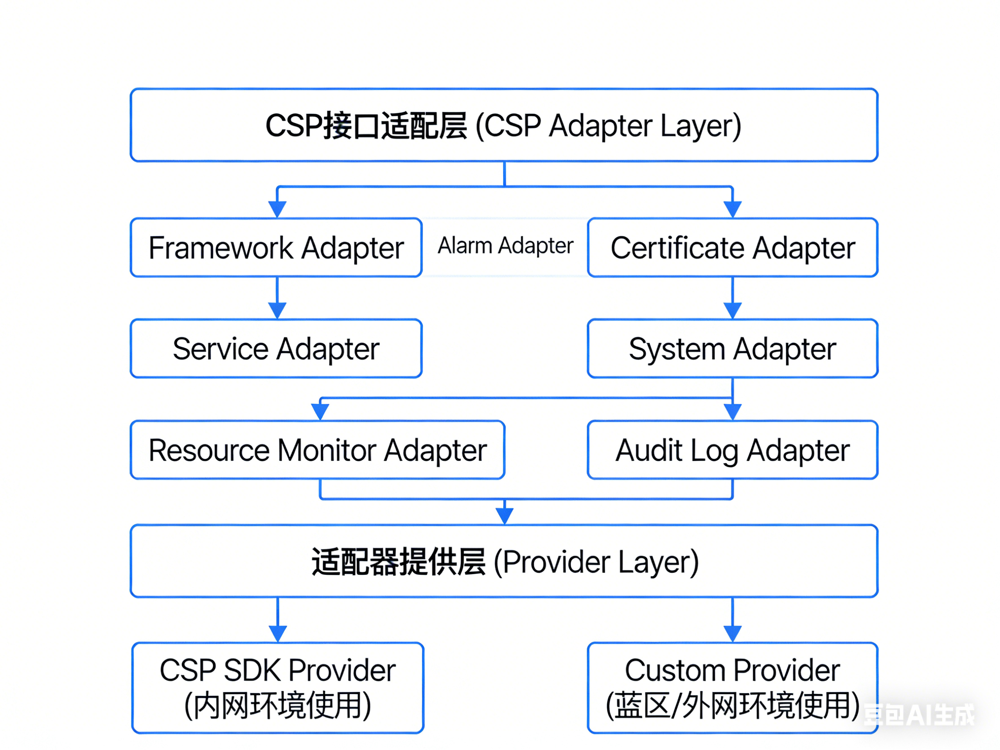
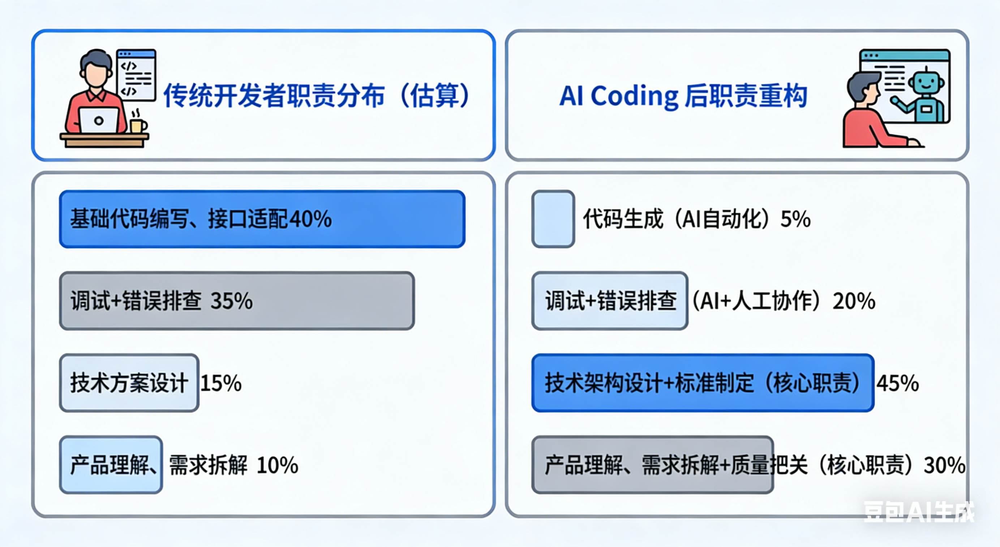
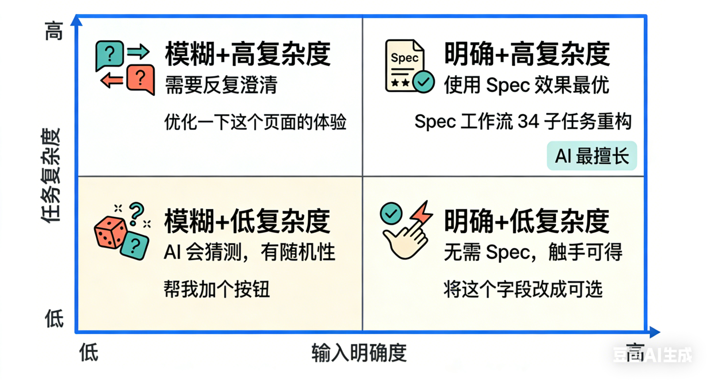

# BrowserGateway 蓝区重写实践

目录

一、前言

二、Spec Coding 

    1.什么是 Spec Coding 工作流

    2.Spec 工作流的实际价值

三、项目是什么

四、开发时间线：文档到代码的演进过程

五、典型案例

六、代码规范落地：CLAUDE.md 和 Rules 的实际效果

七、AI Spec Coding 经验总结

   
一、前言

二、Spec Coding

三、项目是什么

云手机项目面临在人力短缺的情况下完成产品交接与版本交付。具体现状与痛点可以归结为以下几类：

1. **交付压力大、人力缺口明显**：1230 阶段需求交付规模约 60～70K（代码量/需求规模），增量开发工作量约 120 人月，而规划投入仅 17 人，人月与人力严重不匹配，必须在有限人力下完成交接与交付。
2. **多服务并存、单服务维护成本高**：多服务并存带来维护面广、单服务改动牵一发动全身；单服务维护工作量大、问题多，定位与修复成本高，进一步挤压交付节奏。

---

## 四、服务重写的时间线：10 天的演进过程

**问题**： 存量代码中CSP的接口依赖于业务逻辑代码强耦合、如果进行蓝区重写，无法获得csp相关的依赖包，完成相关的基本功能验证。

**策略与方案**：抽象出接口适配层, 区分Custom模式与CSP模式，蓝区实现custom模式，告警、日志记录等功能均已Mock进行替代、主要验证基本功能；内部部署则使用CSP模式； 代码生成阶段以规格与设计文档（SDD）牵引代码实现，以测试用例前置与独立测试工程（TDD）保障蓝区可验，BGW 重写过程中由 AI 参与实现，并保留「同一套代码、双环境可重交付」的架构约束。

**策略 1：同一套代码、双环境可交付**  
业务只依赖适配器接口，换配置（`adapter.environment: internal | external`）即可切内网/蓝区，无需两套代码；

*把「依赖 CSP 的那一层」抽成接口，再给两套实现**：内网用 CspAdapterFactory + Csp*Adapter (通过CodeAgent GUI完成存量代码适配层重构)，蓝区只关注 CustomAdapterFactory + Custom*Adapter。

**策略 2：开发与验证流程**：**SDD 驱动代码开发**——依托架构设计、模块设计、接口契约等规格先行，引导（含 AI）实现代码，保证重写方向与边界清晰；**TDD 进行验证测试**——在蓝区通过独立测试工程（REST/TCP/WebSocket 客户端 + Mock 数据）与用例前置，完成本地功能测试与集成测试，黄区再做部署集成测试，形成「规格 → 实现 → 测试」闭环。

---

## 五、典型案例

### 实施时间线（七阶段）

.png)
| 阶段   | 内容                         | 产出 / 效果概要                         |
|--------|------------------------------|-----------------------------------------|
| 阶段一 | 依赖梳理与设计               | 需求与接口清单、目标与边界
| 阶段二 | 文档梳理                     | 架构与模块文档、接口契约与规格|
| 阶段三 | 适配层抽象                   | CSP 适配层接口与双实现（Csp* / Custom*）设计|
| 阶段四 | 测试用例生成                 | 用例与 Mock 策略、TDD 前置|
| 阶段五 | 代码实现                     | Csp* 与 Custom* 实现；各个模块功能代码 |
| 阶段六 | 测试工程搭建与功能调测       | 独立测试工程、蓝区本地功能与集成调测|
| 阶段七 | 部署验证与调测               | 黄区部署验证与调测|

### 【开发案例 1】适配层与配置切换

在保留业务逻辑不变的前提下，将 CSE、告警、证书、审计、服务发现等依赖 CSP 的能力抽象为 7 类适配器接口，并实现 Csp*（内网）与 Custom*（蓝区）两套；通过 `AdapterConfig` 按 `adapter.environment` 选择工厂。改配置、重启即可在蓝区跑起来，无需维护两套代码。

*（此处可配图/录屏：配置从 internal 切到 external 后启动日志与端口监听）*

### 【开发案例 2】独立测试工程支撑蓝区自测

搭建 browsergateway-test-client：REST 客户端、TCP/WebSocket 客户端、TLV 与协议封装、Mock 视频生成、简易 Web UI。在无 CSP、无真实浏览器的环境下，对预开/删数据/插件信息等 REST 接口、控制流与媒体流连接与报文进行验证，形成「可验证 / 不可验证」清单，与 README/TEST_GUIDE 同步。

*（此处可配图/录屏：测试工程连接网关、发送控制/媒体报文、查看结果的流程）*

### 【开发案例 3】蓝区问题定位与边界固化

一次蓝区部署后网关起不来：通过确认配置为 `external`、检查 Custom*Adapter 注入与启动日志（如 "Using CustomAdapterFactory"），对照「蓝区不保证」清单排除对 CSE/证书等强依赖的路径，快速定位为配置未切。将典型问题与排查步骤沉淀到文档，后续类似问题可快速收敛。

*（此处可配图：排查清单或日志关键信息示意）*

---

## 六、思考：流程优化与作业模式总结

### 1. 流程优化设想

- **变化点 1**：环境差异收口到适配层——不再在业务代码里 if 环境；内网/蓝区差异全部由 CSP 适配层内的两套实现消化，业务只认接口。
- **变化点 2**：蓝区验证前移——通过独立测试工程在蓝区做协议与 API 级验证，可验证/不可验证清单写进文档，避免「以为能验」或「以为不能验」的误判。

### 2. 蓝区重写核心指导思想

1. **一类依赖一套适配抽象**  
   所有依赖 CSP 的能力（服务发现、告警、证书、审计、资源监控等）经适配层统一抽象，业务只依赖接口；内网/蓝区通过配置选择实现，不写死环境。

2. **一个组件一份环境约定**  
   环境开关统一为 `adapter.environment`；内网用 application.yaml（或 internal profile），蓝区用 application-custom.yaml（或 external profile）；详见 [CSP 接口适配层架构设计](模块设计文档/02%20适配层/001%20CSP接口适配层/CSP-接口适配层架构设计.md)。

3. **蓝区验证有清单**  
   测试工程覆盖「在蓝区能测到的」协议与 API；依赖 CSE/证书中心/真实浏览器等的完整链路明确列为「蓝区不保证」，在 README 与本文档维护可验证/不可验证清单，与测试工程同步更新。

### 3. 可验证与不可验证（简要）

| 类型       | 蓝区可验证                     | 蓝区不保证 / 不可验证           |
|------------|--------------------------------|----------------------------------|
| REST API   | 预开、删数据、插件信息等       | 依赖 CSE/真实存储的完整业务流程 |
| TCP/WS     | 连接、心跳、控制消息、Mock 媒体 | 真实浏览器渲染、CSE 会话一致性  |
| 运维与安全 | 启动、端口、配置、适配器切换   | 证书中心订阅、告警上台、CSE 注册 |

### FAQ：遇到的问题与解决方法

**Q1：蓝区启动失败或某端口不监听**  
先确认 `adapter.environment` 是否为 `external`，启动日志是否有 "Using CustomAdapterFactory"；再对照「蓝区不保证」清单，排除对 CSE/证书等强依赖的初始化路径。常见根因是配置未切或某 Custom*Adapter 未实现某方法，将典型场景与步骤写进文档可加速后续排查。

**Q2：不清楚某功能在蓝区能不能验**  
以测试工程 README 与本文「可验证与不可验证」清单为准；若清单未覆盖，在蓝区实际跑一遍测试工程用例或手工点测，根据结果更新清单并同步文档，避免口头约定。

---

## 七、AI Spec Coding 经验总结
【开发者角色重构】

在交付压力大、需求量大的前提下，通过 **AI 完成 BGW 服务重写**、**SDD 驱动代码开发**、**TDD 进行验证测试**，验证了「规格 → 实现 → 测试」的闭环；用 **CSP 适配层** 把对 CSP 的强依赖收口成「可替换实现」，**功能不变、环境可换**；用**文档和测试清单**把蓝区能验什么、不能验什么写清楚，在无 CSP、无 Docker 的蓝区也能完成本地功能测试与集成测试，支撑安全交付与可持续迭代。

【AI能力边界】

真实项目中的并不是所有的需求都值得写一份 Spec。在真实的项目迭代中，我们需要根据需求颗粒度来选择协作模式。

小颗粒需求：对话框即扫即改

场景：改个文案、修个显隐逻辑、调整 CSS 间距。

策略：直接在 Cursor Chat  中对话。

理由：沟通成本低于编写规范的成本，AI 的即时反馈效率最高。

中颗粒标准化需求：基于Rules 或者 Skills 预设规范生成

场景：增加一个标准的 CRUD 页面、创建一个简单的业务组件。

策略：利用预设的 Cursor Rules 或 Skills（如 pro-table.mdc）。

理由：这类需求有强烈的“模式感”。只要规则定义清晰（如“执行流程：识别场景 -> 读取示例 -> 生成类型 -> 完成 UI”），AI 就能基于标准化模板高质量输出。

中大颗粒复杂功能：OpenSpec 深度协作

场景：重构核心逻辑、新增带有复杂业务逻辑的模块、无参考代码的新功能。

策略：OpenSpec 标准流 (SDD)。

理由：业务逻辑复杂时，AI 极易产生幻觉或需求偏移。通过 Spec 强制进行“先设计后编码”，可以确保 AI 的每一步都在既定轨道上，且 Spec 记录了设计的决策过程，对于后期维护价值巨大。

