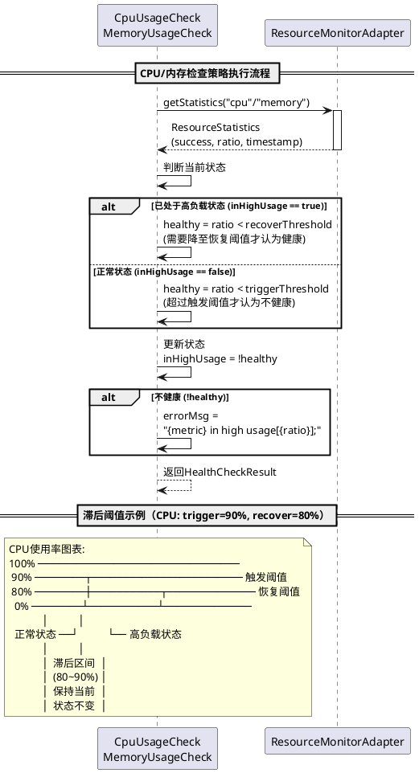

# 健康监控模块 - 模块间接口契约文档

## 1. 概述

本文档定义了健康监控模块与其他模块之间的接口契约。健康监控模块是BGW系统运维层的核心模块，通过定时调度器`HealthCheckTask`定期执行多维度健康检查（CPU、内存、网络接口），并将检查结果通过告警服务和服务管理适配器进行告警通知与状态上报。本文档确保模块间的交互规范、明确、无歧义，依据本文档和设计说明书可100%复现健康监控模块的全部功能代码。

## 2. 模块依赖关系

```
健康监控模块 (scheduled.HealthCheckTask / service.healthCheck.*)
│
├── [对外提供] Spring Boot Actuator Health端点
│   └── 调用方: Kubernetes探针、外部监控系统
│       - GET /actuator/health/liveness
│       - GET /actuator/health/readiness
│
├── [内部接口] ICheckStrategy 健康检查策略接口
│   ├── 实现类: CpuUsageCheck (CPU使用率检查)
│   ├── 实现类: MemoryUsageCheck (内存使用率检查)
│   └── 实现类: NetWorkInterfaceCheck (网络接口检查)
│
└── [依赖] 外部模块接口
    ├── 告警管理服务 (service.IAlarm)
    ├── 服务管理适配器 (adapter.interfaces.ServiceManagementAdapter)
    └── 资源监控适配器 (adapter.interfaces.ResourceMonitorAdapter)
```

---

## 3. 对外提供的接口契约

### 3.1 Spring Boot Actuator Health端点

#### 3.1.1 接口描述

健康监控模块通过Spring Boot Actuator框架对外暴露健康检查端点，供Kubernetes探针和外部监控系统调用。端点配置在`application.yaml`中，支持`liveness`和`readiness`两种探针类型。

#### 3.1.2 接口定义

##### 3.1.2.1 Liveness探针

```
GET /actuator/health/liveness
```

**功能**: 检查应用是否存活（应用进程是否正常运行）

**响应体**:
```json
{
    "status": "UP"
}
```

**说明**:
- `liveness`探针仅包含`ping`检查，确认应用进程存活
- 状态为`UP`表示应用正常运行
- 状态为`DOWN`表示应用进程异常（通常由Kubernetes重启Pod）

##### 3.1.2.2 Readiness探针

```
GET /actuator/health/readiness
```

**功能**: 检查应用是否就绪（应用是否准备好接收流量）

**响应体**:
```json
{
    "status": "UP",
    "components": {
        "redis": {
            "status": "UP"
        }
    }
}
```

**说明**:
- `readiness`探针包含`redis`检查，确认依赖服务就绪
- 状态为`UP`表示应用已就绪，可以接收请求
- 状态为`DOWN`表示应用未就绪（依赖服务不可用），Kubernetes会停止将流量路由到该Pod

##### 3.1.2.3 完整健康信息端点

```
GET /actuator/health
```

**功能**: 获取完整的健康检查信息（包含所有健康检查组件的详细信息）

**响应体**:
```json
{
    "status": "UP",
    "components": {
        "ping": {
            "status": "UP"
        },
        "redis": {
            "status": "UP"
        }
    },
    "groups": [
        "liveness",
        "readiness"
    ]
}
```

**配置说明**:
```yaml
management:
  endpoints:
    web:
      exposure:
        include: health
      base-path: /actuator
  endpoint:
    health:
      probes:
        enabled: true
      show-details: always
      group:
        liveness:
          include:
            - ping
        readiness:
          include:
            - redis
```

**注意**: 健康监控模块的`HealthCheckTask`定时检查结果**不直接暴露**在Actuator端点中，而是通过`ServiceManagementAdapter.reportInstanceProperties()`上报到CSE服务注册中心。

---

### 3.2 ICheckStrategy 健康检查策略接口（内部接口）

#### 3.2.1 接口描述

健康检查策略的统一接口，采用策略模式实现可扩展的检查机制。所有检查策略均需实现此接口，由`HealthCheckTask`统一调度执行。

#### 3.2.2 接口定义

```java
package com.huawei.browsergateway.service.healthCheck;

/**
 * 健康检查策略接口
 * 
 * 功能: 定义健康检查的统一接口，支持多种检查策略的可插拔扩展
 * 
 * 实现类:
 *   - CpuUsageCheck: CPU使用率检查
 *   - MemoryUsageCheck: 内存使用率检查
 *   - NetWorkInterfaceCheck: 网络接口状态检查
 * 
 * 调用方: HealthCheckTask.check() - 遍历所有策略执行检查
 * 调用频率: 每60秒执行一次（由browsergw.scheduled.health-check-period配置）
 */
public interface ICheckStrategy {
    
    /**
     * 执行健康检查
     * 
     * 功能: 执行具体的健康检查逻辑，返回检查结果
     * 
     * @return HealthCheckResult 健康检查结果
     *   - healthy: true表示健康，false表示不健康
     *   - errorMsg: 不健康时的错误信息（健康时可为空字符串）
     *   - checkItem: 检查项名称（如"CpuUsageCheck"、"MemoryUsageCheck"、"NetWorkInterface"）
     * 
     * 实现要求:
     *   - 方法内部必须处理所有异常，不向上抛出未检查异常
     *   - 获取资源失败时返回默认健康结果（healthy=true），避免误报
     *   - errorMsg格式: "{检查项} in {状态}[{具体数值}];"（多个错误信息用分号分隔）
     *   - 日志记录: 异常时打印ERROR/WARN日志，不健康时打印WARN日志
     */
    HealthCheckResult check();
}
```

#### 3.2.3 实现类契约

##### 3.2.3.1 CpuUsageCheck CPU使用率检查策略

**包路径**: `com.huawei.browsergateway.service.healthCheck.CpuUsageCheck`

**构造函数**:
```java
public CpuUsageCheck(float triggerThreshold, float recoverThreshold)
```

**参数说明**:
- `triggerThreshold`: CPU触发阈值（%），超过此值判定为不健康，默认90
- `recoverThreshold`: CPU恢复阈值（%），降至此值以下才恢复健康，默认80

**check()方法契约**:
```
1. 创建HealthCheckResult对象，默认healthy=true
2. 设置checkItem="CpuUsageCheck"
3. 如果resourceMonitorAdapter == null:
   - 打印WARN日志 "ResourceMonitorAdapter is not available"
   - 返回默认健康结果（healthy=true）
4. 调用resourceMonitorAdapter.getStatistics("cpu")获取CPU统计信息
5. 如果cpuStatistics.isSuccess() == false:
   - 返回默认健康结果（healthy=true）
6. 滞后阈值判断:
   - 如果inHighUsage == true（已处于高负载状态）:
     healthy = cpuStatistics.getRatio() < recoverThreshold
   - 如果inHighUsage == false（正常状态）:
     healthy = cpuStatistics.getRatio() < triggerThreshold
7. 更新inHighUsage = !healthy
8. 如果inHighUsage == true:
   errorMsg = String.format("cpu in high usage[%f];", cpuStatistics.getRatio())
9. 返回HealthCheckResult
```

**滞后阈值机制**:
- 正常→不健康: CPU使用率 >= triggerThreshold（90%）时触发
- 不健康→正常: CPU使用率 < recoverThreshold（80%）时恢复
- 80%~90%之间保持当前状态，避免频繁切换

##### 3.2.3.2 MemoryUsageCheck 内存使用率检查策略

**包路径**: `com.huawei.browsergateway.service.healthCheck.MemoryUsageCheck`

**构造函数**:
```java
public MemoryUsageCheck(float triggerThreshold, float recoveryThreshold)
```

**参数说明**:
- `triggerThreshold`: 内存触发阈值（%），默认90
- `recoveryThreshold`: 内存恢复阈值（%），默认80

**check()方法契约**:
```
1. 创建HealthCheckResult对象，默认healthy=true
2. 设置checkItem="MemoryUsageCheck"
3. 如果resourceMonitorAdapter == null:
   - 打印WARN日志 "ResourceMonitorAdapter is not available"
   - 返回默认健康结果（healthy=true）
4. 调用resourceMonitorAdapter.getStatistics("memory")获取内存统计信息
5. 如果memoryStatistic.isSuccess() == false:
   - 返回默认健康结果（healthy=true）
6. 滞后阈值判断（与CPU检查逻辑相同）:
   - 如果inHighUsage == true:
     healthy = memoryStatistic.getRatio() < recoveryThreshold
   - 如果inHighUsage == false:
     healthy = memoryStatistic.getRatio() < triggerThreshold
7. 更新inHighUsage = !healthy
8. 如果inHighUsage == true:
   errorMsg = String.format("memory in high usage[%f];", memoryStatistic.getRatio())
9. 返回HealthCheckResult
```

##### 3.2.3.3 NetWorkInterfaceCheck 网络接口检查策略

**包路径**: `com.huawei.browsergateway.service.healthCheck.NetWorkInterfaceCheck`

**构造函数**:
```java
public NetWorkInterfaceCheck()
```

**检查的网络接口列表**:
```java
private final List<String> interfaceList = Arrays.asList("bond-base", "bond-external");
```

**check()方法契约**:
```
1. 初始化isHealthy=true, errMsg=new StringBuilder()
2. 遍历interfaceList中的每个接口名称name:
   a. try:
      - NetworkInterface ni = NetworkInterface.getByName(name)
      - 如果ni == null:
        isHealthy = false
        errMsg.append(String.format("interface %s not found;", name))
      - 否则如果!ni.isUp():
        isHealthy = false
        errMsg.append(String.format("interface %s is down;", name))
   b. catch (SocketException e):
      - 打印ERROR日志 "get interface error"
      - 继续检查下一个接口（不中断）
3. 如果!isHealthy:
   - 打印WARN日志 "[NetWorkInterfaceCheck] check result: {errMsg}"
4. 创建HealthCheckResult对象
5. 设置healthy=isHealthy, errorMsg=errMsg.toString(), checkItem="NetWorkInterface"
6. 返回HealthCheckResult
```

**检查的网络接口**:
- `bond-base`: 基础网络平面
- `bond-external`: 外部网络平面

---

### 3.3 HealthCheckResult 健康检查结果数据结构

#### 3.3.1 数据结构定义

```java
package com.huawei.browsergateway.service.healthCheck;

import lombok.Data;

/**
 * 健康检查结果实体
 * 
 * 功能: 封装单个检查策略的执行结果
 * 
 * 使用场景:
 *   - ICheckStrategy.check()方法的返回值
 *   - HealthCheckTask.check()方法汇总所有策略的结果
 */
@Data
public class HealthCheckResult {
    
    /**
     * 是否健康
     * - true: 检查通过，系统健康
     * - false: 检查不通过，系统不健康
     */
    private boolean healthy;
    
    /**
     * 错误信息
     * - 健康时: 通常为空字符串
     * - 不健康时: 包含具体的错误描述，格式为 "{检查项} in {状态}[{具体数值}];"
     * - 多个错误信息用分号分隔
     * 
     * 示例:
     *   - "cpu in high usage[95.5];"
     *   - "memory in high usage[92.3];"
     *   - "interface bond-base is down;interface bond-external not found;"
     */
    private String errorMsg;
    
    /**
     * 检查项名称
     * 用于标识是哪个检查策略产生的结果
     * 
     * 取值:
     *   - "CpuUsageCheck"
     *   - "MemoryUsageCheck"
     *   - "NetWorkInterface"
     */
    private String checkItem;
}
```

#### 3.3.2 数据流转

```
ICheckStrategy.check()
  └─> HealthCheckResult (单个策略结果)
       │
       └─> HealthCheckTask.check() 汇总
            └─> isHealthy (boolean, 所有策略的AND结果)
            └─> checkErrMsg (String, 所有错误信息的拼接)
                 │
                 └─> HealthCheckTask.report()
                      ├─> 告警处理 (IAlarm)
                      └─> 状态上报 (ServiceManagementAdapter)
```

---

## 4. 依赖的外部接口契约

### 4.1 告警管理服务 (IAlarm)

#### 4.1.1 接口描述

提供告警的发送和清除功能，健康监控模块在检测到不健康状态时发送告警，恢复健康时清除告警。

#### 4.1.2 接口定义

```java
package com.huawei.browsergateway.service;

import com.huawei.browsergateway.entity.alarm.AlarmEvent;

/**
 * 告警管理接口
 */
public interface IAlarm {
    
    /**
     * 发送告警
     * 
     * 调用方: HealthCheckTask.report()
     * 调用时机: 健康检查结果为不健康时（isHealthy == false）
     * 
     * @param alarmEvent 告警事件
     *   - alarmCodeEnum: AlarmEnum.ALARM_300032（Pod is not healthy）
     *   - eventMessage: "Sub‑health check failed"
     * 
     * @return boolean true=发送成功, false=发送失败
     * 
     * 异常处理: 接口内部处理异常，不抛出
     * 说明: 告警会发送到告警系统，由运维人员处理
     */
    boolean sendAlarm(AlarmEvent alarmEvent);
    
    /**
     * 清除告警
     * 
     * 调用方: HealthCheckTask.report()
     * 调用时机: 健康检查结果为健康时（isHealthy == true）
     * 
     * @param alarmId 告警ID
     *   - 健康监控模块使用: AlarmEnum.ALARM_300032.getAlarmId() = "300032"
     * 
     * @return boolean true=清除成功, false=清除失败
     * 
     * 异常处理: 接口内部处理异常，不抛出
     * 说明: 清除告警表示系统已恢复正常
     */
    boolean clearAlarm(String alarmId);
}
```

#### 4.1.3 调用场景

| 方法 | 调用时机 | 参数 | 说明 |
|------|---------|------|------|
| sendAlarm() | isHealthy == false | AlarmEvent(ALARM_300032, "Sub‑health check failed") | 发送Pod不健康告警 |
| clearAlarm() | isHealthy == true | "300032" | 清除Pod不健康告警 |

#### 4.1.4 告警事件数据结构

```java
package com.huawei.browsergateway.entity.alarm;

import com.huawei.browsergateway.entity.enums.AlarmEnum;
import lombok.Data;
import lombok.AllArgsConstructor;

/**
 * 告警事件
 */
@Data
@AllArgsConstructor
public class AlarmEvent {
    
    /**
     * 告警枚举
     * 健康监控模块使用: AlarmEnum.ALARM_300032
     */
    private AlarmEnum alarmCodeEnum;
    
    /**
     * 告警事件消息
     * 健康监控模块使用: "Sub‑health check failed"
     */
    private String eventMessage;
}
```

#### 4.1.5 告警枚举

```java
package com.huawei.browsergateway.entity.enums;

public enum AlarmEnum {
    /**
     * Pod不健康告警
     * - alarmId: "300032"
     * - alarmName: "Pod is not healthy"
     * - 使用场景: 健康检查不通过时发送此告警
     */
    ALARM_300032("300032", "Pod is not healthy");
    
    private final String alarmId;
    private final String alarmName;
    
    public String getAlarmId() {
        return alarmId;
    }
}
```

---

### 4.2 服务管理适配器 (ServiceManagementAdapter)

#### 4.2.1 接口描述

提供CSE服务注册中心的属性上报功能，健康监控模块将健康状态实时上报到服务注册中心，供服务发现和负载均衡使用。

#### 4.2.2 接口定义

```java
package com.huawei.browsergateway.adapter.interfaces;

import java.util.Map;

/**
 * 服务管理适配器接口
 */
public interface ServiceManagementAdapter {
    
    /**
     * 上报服务实例属性到CSE
     * 
     * 调用方: HealthCheckTask.report()
     * 调用频率: 每60秒执行一次（与健康检查周期一致）
     * 
     * @param properties 属性键值对
     *   健康监控模块上报的属性:
     *   - "isHealthy": "true"或"false"（当前健康状态）
     *   - "checkMsg": 错误信息字符串（健康时为空字符串）
     * 
     * @return boolean true=上报成功, false=上报失败
     * 
     * 异常处理: 接口内部处理异常，不抛出
     * 空值保护: serviceManagementAdapter可能为null，调用前需判空
     * 
     * 说明: 
     *   - 上报的属性会存储在CSE服务注册中心
     *   - 其他服务可以通过查询实例属性获取健康状态
     *   - 上报失败不影响健康检查的继续执行
     */
    boolean reportInstanceProperties(Map<String, String> properties);
}
```

#### 4.2.3 调用场景

| 调用时机 | 上报属性Map | 说明 |
|---------|-----------|------|
| 健康检查完成后 | `{"isHealthy": "true", "checkMsg": ""}` | 系统健康 |
| 健康检查完成后 | `{"isHealthy": "false", "checkMsg": "cpu in high usage[95.5];memory in high usage[92.3];"}` | 系统不健康，包含错误信息 |

#### 4.2.4 上报数据格式

**健康状态上报示例**:
```json
{
    "isHealthy": "false",
    "checkMsg": "cpu in high usage[95.5];memory in high usage[92.3];interface bond-base is down;"
}
```

**说明**:
- `isHealthy`: 字符串类型的布尔值（"true"或"false"）
- `checkMsg`: 所有不健康检查项的错误信息拼接，多个错误用分号分隔
- 健康时`checkMsg`为空字符串

---

### 4.3 资源监控适配器 (ResourceMonitorAdapter)

#### 4.3.1 接口描述

提供系统资源（CPU、内存、网络）的监控数据获取功能，健康监控模块通过此接口获取CPU和内存使用率进行健康检查。

#### 4.3.2 接口定义

```java
package com.huawei.browsergateway.adapter.interfaces;

import com.huawei.browsergateway.adapter.dto.ResourceStatistics;

/**
 * 资源监控适配器接口
 */
public interface ResourceMonitorAdapter {
    
    /**
     * 获取资源统计信息
     * 
     * 调用方:
     *   - CpuUsageCheck.check(): getStatistics("cpu")
     *   - MemoryUsageCheck.check(): getStatistics("memory")
     * 
     * 调用频率: 每60秒执行一次（与健康检查周期一致）
     * 
     * @param metricType 指标类型
     *   - "cpu": CPU使用率
     *   - "memory": 内存使用率
     *   - "network": 网络带宽使用率（健康监控模块暂不使用）
     * 
     * @return ResourceStatistics 资源统计信息
     *   - success: 获取是否成功
     *   - ratio: 使用率百分比（0-100）
     *   - timestamp: 时间戳
     *   - available: 可用量（内存检查时使用）
     *   - capacity: 总容量（内存检查时使用）
     * 
     * 异常处理: 接口内部处理异常，返回success=false的对象
     * 
     * 实现类:
     *   - CspResourceMonitorAdapter: 内网环境，通过CSP SDK获取
     *   - CustomResourceMonitorAdapter: 外网环境，通过JDK MXBean获取
     */
    ResourceStatistics getStatistics(String metricType);
    
    /**
     * 获取CPU使用率
     * 
     * 调用方: 健康监控模块暂不使用（直接使用getStatistics("cpu")）
     * 
     * @return float CPU使用率百分比（0-100）
     */
    float getCpuUsage();
    
    /**
     * 获取内存使用率
     * 
     * 调用方: 健康监控模块暂不使用（直接使用getStatistics("memory")）
     * 
     * @return float 内存使用率百分比（0-100）
     */
    float getMemoryUsage();
    
    /**
     * 获取网络带宽使用率
     * 
     * 调用方: 健康监控模块暂不使用
     * 
     * @return float 网络带宽使用率百分比（0-100）
     */
    float getNetworkUsage();
}
```

#### 4.3.3 资源统计信息数据结构

```java
package com.huawei.browsergateway.adapter.dto;

/**
 * 资源统计信息
 */
public class ResourceStatistics {
    
    /**
     * 获取统计信息是否成功
     * - true: 成功获取统计数据
     * - false: 获取失败（适配器不可用、指标类型不支持等）
     */
    private boolean success;
    
    /**
     * 使用率百分比（0-100）
     * - CPU: 进程CPU使用率百分比
     * - 内存: 堆内存使用率百分比
     */
    private float ratio;
    
    /**
     * 时间戳（毫秒）
     * 统计数据的采集时间
     */
    private long timestamp;
    
    /**
     * 可用量（内存检查时使用）
     * - 内存: 可用堆内存（字节）
     */
    private long available;
    
    /**
     * 总容量（内存检查时使用）
     * - 内存: 最大堆内存（字节）
     */
    private long capacity;
    
    // getter/setter方法...
}
```

#### 4.3.4 调用场景

| 检查策略 | 调用方法 | metricType | 使用字段 | 说明 |
|---------|---------|-----------|---------|------|
| CpuUsageCheck | getStatistics("cpu") | "cpu" | success, ratio | 获取CPU使用率 |
| MemoryUsageCheck | getStatistics("memory") | "memory" | success, ratio | 获取内存使用率 |

#### 4.3.5 适配器实现

**CspResourceMonitorAdapter（内网环境）**:
- 通过反射调用CSP SDK的`RsApi.getLatestContainerResourceStatistics(metricType)`
- 适用于CSP云平台环境

**CustomResourceMonitorAdapter（外网环境）**:
- 通过JDK `ManagementFactory`获取MXBean
- CPU: 使用`OperatingSystemMXBean.getProcessCpuLoad()`
- 内存: 使用`MemoryMXBean.getHeapMemoryUsage()`

#### 4.3.6 异常处理

| 异常场景 | 处理方式 | 返回值 |
|---------|---------|--------|
| ResourceMonitorAdapter为null | 打印WARN日志，返回默认健康结果 | HealthCheckResult(healthy=true) |
| getStatistics()返回success=false | 返回默认健康结果 | HealthCheckResult(healthy=true) |
| 适配器内部异常 | 适配器内部处理，返回success=false | ResourceStatistics(success=false, ratio=0.0) |

**说明**: 资源监控适配器不可用时，健康检查策略默认返回健康状态，避免误报。

---

## 5. 接口调用时序图

### 5.1 健康检查完整流程

```plantuml
@startuml 健康检查完整流程
participant "HealthCheckTask" as HCT
participant "ICheckStrategy" as ICS
participant "ResourceMonitorAdapter" as RMA
participant "ServiceManagementAdapter" as SMA
participant "IAlarm" as ALM

== 初始化阶段 ==
activate HCT
HCT -> HCT: @PostConstruct init()
HCT -> HCT: 创建策略列表
note right: - CpuUsageCheck\n- MemoryUsageCheck\n- NetWorkInterfaceCheck
HCT -> HCT: 启动定时调度器\n(每60秒执行)

== 定时执行阶段 ==
loop 每60秒执行一次
    HCT -> HCT: checkAndReport()
    
    == 1. 执行健康检查 ==
    HCT -> HCT: check()
    
    loop 遍历所有策略
        HCT -> ICS: check()
        activate ICS
        
        alt CPU/Memory检查策略
            ICS -> RMA: getStatistics("cpu"/"memory")
            activate RMA
            RMA --> ICS: ResourceStatistics\n(success, ratio)
            deactivate RMA
        end
        
        ICS -> ICS: 滞后阈值判断
        note right: if (inHighUsage)\n  healthy = ratio < recoverThreshold\nelse\n  healthy = ratio < triggerThreshold
        
        ICS --> HCT: HealthCheckResult\n(healthy, errorMsg, checkItem)
        deactivate ICS
    end
    
    HCT -> HCT: 汇总结果\nisHealthy = 全部通过\ncheckErrMsg = 错误拼接
    
    == 2. 上报结果 ==
    HCT -> HCT: report()
    HCT -> HCT: 构建属性Map\n{"isHealthy": "true/false",\n "checkMsg": "..."}
    
    par 并行执行
        HCT -> SMA: reportInstanceProperties(healthResult)
        activate SMA
        SMA --> HCT: boolean (上报结果)
        deactivate SMA
    and
        alt 不健康
            HCT -> ALM: sendAlarm(ALARM_300032,\n"Sub‑health check failed")
            activate ALM
            ALM --> HCT: boolean (发送结果)
            deactivate ALM
        else 健康
            HCT -> ALM: clearAlarm("300032")
            activate ALM
            ALM --> HCT: boolean (清除结果)
            deactivate ALM
        end
    end
    
    HCT -> HCT: 完成本次检查
    note right: 等待60秒后再次执行
end

deactivate HCT
@enduml
```

### 5.2 滞后阈值判断流程



---

## 6. 异常处理规范

### 6.1 策略级异常处理

| 策略 | 异常场景 | 处理方式 | 返回值 |
|------|---------|---------|--------|
| CpuUsageCheck | ResourceMonitorAdapter为null | 打印WARN日志 | HealthCheckResult(healthy=true) |
| CpuUsageCheck | getStatistics()返回success=false | 直接返回 | HealthCheckResult(healthy=true) |
| MemoryUsageCheck | ResourceMonitorAdapter为null | 打印WARN日志 | HealthCheckResult(healthy=true) |
| MemoryUsageCheck | getStatistics()返回success=false | 直接返回 | HealthCheckResult(healthy=true) |
| NetWorkInterfaceCheck | SocketException | 打印ERROR日志，继续检查下一个接口 | 继续执行 |

### 6.2 调度器级异常处理

| 异常场景 | 处理方式 | 说明 |
|---------|---------|------|
| check()方法内部异常 | 策略内部已处理，不向上抛出 | 单个策略异常不影响其他策略 |
| report()方法内部异常 | 告警和上报操作独立，单个失败不影响其他 | 告警失败不影响状态上报 |
| ScheduledExecutorService异常 | 框架自动捕获，定时任务继续执行 | 不会导致定时任务停止 |

### 6.3 降级策略

| 场景 | 降级策略 | 说明 |
|------|---------|------|
| ResourceMonitorAdapter不可用 | 返回默认健康结果 | 宁可漏报不误报 |
| ServiceManagementAdapter为null | 跳过状态上报 | 不影响健康检查继续执行 |
| IAlarm为null | 跳过告警处理 | 不影响健康检查继续执行 |
| 网络接口检查异常 | 单个接口异常不影响其他接口 | 继续检查剩余接口 |

---

## 7. 性能要求

### 7.1 接口响应时间要求

| 接口/方法 | 响应时间要求 | 说明 |
|---------|------------|------|
| ICheckStrategy.check() | < 1秒 | 单个策略检查应在1秒内完成 |
| ResourceMonitorAdapter.getStatistics() | < 500毫秒 | 资源统计信息获取应快速返回 |
| IAlarm.sendAlarm() | < 3秒 | 告警发送包含重试时间 |
| IAlarm.clearAlarm() | < 3秒 | 告警清除包含重试时间 |
| ServiceManagementAdapter.reportInstanceProperties() | < 2秒 | 状态上报超时后返回false |
| HealthCheckTask.checkAndReport() | < 5秒 | 完整检查流程应在5秒内完成 |

### 7.2 并发要求

| 组件 | 并发要求 | 说明 |
|------|---------|------|
| HealthCheckTask | 单线程执行 | 使用SingleThreadScheduledExecutor，check()和report()串行执行 |
| ICheckStrategy实现类 | 单线程访问 | 由调度器保证串行访问，无需额外同步 |
| isHealthy / checkErrMsg字段 | 单线程写入 | 在同一线程内写入和读取，无需volatile |

### 7.3 资源消耗要求

| 资源类型 | 消耗要求 | 说明 |
|---------|---------|------|
| CPU | 检查周期内CPU占用 < 1% | 健康检查不应影响业务性能 |
| 内存 | 常驻内存 < 10MB | 策略对象和结果对象占用内存较小 |
| 网络 | 状态上报带宽 < 1KB/次 | 上报数据量小，对网络影响可忽略 |

---

## 8. 配置依赖

### 8.1 健康检查阈值配置

| 配置键 | 类型 | 默认值 | 说明 | 使用位置 |
|--------|------|--------|------|---------|
| browsergw.healthCheck.cpu-trigger-threshold | float | 90 | CPU触发阈值（%） | CpuUsageCheck构造函数 |
| browsergw.healthCheck.cpu-recover-threshold | float | 80 | CPU恢复阈值（%） | CpuUsageCheck构造函数 |
| browsergw.healthCheck.memory-trigger-threshold | float | 90 | 内存触发阈值（%） | MemoryUsageCheck构造函数 |
| browsergw.healthCheck.memory-recover-threshold | float | 80 | 内存恢复阈值（%） | MemoryUsageCheck构造函数 |

### 8.2 定时任务配置

| 配置键 | 类型 | 默认值 | 说明 | 使用位置 |
|--------|------|--------|------|---------|
| browsergw.scheduled.health-check-period | long | 60000 | 健康检查周期（毫秒） | HealthCheckTask.period |

### 8.3 Spring Boot Actuator配置

| 配置键 | 类型 | 说明 | 使用位置 |
|--------|------|------|---------|
| management.endpoints.web.exposure.include | String | 暴露的端点列表 | 必须包含"health" |
| management.endpoint.health.probes.enabled | boolean | 启用探针分组 | 必须为true |
| management.endpoint.health.show-details | String | 显示详情级别 | 建议"always" |

---

## 9. 线程安全要求

### 9.1 并发控制机制

| 组件 | 线程安全机制 | 说明 |
|------|-------------|------|
| HealthCheckTask.scheduler | SingleThreadScheduledExecutor | 单线程调度，check()和report()串行执行 |
| CpuUsageCheck.inHighUsage | 单线程访问 | 由调度器保证串行访问 |
| MemoryUsageCheck.inHighUsage | 单线程访问 | 由调度器保证串行访问 |
| isHealthy / checkErrMsg | 实例字段 | 单线程写入，同一线程内读取 |

### 9.2 依赖注入线程安全

| 依赖 | 注入方式 | 线程安全说明 |
|------|---------|------------|
| IAlarm | @Autowired | Spring Bean，线程安全 |
| ServiceManagementAdapter | @Autowired | Spring Bean，线程安全 |
| ResourceMonitorAdapter | @Autowired（策略类中） | **注意**: CpuUsageCheck和MemoryUsageCheck通过new创建，@Autowired字段不会被注入 |

---

## 10. 扩展指南

### 10.1 新增检查策略

要添加新的健康检查策略（如磁盘空间检查），需遵循以下契约：

1. **实现ICheckStrategy接口**:
```java
public class DiskSpaceCheck implements ICheckStrategy {
    @Override
    public HealthCheckResult check() {
        HealthCheckResult result = new HealthCheckResult();
        result.setCheckItem("DiskSpaceCheck");
        // 实现检查逻辑
        result.setHealthy(true);
        return result;
    }
}
```

2. **在HealthCheckTask.init()中注册**:
```java
strategies.add(new DiskSpaceCheck());
```

3. **异常处理要求**:
   - 所有异常必须在check()方法内部处理
   - 获取资源失败时返回默认健康结果（healthy=true）
   - 记录适当的日志（ERROR/WARN级别）

### 10.2 注意事项

- **ResourceMonitorAdapter注入问题**: CpuUsageCheck和MemoryUsageCheck通过`new`创建而非Spring Bean，其`@Autowired ResourceMonitorAdapter`字段不会被Spring注入。实际运行时`resourceMonitorAdapter`为null，会走到null保护分支返回默认健康结果。若需要ResourceMonitorAdapter生效，需要将策略类改为Spring Bean或手动注入依赖。
- **网络接口列表配置化**: NetWorkInterfaceCheck中的接口列表（`bond-base`、`bond-external`）是硬编码的，后续可考虑配置化。

---

## 11. 接口调用示例

### 11.1 健康检查执行示例

```java
// HealthCheckTask内部执行流程

// 1. 初始化（@PostConstruct）
strategies = new ArrayList<>();
strategies.add(new CpuUsageCheck(90.0f, 80.0f));
strategies.add(new MemoryUsageCheck(90.0f, 80.0f));
strategies.add(new NetWorkInterfaceCheck());

// 2. 定时执行（每60秒）
private void checkAndReport() {
    // 2.1 执行检查
    check();
    
    // 2.2 上报结果
    report();
}

// 3. check()方法
private void check() {
    boolean isHealthy = true;
    StringBuilder errMsg = new StringBuilder();
    
    for (ICheckStrategy strategy : strategies) {
        HealthCheckResult result = strategy.check();
        if (!result.isHealthy()) {
            isHealthy = false;
            errMsg.append(result.getErrorMsg());
        }
    }
    
    this.isHealthy = isHealthy;
    this.checkErrMsg = errMsg.toString();
}

// 4. report()方法
private void report() {
    Map<String, String> healthResult = new HashMap<>();
    healthResult.put("isHealthy", Boolean.toString(isHealthy));
    healthResult.put("checkMsg", checkErrMsg);
    
    // 告警处理
    if (isHealthy) {
        alarm.clearAlarm("300032");
    } else {
        alarm.sendAlarm(new AlarmEvent(AlarmEnum.ALARM_300032, "Sub‑health check failed"));
    }
    
    // 状态上报
    if (serviceManagementAdapter != null) {
        serviceManagementAdapter.reportInstanceProperties(healthResult);
    }
}
```

### 11.2 CPU检查策略执行示例

```java
// CpuUsageCheck.check()执行流程

@Override
public HealthCheckResult check() {
    HealthCheckResult result = new HealthCheckResult();
    result.setCheckItem("CpuUsageCheck");
    result.setHealthy(true);
    
    if (resourceMonitorAdapter == null) {
        log.warn("ResourceMonitorAdapter is not available");
        return result;
    }
    
    ResourceStatistics cpuStats = resourceMonitorAdapter.getStatistics("cpu");
    if (!cpuStats.isSuccess()) {
        return result;
    }
    
    // 滞后阈值判断
    if (inHighUsage) {
        result.setHealthy(cpuStats.getRatio() < recoverThreshold); // 80%
    } else {
        result.setHealthy(cpuStats.getRatio() < triggerThreshold); // 90%
    }
    
    inHighUsage = !result.isHealthy();
    if (inHighUsage) {
        result.setErrorMsg(String.format("cpu in high usage[%f];", cpuStats.getRatio()));
    }
    
    return result;
}
```

---

**文档结束**
