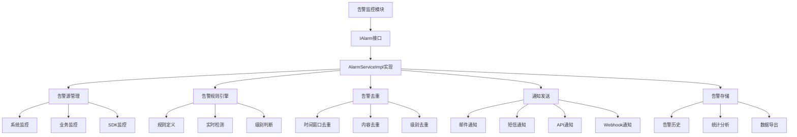
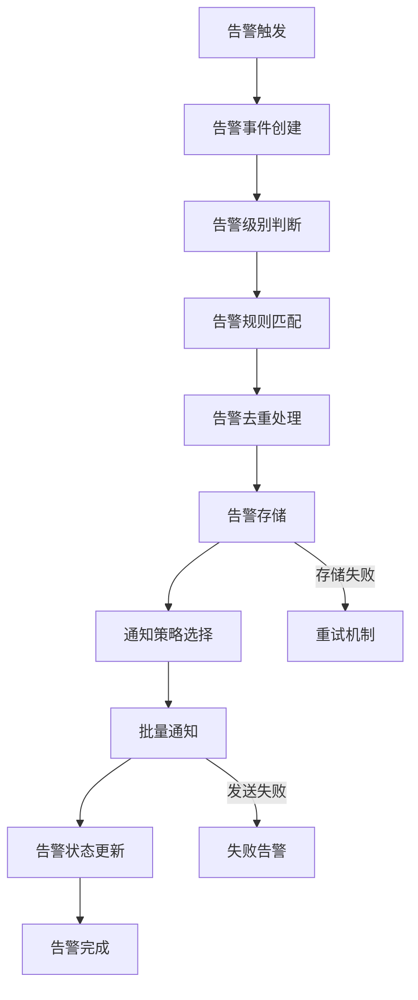
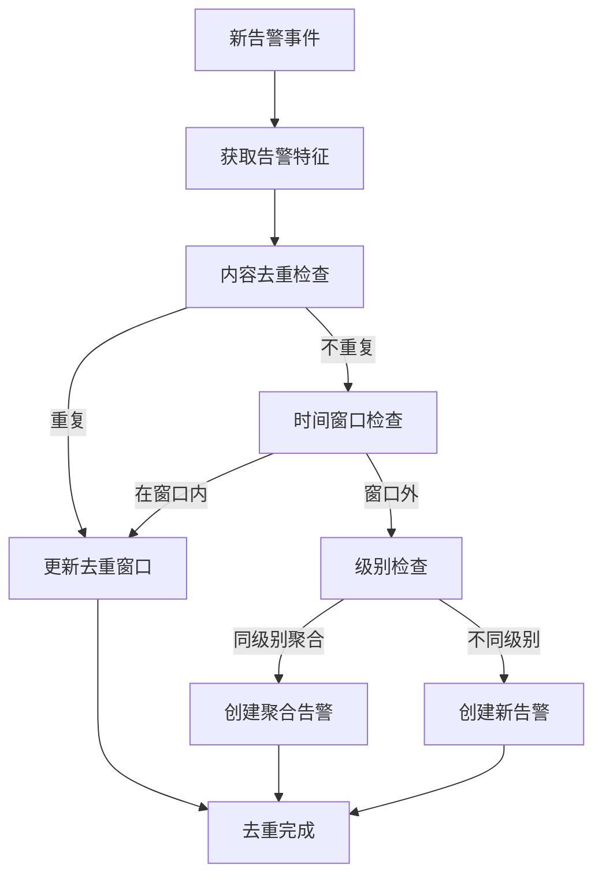
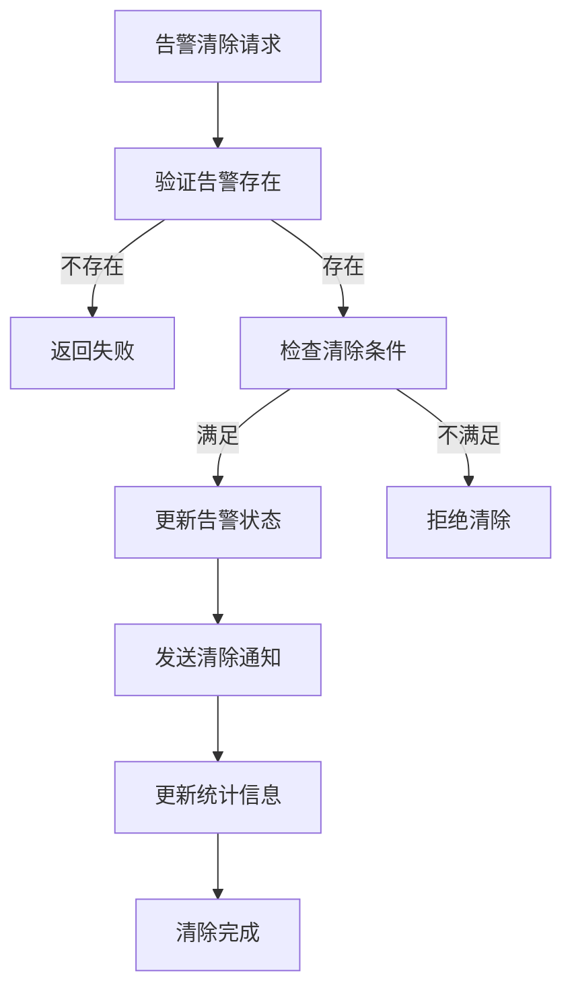

# 告警监控模块设计文档 (IAlarm)

## 文档信息

| 模块名称 | 告警监控模块 |
|---------|--------------|
| 文档类型 | 模块设计文档 |
| 版本 | 1.0 |
| 日期 | 2026-02-14 |
| 所属系统 | BrowserGateway |
| 模块标识 | Alarm |

---

## 1. 模块概述

### 1.1 模块职责

告警监控模块是BrowserGateway系统的核心支撑模块，负责系统全链路的状态监控、异常检测和告警通知。模块通过IAlarm接口提供统一的告警管理能力，主要职责包括：

- **异常检测**：实时监控系统运行状态，自动检测异常情况
- **告警管理**：管理告警的生成、去重、分级和生命周期
- **通知发送**：通过多种渠道发送告警通知
- **通知控制**：控制告警的发送频率，避免告警风暴
- **统计报表**：生成告警统计历史和分析报表

### 1.2 设计目标

- **实时性**：异常发生后秒级内触发告警
- **准确性**：准确识别系统异常，减少误报漏报
- **可扩展性**：支持多种告警源和通知渠道
- **智能化**：支持告警级别分级和智能去重
- **可观测性**：完整的告警生命周期管理

### 1.3 技术架构



---

## 2. 接口设计

### 2.1 IAlarm核心接口

#### 接口定义
```java
/**
 * 告警服务接口，统一管理系统告警和通知
 */
public interface IAlarm {
    
    /**
     * 发送告警
     * 
     * @param alarmEvent 告警事件
     * @return boolean 发送是否成功
     */
    boolean sendAlarm(AlarmEvent alarmEvent);
    
    /**
     * 清除告警
     * 
     * @param alarmEvent 告警事件
     * @return boolean 清除是否成功
     */
    boolean clearAlarm(AlarmEvent alarmEvent);
    
    /**
     * 批量发送告警
     * 
     * @param alarmEvents 告警事件集合
     * @return Map<String, Boolean> 每个告警的发送结果 {告警ID: 是否成功}
     */
    Map<String, Boolean> batchSendAlarms(List<AlarmEvent> alarmEvents);
    
    /**
     * 批量清除告警
     * 
     * @param alarmEvents 告警事件集合
     * @return Map<String, Boolean> 每个告警的清除结果 {告警ID: 是否成功}
     */
    Map<String, Boolean> batchClearAlarms(List<AlarmEvent> alarmEvents);
    
    /**
     * 获取告警历史记录
     * 
     * @param alarmIds 告警ID集合
     * @return List<DataParam> 告警历史记录列表
     */
    List<DataParam> getAlarms(String alarmIds);
    
    /**
     * 获取告警统计信息
     * 
     * @param startTime 开始时间
     * @param endTime 结束时间
     * @return AlarmStatistics 告警统计信息
     */
    AlarmStatistics getAlarmStatistics(LocalDateTime startTime, LocalDateTime endTime);
    
    /**
     * 检告警是否存活
     * 
     * @param alarmId 告警ID
     * @return boolean 是否存活
     */
    boolean isAlarmAlive(String alarmId);
    
    /**
     * 强制发送告警（绕过去重等限制）
     * 
     * @param alarmEvent 告警事件
     * @return boolean 发送是否成功
     */
    boolean forceSendAlarm(AlarmEvent alarmEvent);
}
```

#### 异常设计
```java
/**
 * 告警相关异常
 */
public class AlarmException extends RuntimeException {
    public AlarmException(String message);
    public AlarmException(String message, Throwable cause);
    
    /**
     * 告警发送异常
     */
    public static class SendException extends AlarmException {
        public SendException(String alarmId, String reason);
    }
    
    /**
     * 告警配置异常
     */
    public static class ConfigException extends AlarmException {
        public ConfigException(String configKey, String reason);
    }
    
    /**
     * 告警规则异常
     */
    public static class RuleException extends AlarmException {
        public RuleException(String ruleId, String reason);
    }
}
```

### 2.2 数据对象设计

#### AlarmEvent - 告警事件

#### 数据结构
```
AlarmEvent数据模型字段：
- alarmId: String - 告警ID
- appCode: String - 应用编码
- appName: String - 应用名称
- title: String - 告警标题
- content: String - 告警内容
- alarmLevel: String - 告警级别
- alarmType: String - 告警类型
- eventSource: EventSource - 事件来源
- eventSourceApp: String - 事件来源应用
- originalEventTime: Long - 原始事件时间
- alarmTime: Long - 告警触发时间
- updateTime: Long - 告警更新时间
- clearTime: Long - 告警清除时间
- regionInfo: String - 区域信息
- resourceInfo: String - 资源信息
- hostInfo: String - 主机信息
- containerInfo: String - 容器信息
- associationValue: String - 关联值
- associationName: String - 关联名称
- tags: Map<String, String> - 业务标签
- metadata: Map<String, String> - 扩展元数据
- suggestion: String - 建议处理方案
- suggestions: List<String> - 处理方案列表
```

#### 核心方法
```
AlarmEvent类包含以下关键方法和枚举：

告警级别枚举：
CRITICAL - 紧急 (告警ID: 30001-30099)
MAJOR - 严重 (告警ID: 30100-30199)  
MINOR - 一般 (告警ID: 30200-30299)
INFO - 提示 (告警ID: 30300-30399)

事件来源枚举：
SYSTEM - 系统
BUSINESS - 业务
SERVICE - 服务
SDK - SDK
CUSTOM - 自定义

create(AlarmEnum enumDefinition, String message): AlarmEvent
- 功能：创建告警事件
- 步骤：1. 生成告警ID；2. 设置内容格式；3. 设置事件源；4. 初始化时间戳；5. 初始化元数据和标签
- 返回构造完成的AlarmEvent对象

addTag(String key, String value): void
- 功能：添加业务标签
- 逻辑：如果tags为null则创建Map，然后put键值对

addMetadata(String key, String value): void  
- 功能：添加扩展元数据
- 逻辑：如果metadata为null则创建Map，然后put键值对

addSuggestion(String suggestion): void
- 功能：添加处理建议
- 逻辑：如果suggestions为null则创建List，然后add建议

isCritical(): boolean
- 功能：检查是否为紧急告警
- 逻辑：比较alarmLevel与AlarmLevel.CRITICAL

needsImmediateAttention(): boolean
- 功能：检查是否需要立即处理
- 逻辑：紧急或严重级别返回true，否则返回false

toJsonString(): String
- 功能：转换为JSON字符串
- 逻辑：使用JSON工具序列化为JSON并返回
```

#### AlarmStatistics - 告警统计

#### 数据结构
```
AlarmStatistics数据模型字段：
- startTime: String - 统计开始时间
- endTime: String - 统计结束时间  
- totalCount: long - 总告警数
- levelCount: Map<String, Long> - 各级别告警数
- typeCount: Map<String, Long> - 各类型告警数
- sourceCount: Map<String, Long> - 各来源告警数
- avgResponseTime: double - 平均响应时间(秒)
- resolutionTimeByLevel: Map<String, Double> - 各级别平均解决时间
- topology: List<AlarmTopology> - 告警分布拓扑图

AlarmTopology嵌套类：
- node: String - 节点
- count: long - 告警数  
- children: Map<String, Long> - 子节点分布
```

#### 核心方法
```
AlarmStatistics类包含以下关键方法：

addAlarm(AlarmEvent alarmEvent)
- 功能：添加告警数据并更新统计
- 逻辑：totalCount加1，同时更新levelCount、typeCount、sourceCount统计

calculateResponseTime(long publishTime, long receiveTime)
- 功能：计算告警响应时间并更新平均值
- 步骤：1. 计算时间差；2. 更新avgResponseTime平均值，使用移动平均算法

getCriticalAlarmRate(): double
- 功能：获取紧急告警占比
- 逻辑：从levelCount获取CRITICAL级别数，除以总数，避免除以零异常

getAlarmDensity(): double
- 功能：获取告警密度（每分钟告警数）
- 逻辑：计算时间差（分钟），总告警数除以分钟数
- 异常处理：时间解析异常时返回0.0而不会抛出异常
```

---

## 3. 核心流程设计

### 3.1 告警发送流程



#### 详细步骤说明

1. **告警事件创建**
   - 根据异常情况创建AlarmEvent对象
   - 设置基本告警信息：ID、标题、内容、级别、类型
   - 设置告警时间戳（alarmTime为当前时间）
   - 初始化元数据Map和标签Map（新的HashMap实例）

2. **告警级别判断**
   - 根据告警类型和严重程度判断告警级别
   - 级别判断逻辑：
     - CRITICAL：系统级严重故障，如服务不可用、关键进程异常
     - MAJOR：功能故障影响用户，如浏览器创建失败、连接异常
     - MINOR：一般异常问题，如资源使用率过高、缓存命中率低
     - INFO：提示信息，如定期健康检查、配置变更通知

3. **告警规则匹配**
   - 查询匹配的告警规则（根据alarmType匹配）
   - 获取规则配置：通知对象、通知渠道、去重设置、超时设置
   - 确定是否触发告警发送（根据规则的isAlarmable判断）

4. **告警去重处理**
   - 时间窗口去重：检查该alarmId在去重时间窗口内是否已有相同告警
   - 内容去重：计算告警内容的hash值，检查相同内容的去重规则
   - 级别去重：相同alarmId但不同级别的告警进行合并计数

5. **告警数据存储**
   - 使用MySQL数据库存储告警信息（包含status、createTime等）
   - 更新告警索引（ES搜索引擎索引，便于查询和统计）
   - 记录告警生命周期节点（创建、更新、清除时间）

6. **通知策略执行**
   - 根据告警级别选择通知渠道：
     - CRITICAL：短信+电话+邮件+Webhook
     - MAJOR：邮件+Webhook
     - MINOR：邮件
     - INFO：仅记录日志
   - 读取通知配置（通知对象、模板、发送时间）

7. **批量通知处理**
   - 合并相同级别的告警进行批量发送（减少API调用次数）
   - 使用线程池异步发送通知（提高响应速度）
   - 记录通知发送结果（成功、失败、重试）

8. **状态更新和完成**
   - 更新告警状态为"已发送"（database字段status）
   - 设置发送时间、结果等扩展信息
   - 触发告警事件回调（供其他模块监听）
   - 推送告警完成事件到监控系统

### 3.2 告警去重流程



#### 详细步骤说明

1. **特征提取**
   - 提取告警的关键特征：alarmType、alarmLevel、associationValue
   - 计算告警内容的MD5哈希值（用于内容去重）
   - 构建特征键：`alarmType:associationValue:alarmLevel`

2. **内容去重检查**
   - 查询Redis中是否存在相同的内容哈希值
   - 如果存在且未超过去重窗口，更新对应记录的时间戳和触发次数
   - 返回"内容已去重"状态

3. **时间窗口检查**
   - 获取当前告警对应的去重窗口时长：
     - CRITICAL：30分钟
     - MAJOR：60分钟
     - MINOR：120分钟
     - INFO：不打重复
   - 检查同alarmId下是否有活跃的告警记录

4. **级别和关联处理**
   - 如果去重窗口内存在告警：
     - 同级别：触发次数+1，更新告警标题（"【第N次】原始标题"）
     - 不同级别（CRITICAL vs MAJOR）：优先保留高级别告警
   - 如果没有存在告警或已超过窗口：创建新告警记录

5. **去重窗口管理**
   - 维护Redis中的告警ID到时间戳的映射
   - 设置TTL为去重窗口时间
   - 定期扫描并清理过期的去重记录

### 3.3 告警清除流程



#### 详细步骤说明

1. **告警验证**
   - 根据alarmId查询数据库确认是否存在活跃告警
   - 检查告警状态是否已为"已清除"或"已过期"
   - 验证用户权限：检查用户是否有权限清除该告警

2. **清除条件检查**
   - 验证清除请求的合法性：
     - 告警是否超过最大存活时间（CRITICAL 8小时，其他24小时）
     - 是否由告警责任方发起清除请求
     - 是否满足业务清除逻辑（如问题已修复）
   - 检查清除类型：手动清除、自动清除、恢复清除

3. **状态更新**
   - 数据库操作：
     - 更新status字段为已清除
     - 设置clearTime为当前时间戳
     - 更新clearUser、clearReason、clearMethod字段
   - 索引更新：从ES搜索索引中移除或标记为已清除

4. **清除通知**
   - 向相关人员发送告警已清除通知：
     - 设置通知类型为"告警清除"
     - 填充告警信息和清除详情
     - 使用通知模板生成通知内容
   - 通知渠道：邮件、Webhook、企业微信等

5. **统计更新**
   - 更新告警统计表：
     - 告警生存时间计算（clearTime - createTime）
     - 更新已清除告警计数
     - 计算各级别告警的平均解决时间
   - 记录告警生命周期分析数据

---

## 4. 告警规则引擎

### 4.1 规则定义与管理

#### 告警规则模型

#### 数据结构
```
AlarmRule数据模型字段：
- id: String - 规则ID
- name: String - 规则名称
- description: String - 规则描述
- expression: String - 告警条件表达式
- metricPattern: String - 指标模式
- level: Level - 告警级别
- params: Map<String, Object> - 规则参数
- channels: List<String> - 通知渠道
- window: Window - 去重窗口
- enabled: boolean - 是否启用

级别枚举：
CRITICAL -> AlarmLevel.CRITICAL
MAJOR -> AlarmLevel.MAJOR  
MINOR -> AlarmLevel.MINOR
INFO -> AlarmLevel.INFO

去重窗口配置：
duration: long - 持续时间(毫秒)
strategy: String - 去重策略(time-based/content-based/level-based)
maxCount: int - 最大告警数
```

#### 核心方法
```
AlarmRule类包含以下关键方法：

matchesMetric(String metricName): boolean
- 功能：判断指标是否匹配规则
- 逻辑：如果metricPattern为空则匹配所有，否则使用正则表达式匹配metricName

evaluateCondition(Map<String, Object> metrics): boolean
- 功能：评估告警条件
- 逻辑：如果expression为空则返回true，否则使用表达式引擎评估条件表达式
- 异常处理：评估失败时返回false并记录警告日志
```

#### 规则管理器逻辑

**AlarmRuleManager类逻辑：**

核心组件：
- 规则缓存：ConcurrentHashMap<String, AlarmRule>
- 定时刷新执行器：ScheduledExecutorService

核心方法一：`loadRules(List<AlarmRule> rules)`
处理流程：
1. 遍历ruleList，为每个rule执行：
   - 使用put方法将其加入ruleCache（key为rule.id）
   - 记录加载成功的日志（包含rule.id和rule.name）
2. 在日志中显示总共加载的规则数量

核心方法二：`findMatchingRules(String metricName, Map<String, Object> metrics)`
处理流程：
1. 遍历ruleCache.values()获取所有规则
2. 使用Stream进行过滤操作：
   - filter(rule -> rule.isEnabled()) - 只启用规则
   - filter(rule -> rule.matchesMetric(metricName)) - 指标模式匹配
   - filter(rule -> rule.evaluateCondition(metrics)) - 条件表达式评估
3. 收集所有匹配规则到List并返回

核心方法三：`refreshRuleCache()` - 定时执行
处理流程：
1. 调用loadRulesFromDatabase()从数据库加载规则
2. 调用loadRules()加载新规则到缓存
3. 记录缓存刷新的日志，显示加载的规则数量

### 4.2 实时告警检测

#### 检测引擎逻辑

**AlarmDetectionEngine类逻辑：**

核心组件：
- 规则管理器：AlarmRuleManager
- 告警发送管理器：AlarmSendManager

核心方法：`processMetric(String metricName, Map<String, Object> metrics)`
处理流程：
1. 调用规则管理器findMatchingRules查询匹配的alarmRuleList
2. 如果匹配规则为空，直接返回不处理
3. 将alarmRuleList按AlarmLevel分组（使用Collectors.groupingBy）
4. 获取分组后的Map<AlarmLevel, List<AlarmRule>>
5. 遍历各级别alarmRule，为每个规则：
   - 调用createAlarmEvent(rule, metricName, metrics)构建告警事件
   - 调用alarmSendManager.sendAlarm(event)发送告警

#### 告警事件创建逻辑

**createAlarmEvent(AlarmRule rule, String metricName, Map<String, Object> metrics)**
处理流程：
1. 调用AlarmEvent.create()创建基础告警事件，参数：
   - alarmEnum：创建AlarmEnum对象传入rule的level、description、name
   - message：使用格式化字符串包含metricName和metrics value
2. 调用event.addTag()添加业务标签：
   - "rule.id"：rule.id
   - "rule.name"：rule.name
   - "metric.name"：metricName
3. 调用event.addMetadata()添加扩展元数据：
   - 键"metrics"，值为metrics JSON序列化字符串
4. 返回构造完成的AlarmEvent对象

---

## 5. 通知系统设计

### 5.1 多渠道通知支持

#### 通知接口定义

**NotificationChannel接口方法：**

核心方法：
```java
SendResult send(Notification notification)
- 功能：发送通知
- 参数：Notification包含recipient(接收者)、subject(主题)、content(内容)、type(类型)、priority(优先级)
- 返回：SendResult包含success标志和message详细信息

boolean isAvailable()
- 功能：检查通知渠道是否可用  
- 返回：true表示渠道可用，false表示不可用
```

#### 邮件通知逻辑

**EmailNotificationChannel类逻辑：**

核心组件：
- JavaMailSender：邮件发送服务
- EmailConfig：邮件配置信息

核心方法：`send(Notification notification)`
处理流程：
1. 调用createMimeMessage(notification)创建MimeMessage
2. 配置邮件设置：
   - 设置收件人（to: notification.getRecipient()）
   - 设置主题（subject: [Alarm] + notification.getSubject()）
   - 设置HTML格式内容（buildEmailContent(notification)）
3. 调用mailSender.send(message)发送邮件
4. 成功返回SendResult.success("Email sent successfully")
5. 异常处理：捕获异常并返回SendResult.failure("Email send failed: 异常信息")

**createMimeMessage方法逻辑：**
1. 创建MimeMessage实例
2. 创建MimeMessageHelper（支持HTML内容，字符编码UTF-8）
3. 设置收件人、主题和HTML内容
4. 返回配置完成的MimeMessage

#### Webhook通知逻辑

**WebhookNotificationChannel类逻辑：**

核心组件：
- RestTemplate：HTTP客户端
- WebhookConfig：Webhook配置

核心方法：`send(Notification notification)`
处理流程：
1. 构建WebhookRequest对象，设置字段：
   - receipient：notification.getRecipient()
   - subject：notification.getSubject()
   - content：notification.getContent()
   - type：notification.getType().name()
   - timestamp：System.currentTimeMillis()
2. 创建HttpEntity<WebhookRequest>实体
3. 调用restTemplate.postForEntity发送HTTP POST请求到Webhook URL
4. 检查response.getStatusCode()：
   - 2xx成功：返回SendResult.success
   - 非2xx：返回SendResult.failure(statusCode信息)
5. 异常处理：捕获异常并返回SendResult.failure

### 5.2 通知策略管理

#### 通知策略逻辑

**NotificationPolicyManager类逻辑：**

核心组件：
- 渠道缓存：ConcurrentHashMap<String, List<NotificationChannel>>

核心方法：`getChannels(AlarmEvent.AlarmLevel level)`
处理流程：
1. 构建缓存键：level.name()
2. 从channelCache获取对应级别的渠道列表
3. 如果缓存命中且渠道列表不为空，直接返回
4. 缓存未命中，调用loadChannelsForLevel(level)动态加载
5. 将结果放入channelCache缓存并返回

**loadChannelsForLevel(AlarmEvent.AlarmLevel level)处理流程：**
1. 根据level创建空的渠道列表
2. 使用switch-case选择通知渠道：
   - CRITICAL：短信、邮件、Webhook
   - MAJOR：邮件、Webhook  
   - MINOR：邮件
   - INFO：日志记录（log channel）
3. 遍历渠道列表，调用channel.isAvailable()过滤不可用渠道
4. 返回过滤后的可用渠道列表

#### 批量发送逻辑

**batchSendNotifications(AlarmEvent alarmEvent, List<Notification> notifications)**
处理流程：
1. 创建结果集Map<String, SendResult>和CountDownLatch
2. 遍历notifications列表，为每个notification创建CompletableFuture任务：
   - 异步执行：通知批复逻辑
   - 计数器：latch.countDown()
3. 使用线程池异步执行所有任务
4. 等待所有任务完成（最多等待30秒）
5. 返回包含每个渠道发送结果的Map

**每个渠道的发送逻辑：**
1. 调用getChannels(alarmEvent.getAlarmLevel())获取可用渠道列表
2. 遍历渠道列表，为每个渠道调用channel.send(notification)
3. 将结果放入results Map（key为渠道类名，value为SendResult）
4. 如果发送失败，记录错误日志

---

## 6. 性能优化设计

### 6.1 异步处理机制

#### 异步告警处理器逻辑

**AsyncAlarmProcessor类逻辑：**

核心组件：
- 告警队列：BlockingQueue<AlarmWrapper>，容量限制10000
- 处理执行器：ScheduledExecutorService

核心方法：`submitAlarm(AlarmEvent alarmEvent)`
处理流程：
1. 创建CompletableFuture<SendResult> future
2. 尝试将AlarmWrapper(alarmEvent, future)放入队列
   - 阻塞时间：1秒
   - 队列满时快速失败：future.complete(SendResult.failure("Alarm queue is full"))
3. 捕获中断异常：设置future为异常完成状态
4. 返回future供调用方跟踪

**processAlarms()处理循环逻辑：**
1. 无限循环检查队列：
   - 使用take()阻塞获取任务（线程安全）
   - 捕获InterruptedException退出循环
   - try-catch异常处理，防止循环中断
2. 调用processTask(wrapper)处理具体任务
3. 异常情况下记录错误日志

### 6.2 批量处理优化

#### 批量告警发送器逻辑

**BatchAlarmSender类逻辑：**

核心组件：
- 批量缓存：ConcurrentHashMap<AlarmLevel, List<AlarmEvent>>
- 定时执行器：ScheduledExecutorService

核心方法：`cacheAlarm(AlarmEvent alarmEvent)`
处理流程：
1. 获取alarmEvent的AlarmLevel
2. 调用compute方法更新批量缓存：
   - 尝试从缓存获取对应level的alarmList
   - 为空则创建ArrayList
   - 将event添加到alarmList
   - 检查list.size()是否达到配置的batchSize阈值
3. 如果达到阈值：
   - 调用sendBatch(alarmList)发送批量告警
   - 从缓存中移除已发送的alarmList（remove操作）
4. 如果未达到阈值，保留在缓存中等待下次处理

**sendBatchAlarms()定时执行逻辑：**
1. 遍历batchCache.forEach级别
2. 获取各级别的alarmList（不为空则发送）
3. 记录批次开始时间startTime
4. 异步发送处理：
   - 为alarmList中的每个event创建Future
   - 使用asyncHandler.submitAlarm()异步处理
   - 等待所有Future完成（30秒超时）
5. 记录批次发送日志：
   - 包含告警数量和耗时
   - 显示成功/失败数量统计
6. 清空已处理级别的batch缓存

---

## 7. 配置参数

### 7.1 告警基础配置

#### 基础告警配置
```yaml
# 告警监控模块配置
alarm:
  # 基础配置
  alarm-id-prefix: BLG           # 告警ID前缀
  region: cn-north-4            # 区域
  app-code: browser-gateway      # 应用编码
  app-name: BrowserGateway       # 应用名称
  
  # 去重配置
  deduplication:
    enabled: true                 # 启用去重
    window-duration: 600000       # 去重窗口(毫秒)
    strategy: level-based         # 去重策略
    content-hash-algorithm: md5   # 内容哈希算法
```

#### 通知配置
```yaml
# 通知渠道配置
notification:
  # 邮件通知
  email:
    enabled: true
    smtp-host: smtp.company.com
    smtp-port: 587
    username: alarm@company.com
    password: ${EMAIL_PASSWORD}
    from: alarm@company.com
    timeout: 30000               # 超时(毫秒)
    retry-count: 3               # 重试次数
  
  # 短信通知
  sms:
    enabled: true
    provider: aliyun             # 短信服务商
    access-key: ${SMS_ACCESS_KEY}
    secret-key: ${SMS_SECRET_KEY}
    sign-name: BrowserGateway    # 签名名称
    template-code: SMS_ALARM_TPL # 模板编码
    retry-count: 3
  
  # Webhook通知
  webhook:
    enabled: true
    url: https://alert.company.com/webhook
    method: POST
    headers:
      Content-Type: application/json
      Authorization: Bearer ${WEBHOOK_TOKEN}
    timeout: 10000               # 超时(毫秒)
    retry-count: 3
```

### 7.2 告警规则配置

#### 预定义告警规则
```yaml
# 预定义告警规则
alarm-rules:
  # 系统级告警
  - id: SYS_CPU_USAGE
    name: CPU使用率过高
    description: 系统CPU使用率超过80%
    level: CRITICAL
    metric-pattern: "system.cpu.usage"
    expression: "value > 80"
    window:
      duration: 300000            # 5分钟
      strategy: time-based
    channels: [email, sms, webhook]
  
  # 应用级告警  
  - id: APP_RESPONSE_TIME
    name: 应用响应时间过长
    description: HTTP P95响应时间超过2秒
    level: MAJOR
    metric-pattern: "app.http.response_time.p95"
    expression: "value > 2000"
    window:
      duration: 300000            # 5分钟
      strategy: time-based
    channels: [email, webhook]
  
  # 业务告警
  - id: BUSINESS_LOGIN_FAILED
    name: 用户登录失败
    description: 用户登录失败率超过5%
    level: MINOR
    metric-pattern: "business.login.failed_rate"
    expression: "value > 0.05"
    window:
      duration: 600000            # 10分钟
      strategy: content-based
    channels: [email]
```

### 7.3 性能调优配置

#### 性能配置
```yaml
# 告警性能调优配置
alarm:
  # 批量处理配置
  batch:
    enabled: true                 # 启用批量处理
    size: 10                      # 批量大小
    interval: 5000                # 批量间隔(毫秒)
  
  # 线程池配置
  thread-pool:
    core-size: 5                 # 核心线程数
    max-size: 20                 # 最大线程数
    queue-capacity: 1000         # 队列容量
    keep-alive: 300               # 保活时间(秒)
    
  # 缓存配置
  cache:
    rule-cache-time: 300000      # 规则缓存时间(毫秒)
    memory-cache-size: 1000      # 内存缓存大小
```

---

## 8. 监控与指标

### 8.1 告警系统指标

#### 基础告警指标

**AlarmMetrics类逻辑：**

核心组件：
- MeterRegistry：指标注册表
- 计数器：alarmCounter, alarmProcessedCounter
- 计时器：alarmProcessingTime

核心方法：`recordAlarmTriggered(AlarmEvent.AlarmLevel level, String source)`
处理流程：
- 调用meterRegistry.counter("alarm.triggered", level.name(), source.name()).increment()

核心方法：`recordAlarmProcessed(AlarmEvent.AlarmLevel level, boolean success)`
处理流程：
- 调用alarmProcessedCounter.increment(level.name(), status(success))
- status(success)返回"success"或"failure"

核心方法：`recordAlarmProcessingTime(Timer.Sample start, AlarmEvent.AlarmLevel level)`
处理流程：
- 调用start.stop(alarmProcessingTime.tag("level", level.name()))

#### 通知系统指标

**NotificationMetrics类逻辑：**

核心组件：
- notificationCounter计数器（记录发送的告警数）
- notificationDeliveryTime计时器（记录发送耗时）

核心方法：`recordNotificationSent(Notification.NotificationType type, boolean success)`
处理流程：
- 调用notificationCounter.increment(type.name(), status(success))

核心方法：`getNotificationSuccessRate()`
处理流程：
1. 获取发送总数sent
2. 获取成功数success
3. return sent > 0 ? (double) success / sent : 0.0

### 8.2 告警报规则

#### 系统告警规则
```yaml
# 告警系统自身告警规则
alerts:
  # 系统资源告警
  - name: alarm_system_cpu_high
    condition: > system_cpu_usage > 80
    duration: 5m
    severity: critical
    annotations:
      summary: "告警系统CPU使用率过高"
      description: "告警系统CPU使用率: system_cpu_usage > 80"
  
  # 告警队列积压
  - name: alarm_queue_backlog
    condition: > alarm_queue_backlog > 1000
    duration: 5m
    severity: major
    annotations:
      summary: "告警处理队列积压过多"
      description: "告警队列积压数量: alarm_queue_backlog > 1000"
  
  # 告警发送失败
  - name: alarm_send_failure_rate
    condition: > rate(alarm_send_error_total[5m]) / rate(alarm_send_total[5m]) > 0.1
    duration: 5m
    severity: critical
    annotations:
      summary: "告警发送失败率过高"
      description: "最近5分钟告警发送失败率: > 10%"
  
  # 通知系统异常
  - name: notification_system_unavailable
    condition: > notification_system_available == 0
    duration: 1m
    severity: critical
    annotations:
      summary: "通知系统不可用"
      description: "通知系统已连续1分钟不可用"
```

#### 业务告警规则
```yaml
# 业务系统告警规则
business_alerts:
  # 浏览器创建失败
  - name: browser_creation_failure
    condition: > rate(browser_creation_error_total[5m]) > 5
    duration: 5m
    severity: critical
    annotations:
      summary: "浏览器创建失败"
      description: "最近5分钟浏览器创建失败次数: > 5"
      
  # 用户连接异常
  - name: user_connection_abnormal
    condition: > rate(user_connection_error_total[5m]) > 10
    duration: 5m
    severity: major
    annotations:
      summary: "用户连接异常"
      description: "最近5分钟用户连接失败次数: > 10"
      
  # 插件加载失败
  - name: plugin_load_failure
    condition: > rate(plugin_load_error_total[5m]) > 0
    duration: 5m
    severity: major
    annotations:
      summary: "插件加载失败"
      description: "有插件加载失败，请检查插件文件"
```