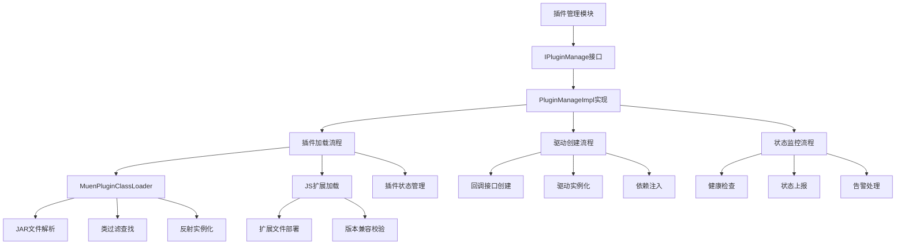
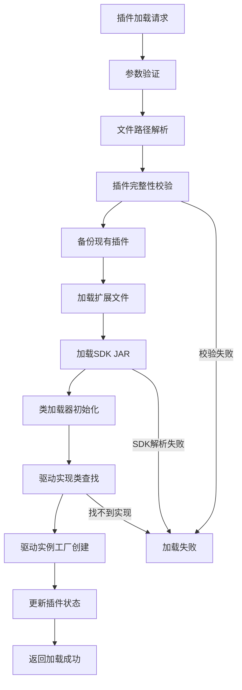
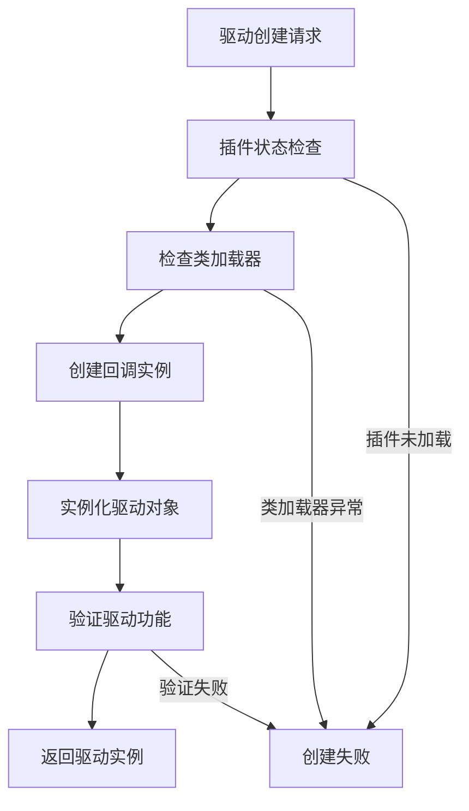
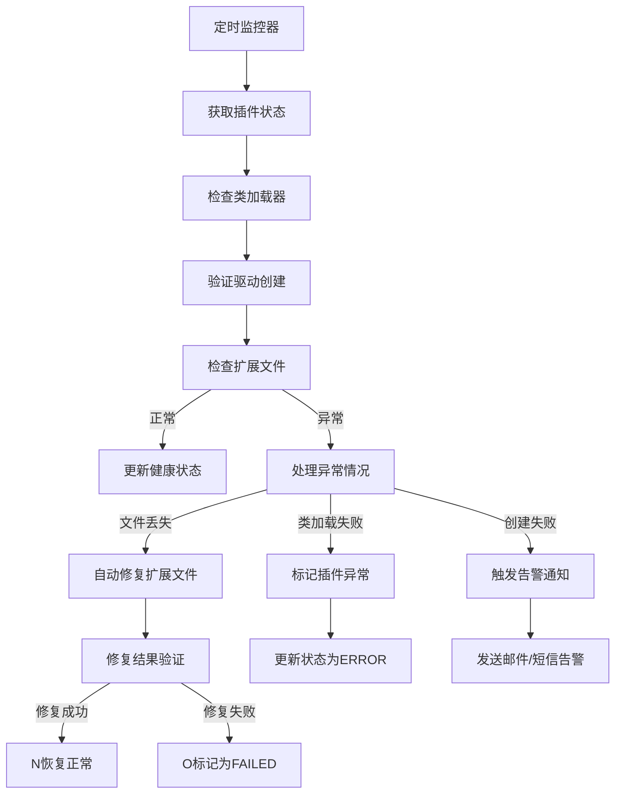

# 插件管理模块设计文档 (IPluginManage)

## 文档信息

| 模块名称 | 插件管理模块 |
|---------|--------------|
| 文档类型 | 模块设计文档 |
| 版本 | 1.0 |
| 日期 | 2026-02-14 |
| 所属系统 | BrowserGateway |
| 模块标识 | PluginManage |

---

## 1. 模块概述

### 1.1 模块职责

插件管理模块是BrowserGateway系统的核心支撑模块，负责Moon SDK插件的全生命周期管理。模块通过IPluginManage接口提供插件加载、驱动创建和状态监控服务，主要职责包括：

- **SDK插件动态加载**：支持从外部JAR文件动态加载Moon SDK实现
- **驱动实例创建**：管理MuenDriver实例的创建和生命周期
- **插件状态监控**：实时监控插件运行状态和健康度
- **异常告警处理**：处理插件相关异常并上报告警信息
- **扩展资源管理**：处理浏览器扩展的加载和版本管理

### 1.2 设计目标

- **动态性**：无需重启即可加载/卸载插件
- **兼容性**：支持多版本SDK并存和切换
- **安全性**：插件隔离和沙箱运行
- **可观测性**：完整的插件生命周期监控
- **高性能**：插件加载速度快，资源占用低

### 1.3 技术架构



---

## 2. 接口设计

### 2.1 IPluginManage核心接口

#### 接口定义
```java
/**
 * 插件管理服务接口，负责Moon SDK插件的全生命周期管理
 */
public interface IPluginManage {
    
    /**
     * 加载插件
     * 
     * @param keyPath Key扩展文件路径
     * @param touchPath Touch扩展文件路径
     * @param jarPath SDK插件JAR文件路径
     */
    void loadPlugin(String keyPath, String touchPath, String jarPath);
    
    /**
     * 创建驱动实例
     * 
     * @param userId 用户ID
     * @return MuenDriver 驱动实例，失败返回null
     */
    MuenDriver createDriver(String userId);
    
    /**
     * 更新插件活跃状态
     * 
     * @param name 插件名称
     * @param version 插件版本
     * @param type 插件类型
     */
    void updatePluginActive(String name, String version, String type);
    
    /**
     * 获取插件状态信息
     * 
     * @return PluginActive 插件活跃状态信息
     */
    PluginActive getPluginActive();
    
    /**
     * 更新插件运行状态
     * 
     * @param pluginStatus 插件状态
     */
    void updateStatus(String pluginStatus);
    
    /**
     * 获取插件运行状态
     * 
     * @return 插件状态字符串
     */
    String getPluginStatus();
    
    /**
     * 关闭插件管理器
     * 释放所有资源
     */
    void shutdown();
}
```

#### 异常设计
```java
/**
 * 插件管理相关异常
 */
public class PluginException extends RuntimeException {
    public PluginException(String message);
    public PluginException(String message, Throwable cause);
    
    /**
     * 插件加载异常
     */
    public static class LoadException extends PluginException {
        public LoadException(String filePath, String reason);
    }
    
    /**
     * 驱动创建异常
     */
    public static class DriverCreateException extends PluginException {
        public DriverCreateException(String userId, String reason);
    }
    
    /**
     * 插件状态异常
     */
    public static class StatusException extends PluginException {
        public StatusException(String expectedStatus, String actualStatus);
    }
    
    /**
     * 安全异常
     */
    public static class SecurityException extends PluginException {
        public SecurityException(String reason);
    }
}
```

### 2.2 数据对象设计

#### PluginActive - 插件状态信息

#### 数据结构
```
PluginActive数据模型字段：
- name: String - 插件名称
- version: String - 插件版本
- type: String - 插件类型
- status: String - 插件状态
- path: String - 插件路径
- loadTime: long - 加载时间戳
- properties: Map<String, Object> - 扩展属性
```

#### 核心方法
```
PluginActive类包含以下关键方法：

createDefault(): PluginActive
- 功能：创建基础插件状态
- 逻辑：设置默认名称MoonSDK、版本Unknown、类型ChromeExtension、状态NOTSTART，初始化properties和loadTime
- 返回：初始化完成的PluginActive对象

isLoaded(): boolean
- 功能：判断是否已加载完成
- 逻辑：检查status是否等于"COMPLETE"

isError(): boolean
- 功能：判断是否处于异常状态
- 逻辑：检查status是否等于"FAILED"

updateStatus(String newStatus)
- 功能：更新状态并触发相关操作
- 步骤：1. 保存旧状态；2. 设置新状态；3. 更新加载时间；4. 调用handleStatusChange处理状态变更
- 调用：根据新状态清除或发送告警

handleStatusChange(String oldStatus, String newStatus)
- 功能：处理状态变更事件
- 逻辑：
  - COMPLETE状态：清除插件加载告警
  - FAILED状态：发送插件加载失败告警
  - 记录状态变更日志
```

#### PluginInfo - 插件信息

#### 数据结构
```
PluginInfo数据模型字段：
- name: String - 插件名称
- version: String - 版本号
- description: String - 描述信息
- vendor: String - 提供商
- type: PluginType - 插件类型
- status: PluginStatus - 插件状态
- jarFile: File - JAR文件路径
- keyExtensionPath: File - Key扩展路径
- touchExtensionPath: File - Touch扩展路径
- loadedTime: long - 加载时间
- metadata: Map<String, String> - 元数据信息

插件类型枚举：
BROWSER_SDK - 浏览器SDK
CONTROL_EXTENSION - 控制扩展
MEDIA_EXTENSION - 媒体扩展
SYSTEM_EXTENSION - 系统扩展

插件状态枚举：
NOT_LOADED - 未加载
LOADING - 加载中
LOADED - 已加载
ACTIVE - 激活状态
ERROR - 错误状态
UNLOADED - 已卸载
```

#### 核心方法
```
PluginInfo类包含以下关键方法：

validate(): boolean
- 功能：验证插件完整性
- 步骤：
  1. 检查JAR文件存在且可读
  2. 检查必要扩展文件（如果指定）
  3. 检查文件大小不超过100MB
- 返回：验证通过返回true，否则返回false

calculateHash(): String
- 功能：计算插件文件哈希
- 逻辑：读取JAR文件所有字节，计算MD5哈希值
- 异常处理：IO异常时返回空字符串
```

---

## 3. 核心流程设计

### 3.1 插件加载流程



#### 详细步骤说明

1. **参数验证**
   - 验证keyPath、touchPath和jarPath参数
   - 检查文件路径格式和权限
   - 确认用户有权限加载插件

2. **文件路径解析**
   - 解析相对路径为绝对路径
   - 检查文件存在性和可读性
   - 验证文件完整性

3. **插件完整性校验**
   - 验证JAR文件完整性
   - 检查数字签名（如果启用）
   - 验证沙箱安全策略

4. **备份现有插件**
   - 移动现有插件到备份目录
   - 保留最近的几个版本
   - 确保回滚能力

5. **扩展文件部署**
   - 复制key扩展文件到指定目录
   - 复制touch扩展文件到指定目录
   - 设置正确的文件权限

6. **SDK JAR加载**
   - 使用独立类加载器加载JAR文件
   - 扫描JAR中的所有类文件
   - 过滤com.moon包下的类

7. **驱动实现查找**
   - 查找MuenDriver的具体实现类
   - 验证类是否可实例化
   - 检查构造函数签名

8. **驱动实例工厂创建**
   - 缓存驱动实现类
   - 创建反射实例化工厂
   - 建立回调接口映射

9. **状态更新与通知**
   - 更新插件状态为COMPLETE
   - 清除相关告警信息
   - 触发加载完成事件

### 3.2 驱动创建流程



#### 详细步骤说明

1. **插件状态检查**
   - 验证插件已成功加载
   - 检查插件处于ACTIVE状态
   - 确认驱动实现类已缓存

2. **回调接口创建**
   - 创建HWCallbackImpl实例
   - 注入必要的依赖组件
   - 配置回调函数参数

3. **驱动对象实例化**
   - 使用反射创建驱动实例
   - 传入回调接口参数
   - 捕获并处理创建异常

4. **驱动功能验证**
   - 测试驱动基本功能
   - 验证关键方法可调用
   - 检查返回值合理性

5. **驱动缓存管理**
   - 缓存已创建的驱动实例
   - 建立用户与驱动映射
   - 准备连接管理资源

### 3.3 状态监控流程



#### 详细步骤说明

1. **定时健康检查**
   - 定期检查插件运行状态
   - 验证关键组件健康度
   - 检测潜在异常情况

2. **组件功能验证**
   - 测试驱动创建功能
   - 验证回调接口工作
   - 检查扩展文件完整性

3. **异常情况处理**
   - 根据异常类型选择处理策略
   - 自动修复可恢复的异常
   - 上报不可恢复的异常

4. **状态恢复机制**
   - 尝试重新加载损坏的组件
   - 回滚到已知良好版本
   - 通知管理员需要人工介入

---

## 4. 动态类加载器设计

### 4.1 MuenPluginClassLoader类

#### 核心功能

**init(Path jarPath): boolean**
- 功能：初始化类加载器并加载插件
- 步骤：
  1. 准备插件目录结构
  2. 创建URLClassLoader实例，指定父类加载器为线程上下文加载器
  3. 扫描JAR文件获取所有类名列表
  4. 查找符合条件的MuenDriver实现类
  5. 验证找到的实现类是否为空，为空则返回失败
  6. 缓存当前JAR文件路径
  7. 记录加载成功日志并返回true
- 异常处理：捕获所有异常，调用cleanup清理资源，返回false

**createDriverInstance(HWCallback hwCallback): MuenDriver**
- 功能：创建驱动实例
- 步骤：
  1. 验证driverImplClass和hwCallback非空
  2. 查找并获取HWCallback参数的构造函数
  3. 使用构造函数实例化驱动对象
  4. 类型转换为MuenDriver并返回
- 返回值：成功返回驱动实例，失败返回null

**close(): void**
- 功能：清理资源
- 逻辑：调用内部cleanup方法

**cleanup(): void**
- 功能：内部清理方法
- 步骤：
  1. 关闭URLClassLoader
  2. 清空classLoader、driverImplClass、currentJarFile引用
- 异常处理：捕获IOException并记录错误日志

#### 类查找与实例化

**listAllClassName(Path path): List<String>**
- 功能：查找JAR文件中所有类名称
- 步骤：
  1. 创建JarFile实例，获取所有条目枚举
  2. 遍历条目，应用过滤条件：
     - 跳过目录和module-info.class
     - 只处理.class文件
  3. 将路径转换为类名格式（去掉.class后缀，替换/为.）
  4. 过滤com.moon包下的类，排除内部类（包含$的类）
  5. 返回过滤后的类名列表
- 异常处理：IO异常返回空列表

**findDriverImpl(List<String> classNames): Class<?>**
- 功能：查找驱动实现类
- 步骤：
  1. 遍历类名列表
  2. 使用classLoader加载每个类
  3. 调用isDriverCandidate检查是否符合条件
  4. 找到第一个符合条件的类即返回
- 异常处理：类加载异常时中断循环并返回null

**isDriverCandidate(Class<?> clazz): boolean**
- 功能：判断类是否为驱动候选
- 步骤：
  1. 检查是否为接口或抽象类，若是则返回false
  2. 检查是否为枚举或注解，若是则返回false
  3. 检查是否为MuenDriver的子类，是则返回true
- 返回值：符合条件返回true，否则返回false

### 4.2 安全设计

#### 插件安全校验逻辑

**PluginSecurityValidator类核心方法：**

**validatePluginSafety(File jarFile): void**
- 功能：安全验证插件
- 步骤：
  1. 调用validateFileSize验证文件大小
  2. 调用validateFileFormat验证文件格式
  3. 调用validateDigitalSignature验证数字签名
  4. 调用validateContentSafety验证内容安全性
- 异常：任何验证失败抛出SecurityException

**validateFileSize(File jarFile): void**
- 功能：验证文件大小
- 逻辑：检查文件大小不超过100MB，否则抛出异常

**validateFileFormat(File jarFile): void**
- 功能：验证文件格式
- 步骤：
  1. 检查文件名以.jar结尾
  2. 尝试打开并关闭JAR文件验证完整性
- 异常：格式错误或文件损坏时抛出异常

**validateDigitalSignature(File jarFile): void**
- 功能：验证数字签名
- 说明：实现CA证书验证、签名验证等逻辑

**validateContentSafety(File jarFile): void**
- 功能：验证内容安全性
- 步骤：
  1. 打开JAR文件获取条目枚举
  2. 遍历所有条目：
     - 检查是否为危险文件类型
     - 非目录且大于0的文件验证内容
- 危险文件：META-INF目录下的.exe、.dll、.so文件

**isDangerousFile(String fileName): boolean**
- 功能：判断是否为危险文件
- 逻辑：检查文件路径和扩展名是否匹配危险模式

---

## 5. 扩展管理设计

### 5.1 JavaScript扩展加载

#### 扩展文件管理逻辑

**ExtensionManager类核心方法：**

**loadExtensions(String keyPath, String touchPath): void**
- 功能：加载JavaScript扩展
- 步骤：
  1. 如果keyPath非空，调用copyExtension复制Key扩展
  2. 如果touchPath非空，调用copyExtension复制Touch扩展

**copyExtension(String sourcePath, String targetPath): void**
- 功能：复制扩展文件
- 步骤：
  1. 删除目标路径的旧版本文件
  2. 创建目标目录和文件
  3. 根据源文件类型选择复制方式：
     - 目录：复制父目录内容
     - 文件：直接复制文件
  4. 记录复制成功的日志
- 异常处理：任何失败抛出LoadException

**validateExtensionCompatibility(File extensionFile): ExtensionCompatibility**
- 功能：验证扩展文件版本兼容性
- 步骤：
  1. 解析扩展文件的元数据
  2. 获取版本约束和当前SDK版本
  3. 检查版本约束是否被满足
  4. 返回兼容性结果：COMPATIBLE/INCOMPATIBLE/UNKNOWN
- 注意：解析异常时返回UNKNOWN

#### 扩展版本管理逻辑

**ExtensionVersionManager类核心方法：**

**registerExtension(String extensionName, String version, String path, String description): void**
- 功能：注册扩展版本
- 步骤：
  1. 创建ExtensionVersion对象，设置所有属性
  2. 使用生成key的方式放入registeredVersions映射
  3. 记录注册成功的日志

**findCompatibleVersion(String extensionName, VersionConstraint constraint): ExtensionVersion**
- 功能：查找兼容版本
- 步骤：
  1. 遍历registeredVersions所有值
  2. 过滤匹配extensionName的版本
  3. 过滤满足版本约束的版本
  4. 按注册时间排序，返回最新的兼容版本
  5. 无结果时返回null

**ExtensionVersion数据模型字段：**
- name: String
- version: String
- path: String
- description: String
- registerTime: long

### 5.2 扩展生命周期管理

#### 生命周期管理逻辑

**ExtensionLifecycleManager类核心方法：**

**loadExtension(String extensionName, String extensionPath): void**
- 功能：加载扩展
- 步骤：
  1. 获取或创建扩展状态对象
  2. 如果扩展正在运行，先停止扩展
  3. 验证扩展文件完整性
  4. 部署扩展文件到目标位置
  5. 启动扩展
  6. 更新状态为RUNNING，记录路径和时间
  7. 记录加载成功的日志
- 异常处理：加载失败更新状态为FAILED，抛出异常

**stopExtension(String extensionName): void**
- 功能：停止扩展
- 步骤：
  1. 获取扩展状态，验证扩展正在运行
  2. 通知扩展停止
  3. 等待扩展优雅停止
  4. 清理扩展资源
  5. 更新状态为STOPPED
  6. 记录停止成功的日志
- 异常处理：停止失败更新状态为ERROR

**getOrCreateState(String extensionName): ExtensionState**
- 功能：获取或创建扩展状态
- 逻辑：使用computeIfAbsent创建初始状态（STOPPED）

**ExtensionState数据模型：**
- name: String
- state: State (STOPPED/STARTING/RUNNING/STOPPING/FAILED/ERROR)
- expectedPath: String
- actualPath: String
- startTime: long
- stopTime: long

**ExtensionState.isRunning()方法逻辑：**
- 功能：判断扩展是否运行中
- 逻辑：检查state是否等于State.RUNNING

---

## 6. 性能优化设计

### 6.1 类加载性能优化

#### 缓存设计逻辑

**DriverClassCache类核心方法：**

**cacheDriverClass(String version, Class<?> driverClass): void**
- 功能：缓存驱动类
- 逻辑：使用.ConcurrentHashMap.put将类放入class缓存
- 记录：记录缓存调试日志

**getCachedDriverClass(String version): Class<?>**
- 功能：获取缓存的驱动类
- 逻辑：从classCache获取并返回

**cacheConstructor(String version, Constructor<?> constructor): void**
- 功能：缓存构造函数
- 逻辑：将构造函数放入constructor缓存

**getCachedConstructor(String version): Constructor<?>**
- 功能：获取缓存的构造函数
- 逻辑：从constructorCache获取并返回

**startCleanupTask(): void** - 注解@PostConstruct
- 功能：启动定期清理过期缓存任务
- 步骤：
  1. 计算过期时间（当前时间-24小时）
  2. 清理classCache：移除类加载器为null或已过期的项
  3. 清理constructorCache：相同规则清理
  4. 记录缓存大小日志
- 执行：每小时执行一次

**hasClassLoaderExpired(Class<?> clazz): boolean**
- 功能：判断类加载器是否已过期
- 逻辑：检查URLClassLoader的URLs数组是否为空

#### 预加载机制逻辑

**PreloadManager类核心方法：**

**registerPreloadTask(String name, Supplier<Boolean> task, long delay, TimeUnit timeUnit): void**
- 功能：注册预加载任务
- 步骤：
  1. 创建PreloadTask对象
  2. 将任务添加到preloadTasks列表
  3. 使用scheduledExecutorService.schedule异步执行任务

**getOrCreateDriverWithPreload(String userId, HWCallback callback): MuenDriver**
- 功能：获取或创建驱动实例（带预加载）
- 步骤：
  1. 尝试直接创建驱动（directCreateDriver）
  2. 如果成功直接返回
  3. 如果失败，使用预加载机制重试（retryWithPreload）
- 返回值：成功返回驱动实例，失败返回null

**PreloadTask内部类：**
**构造函数：**初始化name、task、delay、timeUnit字段
**execute(): void**
- 功能：执行预加载任务
- 步骤：
  1. 检查是否已完成，已完成直接返回
  2. 记录开始时间
  3. 调用task接口获取结果
  4. 设置completed标志，记录执行日志
- 异常处理：任务失败时completed设为false并记录错误日志

### 6.2 资源管理优化

#### 连接池管理逻辑

**PluginPool类核心方法：**

**getOrCreatePool(String poolKey, Supplier<T> supplier, int minSize, int maxSize): T**
- 功能：获取或创建连接池资源
- 步骤：
  1. 从poolResources获取现有pool
  2. 如果pool为null，使用双重检查锁定：
     - 再次检查pool是否为null
     - 调用supplier创建新pool
     - 放入poolResources
     - 记录创建日志
  3. 返回pool

**destroyPool(String poolKey): void**
- 功能：销毁连接池资源
- 步骤：
  1. 从poolResources移除pool
  2. 如果pool非空且实现AutoCloseable，调用close
  3. 记录销毁日志
- 异常处理：close失败时记录错误日志

**startHealthCheck(): void** - 注解@PostConstruct
- 功能：启动定期健康检查
- 执行：每5分钟检查一次池健康状态

**checkPoolHealth(): void**
- 功能：检查所有连接池健康状态
- 步骤：
  1. 遍历poolResources所有资源
  2. 如果资源实现HealthCheckable接口，调用healthCheck方法
- 异常处理：健康检查失败记录警告日志

---

## 7. 配置参数

### 7.1 插件管理配置

#### 基础配置
```yaml
# 插件管理模块配置
plugin:
  # 基础路径配置
  paths:
    base: /opt/browsergateway/plugins
    temp: /tmp/browsergateway/plugin-temp
    backup: /opt/browsergateway/plugin-backups
    extensions: /opt/browsergateway/extensions
  
  # JAR文件配置
  jar:
    max-size: 104857600      # 最大100MB
    allowed-types: [".jar"]  # 允许的文件类型
    scan-interval: 30        # 扫描间隔(秒)
    backup-count: 5          # 备份文件保留数量
    
  # 安全配置
  security:
    enable-signature: true   # 启用签名验证
    allow-upload: true       # 允许文件上传
    scan-malware: true       # 启用恶意软件扫描
    restricted-apis:         # 限制的API列表
      - "java.lang.System.exit"
      - "java.io.File.delete"
      - "Runtime.exec"
  
  # 类加载器配置
  classloader:
    parent-first: false      # 双亲委派是否优先
    cache-classes: true      # 缓存已加载的类
    isolation: true          # 类加载器隔离
```

#### 性能配置
```yaml
# 性能调优配置
performance:
  # 线程池配置
  thread-pool:
    core-size: 5               # 核心线程数
    max-size: 20               # 最大线程数
    queue-capacity: 100        # 队列容量
    keep-alive: 60             # 线程保活时间(秒)
    
  # 缓存配置
  cache:
    class-cache-size: 100      # 类缓存大小
    constructor-cache-size: 50 # 构造函数缓存大小
    preload-enabled: true      # 启用预加载
    preload-threads: 3        # 预加载线程数
    
  # 连接池配置
  pool:
    extension-pool: 10         # 扩展连接池大小
    driver-pool: 5             # 驱动连接池大小
    health-check-interval: 30  # 健康检查间隔(秒)
```

### 7.2 扩展管理配置

#### 扩展配置
```yaml
# 扩展管理配置
extensions:
  # Key扩展配置
  key-extension:
    path: /opt/browsergateway/extensions/key
    version: 1.0.0
    auto-update: true
    update-interval: 3600      # 更新间隔(秒)
    
  # Touch扩展配置
  touch-extension:
    path: /opt/browsergateway/extensions/touch
    version: 1.0.0
    auto-update: true
    update-interval: 3600      # 更新间隔(秒)
  
  # 加载配置
  loading:
    timeout: 30000             # 加载超时(毫秒)
    retry-count: 3             # 重试次数
    startup-delay: 5000        # 启动延迟(毫秒)
    
  # 兼容性配置
  compatibility:
    strict-mode: false         # 严格模式
    fallback-version: 1.0.0    # 回退版本
    allowed-versions:          # 允许的版本范围
      - min: "1.0.0"
      - max: "2.0.0"
```

---

## 8. 监控与指标

### 8.1 插件管理指标

#### 加载指标逻辑

**PluginLoadMetrics类核心方法：**

**构造函数初始化：**
- 注册pluginLoadCounter（总数计数器）
- 注册pluginLoadErrorCounter（错误计数器）
- 注册pluginLoadTimer（加载耗时）

**startLoadOperation(String pluginName): Timer.Sample**
- 功能：记录插件加载开始
- 步骤：
  1. pluginLoadCounter.increment()
  2. 返回Timer.start(meterRegistry)

**recordLoadSuccess(Timer.Sample start, String pluginName, long fileSize): void**
- 功能：记录插件加载完成
- 步骤：
  1. 停止计时器并记录pluginLoadTimer
  2. 调用recordFileSize记录文件大小

**recordLoadFailure(String pluginName, String errorType): void**
- 功能：记录插件加载失败
- 逻辑：pluginLoadErrorCounter.increment(tags: plugin, error)

**recordFileSize(long bytes, String pluginName): void**
- 功能：记录文件大小指标
- 逻辑：使用meterRegistry.gauge注册gauge

#### 驱动创建指标逻辑

**DriverCreateMetrics类核心方法：**

**构造函数初始化：**
- 注册driverCreateCounter（创建总数计数器）
- 注册driverCreateTimer（创建耗时）
- 注册activeDriverGauge（活跃驱动数）

**startDriverCreation(): Timer.Sample**
- 功能：记录驱动创建操作
- 步骤：
  1. driverCreateCounter.increment()
  2. 返回Timer.start(meterRegistry)

**recordDriverCreationSuccess(Timer.Sample start, long userIdHash): void**
- 功能：记录驱动创建完成
- 逻辑：停止计时器并记录driverCreateTimer

**recordDriverCreationFailure(String errorType): void**
- 功能：记录驱动创建失败
- 逻辑：创建并递增driver.create.error计数器

**getActiveDriverCount(): double**
- 功能：获取活跃驱动数量
- 逻辑：调用DriverManager.getActiveDriverCount()

### 8.2 扩展管理指标

#### 扩展加载指标逻辑

**ExtensionMetrics类核心方法：**

**构造函数初始化：**
- 注册extensionLoadCounter（总数计数器）
- 注册extensionLoadTimer（加载耗时）

**startExtensionLoad(String extensionType): Timer.Sample**
- 功能：记录扩展加载开始
- 步骤：
  1. extensionLoadCounter.increment(tag: type)
  2. 返回Timer.start(meterRegistry)

**recordExtensionLoadComplete(Timer.Sample start, String extensionType): void**
- 功能：记录扩展加载完成
- 逻辑：停止计时器并带有extension type tag

**recordExtensionError(String extensionType, String error): void**
- 功能：记录扩展错误
- 逻辑：创建并递增extension.error计数器

### 8.3 告警规则

#### 插件告警规则
```yaml
# 插件管理告警规则
alerts:
  plugin_management:
    # 插件加载失败
    - name: plugin_load_failure
      condition: > rate(plugin_load_error_total[5m]) > 0
      duration: 5m
      severity: critical
    
    # 插件文件大小异常
    - name: abnormal_plugin_size
      condition: > avg(plugin_file_size) > 104857600  # 100MB警告
      duration: 10m
      severity: warning
    
    # 驱动创建失败率过高
    - name: driver_create_failure_rate
      condition: > rate(driver_create_error_total[5m]) / rate(driver_create_total[5m]) > 0.1
      duration: 5m
      severity: critical
    
    # 扩展加载失败
    - name: extension_load_failure
      condition: > rate(extension_error_total[5m]) > 0
      duration: 5m
      severity: warning
```

#### 性能告警规则
```yaml
# 性能告警规则
performance_alerts:
  # 插件加载时间过长
  - name: slow_plugin_load
    condition: > histogram_quantile(0.95, rate(plugin_load_duration_bucket[5m])) > 30000
    duration: 5m
    severity: warning
  
  # 驱动创建时间过长
  - name: slow_driver_create
    condition: > histogram_quantile(0.95, rate(driver_create_duration_bucket[5m])) > 5000
    duration: 5m
    severity: warning
  
  # 活跃驱动数量过多
  - name: too_many_drivers
    condition: > driver_active_count > 500
    duration: 5m
    severity: warning
  
  # 类加载器缓存命中率低
  - name: low_cache_hit_rate
    condition: > (1 - (rate(class_cache_miss_total[5m]) / rate(class_cache_total[5m]))) < 0.8
    duration: 10m
    severity: warning
```

---

本插件管理模块设计文档提供了完整的插件生命周期管理、动态类加载、扩展管理方案。基于此文档开发团队可以准确实现IPluginManage模块，确保Moon SDK的动态加载和驱动创建的高效可靠，满足系统对插件管理的各种需求。