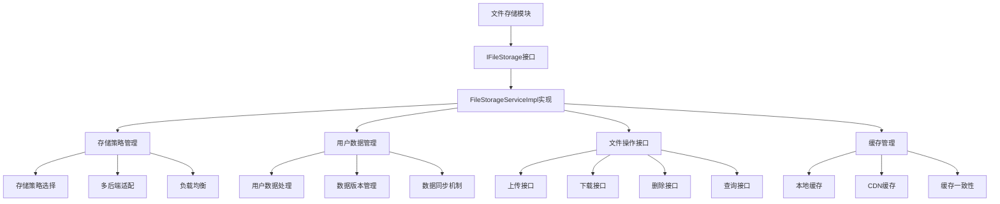
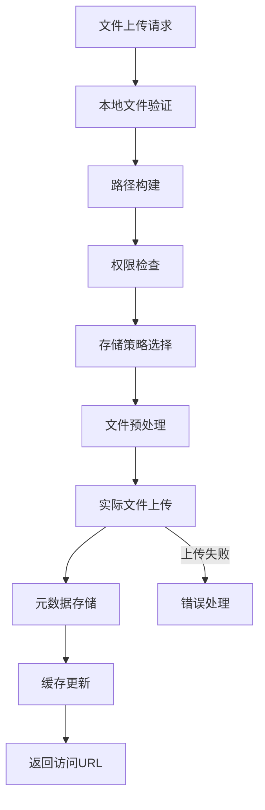
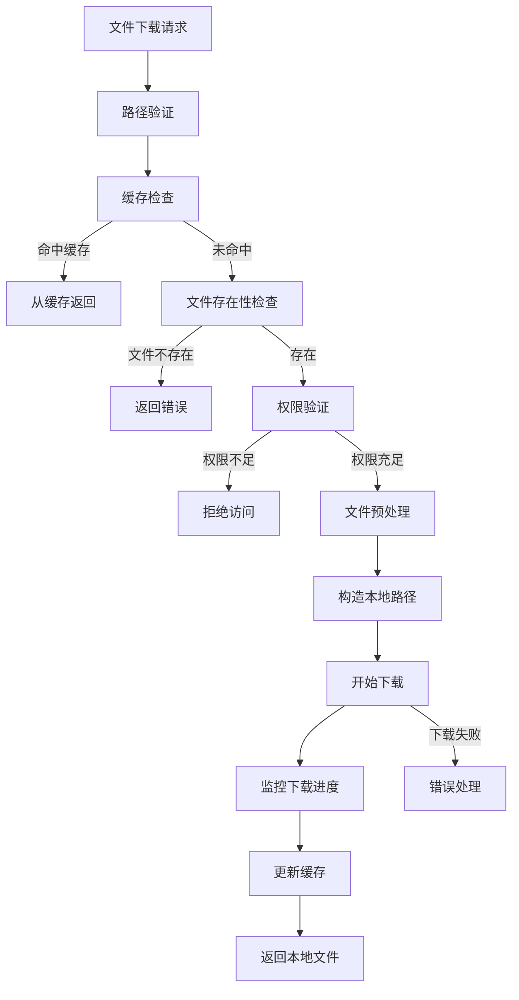
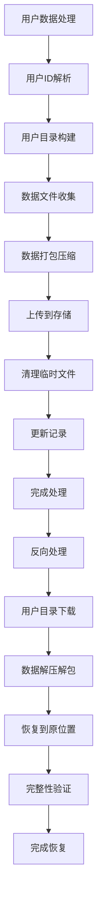

# 文件存储模块设计文档 (IFileStorage)

## 文档信息

| 模块名称 | 文件存储模块 |
|---------|--------------|
| 文档类型 | 模块设计文档 |
| 版本 | 1.0 |
| 日期 | 2026-02-14 |
| 所属系统 | BrowserGateway |
| 模块标识 | FileStorage |

---

## 1. 模块概述

### 1.1 模块职责

文件存储模块是BrowserGateway系统的核心支撑模块，负责用户数据和文件的统一抽象存储管理。模块通过IFileStorage接口提供文件上传、下载、删除和用户数据管理能力，主要职责包括：

- **用户数据管理**：管理浏览器用户的配置数据和状态信息
- **文件存储抽象**：为上层提供统一的文件操作接口，支持多种存储后端
- **安全访问控制**：确保文件访问的安全性和私有性
- **版本控制管理**：支持文件的版本控制和历史记录
- **性能优化策略**：实现缓存策略和异步处理，提升存储性能

### 1.2 设计目标

- **统一抽象**：屏蔽底层存储细节，提供统一的文件操作接口
- **高可用性**：99.9%的存储服务可用性
- **高性能**：毫秒级文件操作响应，高吞吐量并发访问
- **数据一致性**：确保文件操作的准确性和数据完整性
- **可扩展性**：支持多种存储后端和水平扩展

### 1.3 技术架构



---

## 2. 接口设计

### 2.1 IFileStorage核心接口

#### 接口定义
```java
/**
 * 文件存储服务接口，统一管理用户数据和文件操作
 */
public interface IFileStorage {
    
    /**
     * 上传文件到存储
     * 
     * @param localPath 本地文件路径
     * @param remotePath 远程存储路径
     * @return String 文件的访问URL，失败返回null
     */
    String uploadFile(String localPath, String remotePath);
    
    /**
     * 下载文件到本地
     * 
     * @param localPath 本地保存路径
     * @param remotePath 远程文件路径
     * @return File 本地文件对象，失败返回null
     */
    File downloadFile(String localPath, String remotePath);
    
    /**
     * 删除文件
     * 
     * @param path 文件路径
     * @return boolean 删除是否成功
     */
    boolean deleteFile(String path);
    
    /**
     * 检查文件是否存在
     * 
     * @param path 文件路径
     * @return boolean 文件是否存在
     */
    boolean exist(String path);
    
    /**
     * 获取文件大小
     * 
     * @param path 文件路径
     * @return long 文件大小(字节)，文件不存在返回-1
     */
    long getFileSize(String path);
    
    /**
     * 获取文件访问URL
     * 
     * @param path 文件路径
     * @param expireSeconds 过期时间(秒)
     * @return String 文件访问URL，失败返回null
     */
    String getFileUrl(String path, int expireSeconds);
    
    /**
     * 用户数据下载
     * 
     * @param userDataPath 用户数据目录
     * @param userId 用户ID
     * @param serverAddr 服务器地址
     * @return String 本地用户数据路径
     */
    String downloadUserData(String userDataPath, String userId, String serverAddr);
    
    /**
     * 用户数据上传
     * 
     * @param userDataPath 用户数据目录
     * @param userId 用户ID
     * @param serverAddr 服务器地址
     * @return boolean 上传是否成功
     */
    boolean uploadUserData(String userDataPath, String userId, String serverAddr);
    
    /**
     * 批量文件上传
     * 
     * @param fileMap 文件路径映射 {本地路径: 远程路径}
     * @return Map<String, String> 上传结果 {文件路径: 访问URL}
     */
    Map<String, String> batchUpload(Map<String, String> fileMap);
    
    /**
     * 批量文件删除
     * 
     * @param paths 文件路径集合
     * @return Map<String, Boolean> 删除结果 {文件路径: 是否成功}
     */
    Map<String, Boolean> batchDelete(Set<String> paths);
}
```

#### 异常设计
```java
/**
 * 文件存储相关异常
 */
public class FileStorageException extends RuntimeException {
    public FileStorageException(String message);
    public FileStorageException(String message, Throwable cause);
    
    /**
     * 文件上传异常
     */
    public static class UploadException extends FileStorageException {
        public UploadException(String localPath, String remotePath, String reason);
    }
    
    /**
     * 文件下载异常
     */
    public static class DownloadException extends FileStorageException {
        public DownloadException(String localPath, String remotePath, String reason);
    }
    
    /**
     * 文件删除异常
     */
    public static class DeleteException extends FileStorageException {
        public DeleteException(String path, String reason);
    }
    
    /**
     * 用户数据异常
     */
    public static class UserDataException extends FileStorageException {
        public UserDataException(String userId, String operation, String reason);
    }
    
    /**
     * 权限异常
     */
    public static class AccessException extends FileStorageException {
        public AccessException(String userId, String path, String operation);
    }
}
```

### 2.2 数据对象设计

#### StorageConfig - 存储配置

#### 数据结构
```
StorageConfig数据模型字段：
- storageType: StorageType - 存储类型
- accessKey: String - 访问密钥
- secretKey: String - 密钥
- region: String - 区域/地区
- bucketName: String - 存储桶名称
- endpoint: String - 服务端点
- basePath: String - 基础路径
- tempPath: String - 临时文件路径
- maxFileSize: int - 最大文件大小(MB)
- enableCache: boolean - 是否启用缓存
- cacheSize: int - 缓存大小(MB)
- cacheExpire: long - 缓存过期时间(秒)
- maxUploadThreads: int - 最大上传线程数
- maxDownloadThreads: int - 最大下载线程数
- connectTimeout: int - 连接超时(秒)
- readTimeout: int - 读取超时(秒)
- retryCount: int - 重试次数

存储类型枚举：
LOCAL - 本地文件系统
S3 - Amazon S3兼容存储
MINIO - MinIO对象存储
ALIYUN_OSS - 阿里云OSS
HUAWEI_OBS - 华为云OBS
```

#### 核心方法
```
StorageConfig类包含以下关键方法：

validate(): void
- 功能：验证配置有效性
- 步骤：
  1. 检查storageType非空
  2. 根据存储类型调用相应验证方法（LOCAL调用validateLocalConfig，其他调用validateCloudConfig）
  3. 调用validateCommonConfig验证通用配置
- 异常：任何验证失败抛出IllegalArgumentException

validateLocalConfig(): void
- 功能：验证本地存储配置
- 步骤：
  1. 检查basePath非空
  2. 验证basePath目录存在，不存在则创建
- 异常：验证失败抛出IllegalArgumentException

validateCloudConfig(): void
- 功能：验证云存储配置
- 步骤：
  1. 检查accessKey和secretKey非空
  2. 检查region非空
  3. 检查bucketName非空
  4. 检查endpoint非空
- 异常：任何为空时抛出IllegalArgumentException

validateCommonConfig(): void
- 功能：验证通用配置
- 步骤：
  1. 检查maxFileSize大于0
  2. 如果启用缓存，检查cacheSize大于0
  3. 检查connectTimeout和readTimeout大于0
- 异常：任何验证失败抛出IllegalArgumentException
```

#### FileInfo - 文件信息

#### 数据结构
```
FileInfo数据模型字段：
- path: String - 文件路径
- name: String - 文件名
- extension: String - 文件扩展名
- size: long - 文件大小(字节)
- lastModified: long - 最后修改时间戳
- hash: String - 文件哈希值
- accessUrl: String - 访问URL
- metadata: Map<String, Object> - 自定义元数据
```

#### 核心方法
```
FileInfo类包含以下关键方法：

create(String path, File file): FileInfo
- 功能：创建文件信息
- 步骤：
  1. 验证file非空且存在
  2. 创建FileInfo对象，设置path、name、size、lastModified
  3. 调用getExtension获取文件扩展名
  4. 初始化metadata为空Map
  5. 调用calculateFileHash计算文件哈希
- 返回值：文件存在返回FileInfo，否则返回null

getExtension(String fileName): String
- 功能：获取文件扩展名
- 逻辑：查找最后一个点号，返回点号后的内容
- 特殊：无点号或点号在开头时返回空字符串

calculateFileHash(File file): String
- 功能：计算文件哈希
- 逻辑：使用MD5算法计算文件哈希值
- 返回值：返回32位MD5哈希字符串

isValidFileName(): boolean
- 功能：判断是否是合法文件名
- 步骤：
  1. 检查name非空
  2. 检查文件名不包含非法字符：\ / : * ? " < > |
- 返回值：合法返回true，否则返回false

buildFullUrl(String baseUrl): String
- 功能：构建完整的访问URL
- 逻辑：拼接baseUrl和accessUrl，处理路径分隔符
- 返回值：返回完整URL，accessUrl为空时返回null
```

---

## 3. 核心流程设计

### 3.1 文件上传流程



#### 详细步骤说明

1. **文件验证**
   - 检查本地文件是否存在
   - 验证文件大小限制
   - 检查文件格式和安全性

2. **路径构建**
   - 根据文件类型和配置生成远程路径
   - 确保路径安全性，防止路径遍历
   - 规范化路径格式

3. **权限验证**
   - 检查用户对文件的访问权限
   - 验证存储桶权限
   - 确保操作符合安全策略

4. **存储策略选择**
   - 根据文件类型选择存储后端
   - 确定存储策略和冗余级别
   - 选择适当的存储路径

5. **文件预处理**
   - 检查文件是否需要压缩
   - 验证文件完整性
   - 生成文件哈希值

6. **实际执行上传**
   - 建立与存储服务的连接
   - 使用多线程或分块上传大文件
   - 实时上传进度监控

7. **元数据存储**
   - 保存文件的基本信息
   - 记录用户操作日志
   - 更新文件索引信息

8. **缓存更新**
   - 更新本地缓存
   - 刷新CDN缓存（如果启用）
   - 预热常用文件缓存

### 3.2 文件下载流程



#### 详细步骤说明

1. **请求验证**
   - 验证请求参数的有效性
   - 检查下载权限
   - 确认存储策略

2. **缓存检查**
   - 检查本地缓存是否存在该文件
   - 验证缓存有效性
   - 如果命中则直接返回

3. **文件存在性检查**
   - 在存储后端验证文件存在
   - 获取文件基本信息
   - 检查文件可用性

4. **权限和策略验证**
   - 验证用户的下载权限
   - 检查存储访问策略
   - 确认存储后端可用性

5. **预处理操作**
   - 创建本地目录结构
   - 分配临时存储空间
   - 设置文件下载参数

6. **执行下载**
   - 建立与存储的连接
   - 使用断点续传技术
   - 实现下载进度监控

7. **本地化处理**
   - 验证下载文件的完整性
   - 计算文件哈希值比较
   - 将文件移至最终存储位置

8. **缓存和索引更新**
   - 更新本地缓存
   - 刷新文件索引
   - 记录下载日志

### 3.3 用户数据处理流程



#### 详细步骤说明

1. **用户识别**
   - 解析传入的用户标识
   - 构建用户数据目录路径
   - 验证用户数据访问权限

2. **数据收集**
   - 遍历用户数据目录
   - 收集所有需要处理的文件
   - 构建文件路径映射关系

3. **数据打包**
   - 建立临时压缩包
   - 添加必要的元数据文件
   - 确保压缩包的完整性

4. **远程传输**
   - 建立与存储服务的连接
   - 上传数据压缩包
   - 生成访问URL和下载地址

5. **清理和记录**
   - 清理临时文件
   - 更新用户数据索引
   - 记录操作历史

6. **反向恢复**
   - 下载用户数据压缩包
   - 解压并恢复文件结构
   - 验证数据完整性

---

## 4. 存储策略设计

### 4.1 多存储后端支持

#### 存储适配器接口

**StorageAdapter接口方法：**

核心方法：
```java
void init(StorageConfig config) throws FileStorageException
- 功能：初始化存储适配器
- 逻辑：使用配置参数初始化存储连接和客户端

String uploadFile(String localPath, String remotePath) throws FileStorageException
- 功能：上传文件
- 返回：文件访问URL

File downloadFile(String localPath, String remotePath) throws FileStorageException
- 功能：下载文件到本地
- 返回：本地文件对象

boolean deleteFile(String path) throws FileStorageException
- 功能：删除文件
- 返回：删除是否成功

boolean exist(String path) throws FileStorageException
- 功能：检查文件是否存在
- 返回：文件是否存在

FileInfo getFileInfo(String path) throws FileStorageException
- 功能：获取文件信息
- 返回：文件信息对象

String getFileUrl(String path, int expireSeconds) throws FileStorageException
- 功能：获取文件访问URL
- 返回：文件访问URL
```

#### 本地文件系统适配器逻辑

**LocalFileSystemAdapter类核心方法：**

**init(StorageConfig config): void**
- 功能：初始化本地文件系统适配器
- 步骤：
  1. 保存basePath配置
  2. 创建基础目录，不存在则创建
- 异常：创建目录失败抛出FileStorageException

**uploadFile(String localPath, String remotePath): String**
- 功能：上传文件到本地文件系统
- 步骤：
  1. 构造完整目标路径
  2. 创建目标目录
  3. 验证源文件存在
  4. 计算源文件MD5哈希
  5. 执行文件复制
  6. 返回remotePath作为访问URL
- 返回值：成功返回远程路径，失败抛出UploadException

**downloadFile(String localPath, String remotePath): File**
- 功能：从本地文件系统下载文件
- 步骤：
  1. 构造源文件路径
  2. 验证源文件存在
  3. 创建目标目录
  4. 执行文件复制
  5. 返回目标文件对象
- 返回值：成功返回目标文件，失败抛出DownloadException

#### S3兼容存储适配器逻辑

**S3CompatibleAdapter类核心方法：**

**init(StorageConfig config): void**
- 功能：初始化S3兼容存储适配器
- 步骤：
  1. 保存配置参数
  2. 构建AWS凭证（使用accessKey和secretKey）
  3. 配置客户端连接参数（连接超时、读取超时）
  4. 创建S3客户端（使用builder模式）
  5. 配置endpoint和region（如果指定）
  6. 测试连接（调用listBuckets）
- 异常：初始化失败抛出FileStorageException

**uploadFile(String localPath, String remotePath): String**
- 功能：上传文件到S3兼容存储
- 步骤：
  1. 验证本地文件存在
  2. 构建ObjectMetadata（设置contentLength、contentType）
  3. 添加自定义元数据（上传时间、原始文件名）
  4. 创建PutObjectRequest
  5. 执行s3Client.putObject上传
  6. 返回remotePath
- 返回值：成功返回远程路径，失败抛出UploadException

**downloadFile(String localPath, String remotePath): File**
- 功能：从S3兼容存储下载文件
- 步骤：
  1. 创建目标文件和目录
  2. 调用s3Client.getObject获取S3Object
  3. 使用try-with-resources获取输入流和输出流
  4. 复制流数据到本地文件
  5. 返回目标文件对象
- 返回值：成功返回目标文件，失败抛出DownloadException

### 4.2 存储策略管理

#### 策略选择器逻辑

**StorageStrategySelector类核心方法：**

**registerAdapter(StorageType type, StorageAdapter adapter): void**
- 功能：注册存储适配器
- 步骤：
  1. 将adapter添加到adapters列表
  2. 使用type.name()作为key放入typeAdapters映射
  3. 记录注册成功的日志

**selectAdapter(StorageConfig config): StorageAdapter**
- 功能：根据配置选择适配器
- 步骤：
  1. 从config获取storageType
  2. 从typeAdapters获取对应类型的adapter
  3. 验证adapter非空
  4. 调用adapter.init(config)初始化
  5. 返回初始化后的adapter
- 异常：无注册适配器或初始化失败时抛出FileStorageException

**selectAdapterByPath(String path): StorageAdapter**
- 功能：根据文件路径选择适配器
- 逻辑：
  - user/或cache/开头的路径使用本地存储适配器
  - 其他路径使用第一个适配器
- 返回值：选择到的存储适配器

---

## 5. 缓存设计

### 5.1 多层缓存架构

#### 多层缓存管理器逻辑

**MultiLevelCacheManager类核心方法：**

**构造函数初始化：**
- 保存RedisTemplate引用
- 初始化本地缓存（Caffeine）：
  - 最大容量：1000
  - 写入过期时间：10分钟

**getFile(String filePath): CachedFile**
- 功能：获取文件
- 步骤：
  1. 检查本地缓存：获取缓存，验证未过期，记录本地缓存命中，返回
  2. 检查分布式缓存：调用getFromDistributedCache，命中则更新本地缓存并返回
  3. 缓存未命中：记录缓存未命中，返回null

**cacheFile(String filePath, CachedFile file): void**
- 功能：缓存文件
- 步骤：
  1. 更新本地缓存
  2. 更新分布式缓存
  3. 预热CDN缓存

**getFromDistributedCache(String filePath): CachedFile**
- 功能：从分布式缓存获取
- 步骤：
  1. 使用redisTemplate从cache路径获取值
  2. 类型转换为CachedFile
- 异常处理：获取失败返回null并记录警告日志

**putToDistributedCache(String filePath, CachedFile file): void**
- 功能：放入分布式缓存
- 步骤：
  1. 使用redisTemplate.opsForValue().set设置缓存
  2. 设置过期时间为file.expireTime
- 异常处理：存储失败记录警告日志

**warmCdnCache(String filePath, CachedFile file): void**
- 功能：预热CDN缓存
- 步骤：
  1. 使用异步执行器提交预热任务
  2. 调用cdnClient.warmCache预热缓存
- 异常处理：预热失败记录警告日志

### 5.2 缓存策略实现

#### 缓存策略逻辑

**CacheStrategy类核心方法：**

**generateCacheKey(String filePath, String userId): String**
- 功能：生成缓存键
- 逻辑：计算"file:" + MD5(filePath + ":" + userId)
- 返回值：32位MD5缓存键

**calculateCacheExpire(FileInfo fileInfo): Duration**
- 功能：计算缓存过期时间
- 逻辑：根据文件类型决定过期时间
  - 静态资源：24小时
  - 用户数据：10分钟
  - 普通文件：1小时
- 返回值：Duration对象

**shouldEvict(CachedFile oldFile, CachedFile newFile): boolean**
- 功能：判断是否应该淘汰缓存
- 逻辑：
  1. 检查最后修改时间，新文件时间更大则淘汰
  2. 检查缓存大小，超过MAX_CACHE_SIZE则淘汰
  3. 其他情况保留缓存
- 返回值：true表示淘汰，false表示保留

**isStaticResource(FileInfo fileInfo): boolean**
- 功能：判断是否为静态资源
- 逻辑：检查文件扩展名是否为css、js、png、jpg、html
- 返回值：是静态资源返回true

**isUserData(FileInfo fileInfo): boolean**
- 功能：判断是否为用户数据
- 逻辑：检查文件路径是否以"user/"开头
- 返回值：是用户数据返回true

---

## 6. 异步与并发设计

### 6.1 异步文件操作

#### 异步文件操作处理器逻辑

**AsyncFileOperationHandler类核心方法：**

**构造函数初始化：**
- 创建上传线程池：固定大小（CPU核心数*2），名称格式upload-pool-%d
- 创建下载线程池：固定大小（CPU核心数*2），名称格式download-pool-%d
- 创建任务队列：LinkedBlockingQueue，容量10000
- 调用startTaskProcessor启动任务处理线程

**submitUploadTask(String localPath, String remotePath): CompletableFuture<String>**
- 功能：提交异步文件上传任务
- 步骤：
  1. 创建CompletableFuture
  2. 创建FileOperationTask对象（UPLOAD类型）
  3. 尝试放入任务队列（阻塞1秒）
  4. 队列满时设置异常完成
  5. 捕获中断异常
- 返回值：CompletableFuture<String>供调用方跟踪

**submitDownloadTask(String localPath, String remotePath): CompletableFuture<File>**
- 功能：提交异步文件下载任务
- 步骤：与submitUploadTask类似，类型为DOWNLOAD
- 返回值：CompletableFuture<File>供调用方跟踪

**startTaskProcessor(): void**
- 功能：启动任务处理线程
- 步骤：
  1. 创建新线程，执行processTasks方法
  2. 设置线程名称file-operation-processor
  3. 设置为守护线程
  4. 启动线程

**processTasks(): void**
- 功能：处理任务队列
- 步骤：
  1. 无限循环
  2. 使用taskQueue.take()阻塞获取任务
  3. 捕获InterruptedException退出循环
  4. 调用processTask处理任务
  5. 捕获异常记录错误日志

**processTask(FileOperationTask task): void**
- 功能：处理单个任务
- 步骤：
  1. 根据任务类型分支处理（UPLOAD/DOWNLOAD）
  2. 调用相应的处理方法
  3. 捕获异常，设置future异常完成

**FileOperationTask数据模型字段：**
- type: FileOperationType
- localPath: String
- remotePath: String
- future: CompletableFuture<?>
- submitTime: long

**FileOperationType枚举：**
- UPLOAD
- DOWNLOAD

### 6.2 批量操作处理

#### 批量文件操作处理器逻辑

**BatchFileOperationHandler类核心方法：**

**batchUpload(Map<String, String> fileMap): Map<String, String>**
- 功能：批量上传文件
- 步骤：
  1. 创建CountDownLatch（计数器为fileMap大小）
  2. 创建results映射
  3. 遍历fileMap，为每个文件：
     - 调用asyncHandler.submitUploadTask
     - 设置whenComplete回调（记录结果，计数减1）
  4. 等待所有任务完成（最多30分钟）
  5. 捕获中断异常
  6. 返回results映射

**batchDownload(Map<String, String> pathMap): Map<String, File>**
- 功能：批量下载文件
- 步骤：与batchUpload类似，类型为File
- 返回值：Map<String, File>，包含本地文件路径和文件对象映射

---

## 7. 配置参数

### 7.1 存储配置

#### 基础配置
```yaml
# 文件存储模块配置
file-storage:
  # 基础路径配置
  paths:
    base: /opt/browsergateway/storage
    temp: /tmp/browsergateway/storage-temp
    user: /opt/browsergateway/storage/user
    cache: /opt/browsergateway/storage/cache
    backup: /opt/browsergateway/storage/backup
    
  # 文件大小限制
  file-size:
    max-size: 1073741824         # 1GB
    max-single: 52428800         # 50MB (单个文件)
    max-batch: 104857600        # 100MB (批量文件)
    
  # 缓存配置
  cache:
    enabled: true
    size: 1024000000            # 1GB
    expire-time: 600             # 10分钟(秒)
    preheat: true                # 启用缓存预热
    
  # 上传配置
  upload:
    chunk-size: 5242880          # 5MB (分片大小)
    max-retry: 3                 # 最大重试次数
    timeout: 300                 # 超时时间(秒)
    thread-pool-size: 10        # 上传线程池大小
    
  # 下载配置
  download:
    chunk-size: 5242880          # 5MB (分片大小)
    max-retry: 3                 # 最大重试次数
    timeout: 300                 # 超时时间(秒)
    thread-pool-size: 10        # 下载线程池大小
```

#### 存储后端配置
```yaml
# 存储后端配置
storage-backend:
  # 本地存储
  local:
    enabled: true
    path: /opt/browsergateway/storage
    
  # S3兼容存储
  s3:
    enabled: false
    access-key: ""
    secret-key: ""
    region: ""
    bucket-name: browser-gateway-resources
    endpoint: ""
    
  # MinIO存储
  minio:
    enabled: false
    access-key: ""
    secret-key: ""
    region: ""
    bucket-name: browser-gateway-resources
    endpoint: http://localhost:9000
    
  # 阿里云OSS
  aliyun:
    enabled: false
    access-key: ""
    secret-key: ""
    region: ""
    bucket-name: browser-gateway-resources
    endpoint: https://oss-cn-hangzhou.aliyuncs.com
```

### 7.2 性能配置

#### 性能调优参数
```yaml
# 性能调优配置
performance:
  # 线程池配置
  thread-pool:
    core-size: 10               # 核心线程数
    max-size: 50                # 最大线程数
    queue-capacity: 1000        # 队列容量
    keep-alive: 60              # 线程保活时间(秒)
    
  # 内存配置
  memory:
    heap-size: 2g               # 内存限制
    direct-buffer-size: 512m    # 直接缓冲区大小
    cache-ratio: 0.3           # 内存使用比例
  
  # 网络配置
  network:
    receive-buffer: 65536       # 接收缓冲区
    send-buffer: 65536          # 发送缓冲区
    connect-timeout: 5000       # 连接超时(毫秒)
    read-timeout: 30000         # 读取超时(毫秒)
    retry-policy: exponential    # 重试策略
```

#### 监控配置
```yaml
# 监控配置
monitoring:
  # 指标收集
  metrics:
    enabled: true
    interval: 60000             # 收集间隔(毫秒)
    history-size: 1000          # 历史数据大小
    
  # 日志配置
  logging:
    level: INFO
    log-operations: true        # 是否记录操作日志
    log-performance: true       # 是否记录性能日志
    
  # 告警配置
  alert:
    enabled: true
    cache-hit-rate-low: 0.8    # 缓存命中率低
    upload-failure-rate: 0.01   # 上传失败率
    bandwidth-threshold: 100m   # 带宽阈值
```

---

## 8. 监控与指标

### 8.1 存储操作指标

#### 基础操作指标逻辑

**StorageOperationMetrics类核心方法：**

**构造函数初始化：**
- 注册uploadCounter（上传计数）
- 注册downloadCounter（下载计数）
- 注册deleteCounter（删除计数）
- 注册operationTimer（操作耗时）

**startOperation(String operationType): Timer.Sample**
- 功能：记录操作开始
- 返回值：Timer.Sample对象

**recordUploadOperation(Timer.Sample start, long fileSize, String fileType): void**
- 功能：记录上传操作
- 步骤：
  1. uploadCounter.increment(tag: type=fileType)
  2. 停止计时器并记录操作Timer（tags: operation=upload, type=fileType）
  3. 记录文件大小指标gauge

**recordDownloadOperation(Timer.Sample start, long fileSize, String fileType): void**
- 功能：记录下载操作
- 步骤：与recordUploadOperation类似，operation=download

**recordDeleteOperation(String fileType): void**
- 功能：记录删除操作
- 逻辑：deleteCounter.increment(tag: type=fileType)

#### 缓存命中率指标逻辑

**CacheHitRateMetrics类核心方法：**

**构造函数初始化：**
- 注册localCacheHitCounter和localCacheMissCounter
- 注册distributedCacheHitCounter和distributedCacheMissCounter
- 注册cache.hit.rate.gauge（本地和分布式命中率）

**recordLocalCacheHit(String filePath): void**
- 功能：记录本地缓存命中
- 逻辑：localCacheHitCounter.increment(tag: file=filePath)

**recordLocalCacheMiss(String filePath): void**
- 功能：记录本地缓存未命中
- 逻辑：localCacheMissCounter.increment(tag: file=filePath)

**recordDistributedCacheHit(String filePath): void**
- 功能：记录分布式缓存命中
- 逻辑：distributedCacheHitCounter.increment(tag: file=filePath)

**recordDistributedCacheMiss(String filePath): void**
- 功能：记录分布式缓存未命中
- 逻辑：distributedCacheMissCounter.increment(tag: file=filePath)

**calculateCacheHitRate(Counter hitCounter, Counter missCounter): double**
- 功能：计算缓存命中率
- 逻辑：hits / (hits + misses)，避免除以零
- 返回值：0.0~1.0之间的命中率

### 8.2 告警规则

#### 存储操作告警
```yaml
# 存储操作告警规则
alerts:
  storage_operations:
    # 上传失败率过高
    - name: upload_failure_rate
      condition: > rate(storage_operation_upload_error_total[5m]) / rate(storage_operation_upload_total[5m]) > 0.05
      duration: 5m
      severity: warning
    
    # 下载失败率过高
    - name: download_failure_rate
      condition: > rate(storage_operation_download_error_total[5m]) / rate(storage_operation_download_total[5m]) > 0.05
      duration: 5m
      severity: warning
    
    # 文件大小异常
    - name: abnormal_file_size
      condition: > histogram_quantile(0.95, rate(storage_upload_file_size_bucket[5m])) > 1073741824  # 1GB
      duration: 5m
      severity: critical
    
    # 操作时间过长
    - name: slow_operation
      condition: > histogram_quantile(0.95, rate(storage_operation_duration_bucket[5m])) > 60000  # 1分钟
      duration: 5m
      severity: warning
```

#### 缓存告警
```yaml
# 缓存告警规则
cache_alerts:
  # 缓存命中率低
  - name: low_cache_hit_rate
    condition: > (1 - (rate(cache_local_miss_total[5m]) / rate(cache_local_total[5m]))) < 0.5
    duration: 10m
    severity: critical
  
  # 缓存空间不足
  - name: cache_space_exhausted
    condition: > cache_usage_ratio > 0.9
    duration: 5m
    severity: warning
  
  # 缓存驱逐频率过高
  - name: high_cache_eviction_rate
    condition: > rate(cache_evict_total[5m]) > 100
    duration: 5m
    severity: warning
```

#### 性能告警
```yaml
# 性能告警规则
performance_alerts:
  # 存储带宽过高
  - name: high_storage_bandwidth
    condition: > rate(storage_bytes_transferred_total[1m]) > 104857600  # 100MB/min
    duration: 2m
    severity: warning
  
  # 异步任务队列积压
  - name: async_task_backlog
    condition: > async_task_queue_size > 10000
    duration: 1m
    severity: warning
  
  # 磁盘空间不足
  - name: disk_space_low
    condition: > disk_usage_percentage > 80
    duration: 5m
    severity: critical
```

---

本文件存储模块设计文档提供了完整的文件存储抽象、多后端适配、缓存管理方案。基于此文档开发团队可以准确实现IFileStorage模块，确保用户数据和文件的高效可靠存储，满足系统对文件存储管理的各种需求。