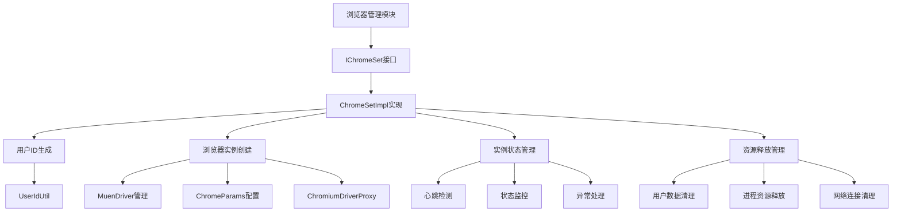
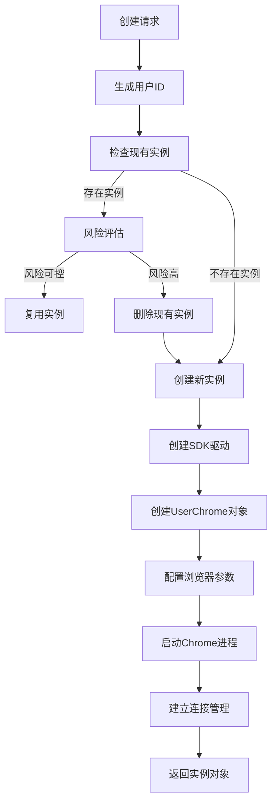
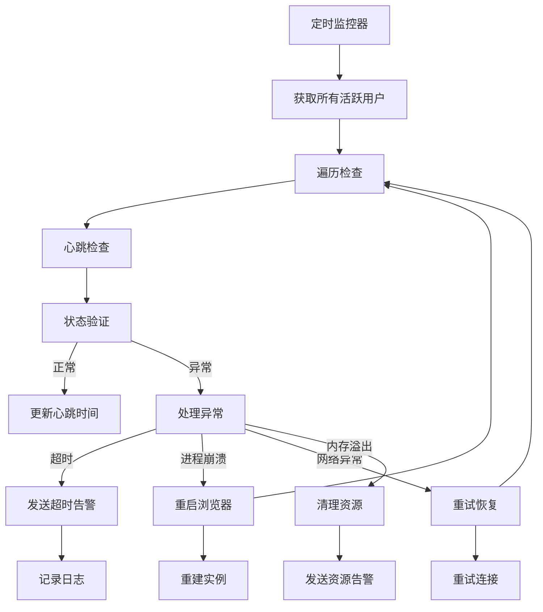
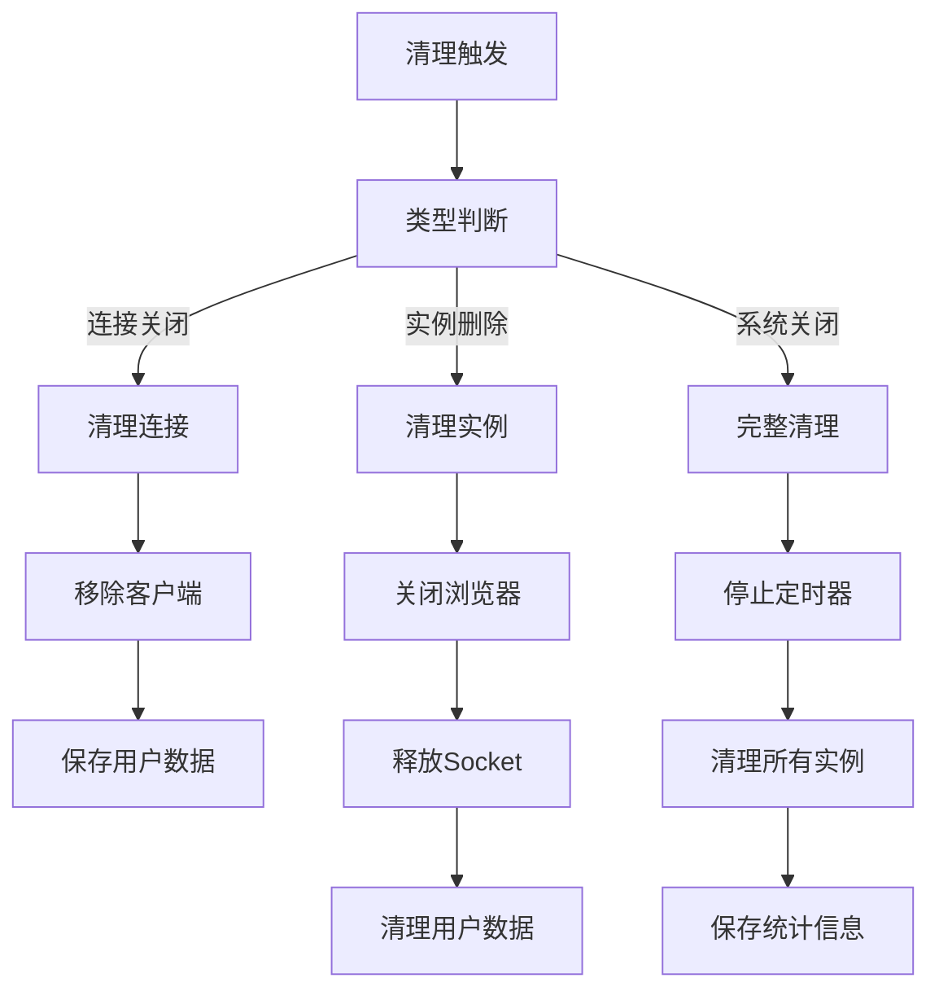

# 浏览器管理模块设计文档 (IChromeSet)

## 文档信息

| 模块名称 | 浏览器管理模块 |
|---------|--------------|
| 文档类型 | 模块设计文档 |
| 版本 | 1.0 |
| 日期 | 2026-02-14 |
| 所属系统 | BrowserGateway |
| 模块标识 | ChromeSet |

---

## 1. 模块概述

### 1.1 模块职责

浏览器管理模块是BrowserGateway系统的核心业务模块，负责用户浏览器实例的全生命周期管理。模块通过接口IChromeSet对外提供服务，主要职责包括：

- **用户会话管理**：创建和管理用户与浏览器实例的映射关系
- **浏览器实例创建**：根据用户需求创建独立的Chrome浏览器实例
- **实例状态监控**：实时监控浏览器实例的运行状态和健康度
- **实例销毁清理**：安全销毁浏览器实例并释放相关资源
- **用户资源隔离**：确保不同用户的浏览器资源完全隔离

### 1.2 设计目标

- **高并发支持**：单实例支持1000+并发用户访问
- **快速响应**：浏览器实例创建时间<3秒
- **资源隔离**：完全隔离用户数据和浏览器进程
- **高可用性**：99.9%的服务可用性
- **自动恢复**：异常情况下自动重启浏览器实例

### 1.3 技术架构



---

## 2. 接口设计

### 2.1 IChromeSet核心接口

#### 接口定义
```java
/**
 * 浏览器管理服务接口，负责用户浏览器实例的全生命周期管理
 */
public interface IChromeSet {
    /**
     * 创建用户浏览器实例
     * 
     * @param request 浏览器初始化请求
     * @return UserChrome 用户浏览器实例
     */
    UserChrome create(InitBrowserRequest request);
    
    /**
     * 根据用户ID获取浏览器实例
     * 
     * @param userId 用户唯一标识
     * @return UserChrome 用户浏览器实例，不存在返回null
     */
    UserChrome get(String userId);
    
    /**
     * 删除用户浏览器实例
     * 
     * @param userId 用户唯一标识
     */
    void delete(String userId);
    
    /**
     * 重启用户浏览器实例
     * 先删除现有实例，然后重新创建
     * 
     * @param userId 用户唯一标识
     */
    void deleteForRestart(String userId);
    
    /**
     * 重启用户浏览器实例
     * 
     * @param userId 用户唯一标识
     * @param request 新的浏览器初始化请求
     * @return 重启的浏览器实例
     */
    UserChrome restart(String userId, InitBrowserRequest request);
    
    /**
     * 获取所有活跃用户ID
     * 
     * @return 用户ID集合
     */
    Set<String> getAllUser();
    
    /**
     * 获取浏览器实例统计信息
     * 
     * @return 统计信息
     */
    ChromeStatistics getStatistics();
}
```

#### 异常设计
```java
/**
 * 浏览器管理相关异常
 */
public class ChromeException extends RuntimeException {
    public ChromeException(String message);
    public ChromeException(String message, Throwable cause);
    
    /**
     * 浏览器创建异常
     */
    public static class CreateException extends ChromeException {
        public CreateException(String message, Throwable cause);
    }
    
    /**
     * 浏览器连接异常
     */
    public static class ConnectionException extends ChromeException {
        public ConnectionException(String userId, Throwable cause);
    }
    
    /**
     * 浏览器状态异常
     */
    public static class StatusException extends ChromeException {
        public StatusException(String userId, BrowserStatus status);
    }
}
```

### 2.2 数据对象设计

#### UserChrome - 用户浏览器实例

#### 数据结构
```
UserChrome数据模型字段：
- userId: String - 唯一用户标识（final）
- options: BrowserOptions - 浏览器配置选项
- chromeDriver: ChromiumDriverProxy - Chrome驱动代理
- muenDriver: MuenDriver - Moon SDK驱动（final）
- userData: UserData - 用户数据管理器（final）
- controlClientSet: ControlClientSet - 控制客户端集合（final）
- mediaClientSet: MediaClientSet - 媒体客户端集合（final）
- chromeParams: ChromeParams - SDK返回的浏览器配置
- status: BrowserStatus - 实例状态
- heartbeats: long - 心跳时间戳
```

#### 核心方法
```
UserChrome类包含以下关键方法：

构造函数 public UserChrome(InitBrowserRequest request, IFileStorage fs, Config config, 
                         MuenDriver muenDriver, ControlClientSet controlClientSet, 
                         MediaClientSet mediaClientSet, IRemote remote)
- 功能：创建用户浏览器实例
- 步骤：
  1. 调用UserIdUtil生成用户ID（基于IMEI和IMSI）
  2. 初始化用户数据管理器UserData
  3. 调用userData.download()下载用户数据
  4. 调用request.buildBrowserOptions()构建浏览器选项
  5. 保存连接管理和SDK驱动引用
  6. 初始化状态为NORMAL，心跳时间戳
- 返回值：构造完成的UserChrome对象

createBrowser(ChromeRecordConfig params): void
- 功能：创建实际浏览器进程
- 步骤：
  1. 配置浏览器窗口视点（viewpoint）
  2. 设置录制数据（recordData）
  3. 根据扩展路径判断浏览器类型（KEYS或TOUCH）
  4. 设置扩展ID和扩展路径
  5. 设置limit参数
  6. 创建ChromiumDriverProxy实例并启动Chrome

closeApp(): void
- 功能：关闭应用程序连接
- 步骤：
  1. 从controlClientSet和mediaClientSet中删除userId
  2. 调用muenDriver.onControlTcpDisconnected()通知SDK
  3. 调用chromeDriver.saveUserdata()保存用户数据
  4. 调用userData.upload()上传用户数据

closeInstance(): void
- 功能：关闭实例并释放资源
- 步骤：
  1. 如果chromeDriver非空，调用quit()退出
  2. 调用userData.upload()上传用户数据

setHeartbeats(long heartbeats): void
- 功能：设置心跳时间
- 逻辑：更新heartbeats字段为传入值

setStatus(BrowserStatus status): void
- 功能：更新浏览器状态
- 逻辑：更新status字段并记录状态变更日志
```

#### BrowserStatus - 浏览器状态枚举

#### 数据结构
```
BrowserStatus枚举值：
- NORMAL("正常") - 正常运行状态
- PRE_OPENING("预开启中") - 预开启状态
- CONNECTING("连接中") - 正在连接
- RECORDING("录制中") - 正在录制
- OPEN_ERROR("开启错误") - 实例开启失败
- CONNECTION_ERROR("连接错误") - 连接失败
- PAGE_CONTROL_ERROR("页面控制错误") - 页面控制异常
- NETWORK_ERROR("网络错误") - 网络异常
- MEMORY_ERROR("内存错误") - 内存溢出等
- CLOSING("关闭中") - 正在关闭
- CLOSED("已关闭") - 已关闭

字段：
- description: String - 状态描述
```

#### 核心方法
```
BrowserStatus枚举包含以下方法：

getDescription(): String
- 功能：获取状态描述
- 返回值：description字段值

isHealthy(): boolean
- 功能：判断是否为健康状态
- 逻辑：检查是否为NORMAL、PRE_OPENING或CONNECTING
- 返回值：健康状态返回true

isTerminal(): boolean
- 功能：判断是否为终止状态
- 逻辑：检查是否为CLOSED
- 返回值：终止状态返回true
```

---

## 3. 核心流程设计

### 3.1 浏览器实例创建流程



#### 详细步骤说明

1. **用户ID生成**
   - 使用IMEI和IMSI生成唯一用户标识
   - 确保用户标识的唯一性和一致性

2. **实例状态检查**
   - 检查是否已存在该用户的浏览器实例
   - 评估是否需要复用现有实例

3. **资源清理（如需要）**
   - 安全关闭现有浏览器实例
   - 释放相关资源并保存用户数据

4. **SDK驱动创建**
   - 通过PluginManage创建MuenDriver实例
   - 注入HWCallback回调接口

5. **浏览器对象初始化**
   - 创建UserChrome核心对象
   - 初始化用户数据管理器

6. **浏览器配置**
   - 根据用户请求构建Chrome配置
   - 设置分辨率、编码参数等关键配置

7. **Chrome进程启动**
   - 使用ChromiumDriverProxy启动Chrome
   - 加载必要的扩展和插件

8. **连接管理建立**
   - 初始化控制客户端和媒体客户端
   - 建立与客户端的通信通道

### 3.2 实例监控管理流程



#### 详细步骤说明

1. **定时监控**
   - 定时(每30秒)扫描所有活跃用户
   - 获取用户对应的浏览器实例

2. **心跳检查**
   - 检查用户最后心跳时间
   - 判断是否超时(默认5分钟)

3. **状态验证**
   - 验证Chrome进程是否存活
   - 检查WebSocket连接状态

4. **异常处理**
   - 根据异常类型选择对应处理策略
   - 包括重启、告警、资源清理等

5. **状态恢复**
   - 尝试重启异常的浏览器实例
   - 更新监控状态和告警信息

### 3.3 资源清理流程



#### 详细步骤说明

1. **清理触发判断**
   - 根据触发类型选择清理策略
   - 分为连接关闭、实例删除、系统关闭三种情况

2. **连接清理**
   - 移除对应的控制客户端和媒体客户端
   - 保存用户数据和会话信息

3. **实例清理**
   - 安全关闭Chrome进程
   - 释放网络连接资源
   - 清理临时文件

4. **系统级清理**
   - 停止定时监控任务
   - 清理所有活跃实例
   - 保存系统统计信息

---

## 4. 状态管理设计

### 4.1 状态转换机制

#### 状态机设计
```
[SYSTEM_INIT] → [NORMAL] ←→ [PRE_OPENING] ←→ [CONNECTING]
    ↓             ↓         ↓           ↓
[CLOSED]     [OPEN_ERROR][CONNECTION_ERROR][PAGE_CONTROL_ERROR]
    ↑             ↑         ↑           ↑
   reboot     retry    reconnect    fallback
```

#### 状态转换规则逻辑

**StatusManager类核心方法：**

**applyConnectionStatus(UserChrome chrome, WebSocketSession session): void**
- 功能：应用连接状态转换
- 逻辑：
  - 如果当前状态为NORMAL且session非空，转换为CONNECTING
  - 如果session为空，转换为CLOSED
- 调用：chrome.setStatus()更新状态

**handlePageControlError(UserChrome chrome): void**
- 功能：处理页面控制异常
- 步骤：
  1. 调用chrome.setStatus(BrowserStatus.PAGE_CONTROL_ERROR)
  2. 触发告警，调用reportAlarm()上报异常

**canRestart(UserChrome chrome, InitBrowserRequest newRequest): boolean**
- 功能：评估重启可行性
- 逻辑：
  1. 检查配置是否变化（对比chromeParams和newRequest.toChromeParams()）
  2. 如果配置变化，返回true
  3. 检查错误类型：非终止状态且非OPEN_ERROR返回true
  4. 其他情况返回false
- 返回值：可以重启返回true，否则返回false

### 4.2 心跳监控机制

#### 心跳检测设计逻辑

**HeartbeatMonitor类核心方法：**

**monitorHeartbeats(): void** - @Scheduled(fixedRate = 10000)
- 功能：定时监控心跳（每10秒）
- 步骤：
  1. 从chromeSet获取所有活跃用户
  2. 获取当前时间currentTime
  3. 遍历所有用户：
     - 获取UserChrome实例
    - 检查心跳时间差是否超过MAX_HEARTBEAT_INTERVAL（5分钟）
     - 超时则调用handleTimeout()处理

**handleTimeout(UserChrome chrome): void**
- 功能：处理心跳超时
- 步骤：
  1. 记录警告日志
  2. 更新chrome状态为CONNECTION_ERROR
  3. 发送告警（告警枚举ALARM_300034）
  4. 调用tryReconnect()尝试恢复连接

**tryReconnect(UserChrome chrome): void**
- 功能：尝试重新连接
- 逻辑：调用chrome.deleteForRestart()重启实例

---

## 5. 错误处理设计

### 5.1 异常分类处理

#### 异常处理器逻辑

**ChromeExceptionHandler类核心方法：**

**handleCreateException(String userId, Exception e): void**
- 功能：处理实例创建异常
- 步骤：
  1. 记录错误日志
  2. 发送告警（告警枚举ALARM_300033）
  3. 调用statistics.recordError()记录错误码

**handleConnectionException(String userId, Exception e): void**
- 功能：处理连接异常
- 步骤：
  1. 记录错误日志
  2. 获取UserChrome实例
  3. 如果存在，更新状态为CONNECTION_ERROR
  4. 发送告警（告警枚举ALARM_300034）

**handleProcessException(String userId, Exception e): void**
- 功能：处理进程异常
- 步骤：
  1. 记录错误日志
  2. 调用tryRecoverProcess()尝试恢复进程

**tryRecoverProcess(String userId): void**
- 功能：尝试恢复进程
- 步骤：
  1. 获取UserChrome实例，不存在则直接返回
  2. 调用closeApp()和closeConnection()关闭异常实例
  3. 使用scheduledThreadPool延迟2秒执行：
     - 调用chromeSet.restart()重启实例
     - 重启失败记录错误日志

### 5.2 重试机制逻辑

**RetryConfig类核心方法：**

**browserCreateRetryTemplate(): RetryTemplate** - @Bean
- 功能：创建浏览器创建重试策略模板
- 步骤：
  1. 创建RetryTemplate实例
  2. 配置指数退避策略：
     - 初始间隔：1秒
     - 指数倍数：2.0
     - 最大间隔：10秒
  3. 配置简单重试策略：最大尝试次数3次
  4. 设置退避策略和重试策略
- 返回值：配置完成的RetryTemplate对象

**createWithRetry(InitBrowserRequest request): UserChrome**
- 功能：带重试的浏览器创建
- 步骤：
  1. 获取 RetryTemplate 实例
  2. 执行重试逻辑：
     - 调用create()创建浏览器
     - 记录成功统计
     - 返回结果
  3. 重试失败处理：
     - 记录重试失败错误
     - 抛出CreateException
  4. 捕获所有异常，调用handleCreateException()处理
- 返回值：成功返回UserChrome，失败抛出异常

---

## 6. 性能优化设计

### 6.1 实例池优化

#### 实例池逻辑

**ChromeInstancePool类核心方法：**

**getInstance(String userId, Supplier<UserChrome> supplier): UserChrome**
- 功能：获取实例
- 逻辑：
  1. 使用instanceCache.computeIfAbsent方法
  2. 如果不存在则调用supplier创建新实例
  3. 如果创建成功，将userId加入idleQueue
  4. 返回获取或创建的实例

**returnInstance(String userId): void**
- 功能：回收实例
- 步骤：
  1. 从instanceCache获取UserChrome实例
  2. 如果存在且状态为NORMAL，将userId加入idleQueue

**preCreateIdleInstances(): void** - @Scheduled(fixedDelay = 60000)
- 功能：预创建空闲实例（每分钟）
- 步骤：
  1. 获取当前实例数和目标池大小
  2. 循环创建实例直到达到目标大小：
     - 生成伪用户ID
     - 调用createIdleInstance()创建空闲实例
     - 放入instanceCache和idleQueue
     - 创建失败时记录警告并中断循环

### 6.2 内存管理优化

#### 内存管理器逻辑

**MemoryManager类核心方法：**

**monitorMemory(): void** - @Scheduled(fixedRate = 30000)
- 功能：定时监控内存（每30秒）
- 步骤：
  1. 计算已使用内存和最大内存
  2. 计算内存使用率
  3. 如果使用率超过0.8，调用handleMemoryWarning()处理

**handleMemoryWarning(): void**
- 功能：处理内存警告
- 步骤：
  1. 记录警告日志
  2. 调用clearIdleInstances()清理空闲实例
  3. 调用System.gc()执行垃圾回收
  4. 再次检查内存使用率，超过0.85则调用forceClearInstances()强制清理

**clearIdleInstances(): void**
- 功能：清理空闲实例
- 说明：实现空闲实例清理逻辑

---

## 7. 配置参数

### 7.1 基础配置

#### 浏览器基础参数
```yaml
# 浏览器管理模块基础配置
chrome:
  # 默认浏览器参数
  default:
    width: 1920
    height: 1080
    frame-rate: 30
    bit-rate: 2000
    sample-rate: 44100
    channels: 2
    
  # 实例池配置
  pool:
    min-size: 10      # 最小实例数
    max-size: 100     # 最大实例数
    idle-timeout: 300 # 空闲超时时间(秒)
    
  # 心跳配置
  heartbeat:
    interval: 30000          # 心跳间隔(毫秒)
    max-interval: 300000     # 最大允许间隔(毫秒)
    monitor-interval: 10000  # 监控间隔(毫秒)
    
  # 错误处理配置
  error:
    retry-attempts: 3         # 重试次数
    retry-interval: 1000      # 重试间隔(毫秒)
    max-wait-time: 30000     # 最大等待时间(毫秒)
```

#### 连接管理配置
```yaml
# 连接管理配置
connection:
  # 控制流连接
  control:
    buffer-size: 1024000     # 缓冲区大小
    timeout: 30000           # 连接超时(毫秒)
    max-connections: 1000    # 最大连接数
    
  # 媒体流连接
  media:
    buffer-size: 2048000     # 缓冲区大小
    timeout: 30000           # 连接超时(毫秒)
    max-connections: 1000    # 最大连接数
    
  # WebSocket连接
  websocket:
    buffer-size: 1024000     # 缓冲区大小
    idle-timeout: 300000     # 空闲超时(毫秒)
    max-frames: 100000       # 最大帧数限制
```

### 7.2 性能调优参数

#### 内存配置
```yaml
# 内存使用配置
memory:
  # JVM内存分配
  jvm:
    heap-size: 16G           # 堆内存大小
    max-metaspace: 512M      # 元空间大小
    direct-buffer-size: 1G   # 直接缓冲区大小
    
  # 内存监控配置
  monitor:
    usage-threshold: 0.8     # 使用率阈值
    gc-threshold: 0.85       # GC触发阈值
    alert-threshold: 0.9     # 告警阈值
    
  # 垃圾回收配置
  gc:
    young-size: 4G          # 年轻代大小
    old-size: 8G            # 老年代大小
    gc-threads: 4           # GC线程数
```

#### 性能指标配置
```yaml
# 性能监控配置
performance:
  # 指标收集
  metrics:
    interval: 10000          # 收集间隔(毫秒)
    history-size: 1000       # 历史数据大小
    
  # 告警阈值
  alert:
    response-time: 1000     # 响应时间阈值(毫秒)
    error-rate: 0.01         # 错误率阈值(1%)
    retry-rate: 0.05         # 重试率阈值(5%)
    
  # 统计配置
  statistics:
    collect-interval: 60000  # 收集间隔(毫秒)
    report-interval: 300000  # 上报间隔(毫秒)
```

---

## 8. 监控与指标

### 8.1 关键指标定义

#### 实例指标逻辑

**ChromeMetrics类核心方法：**

**构造函数初始化：**
- 注册totalInstances、activeInstances、createErrors计数器

**incrementTotalInstances(): void**
- 功能：实例总数增加
- 逻辑：totalInstances.incrementAndGet()并更新计数器指标

**updateActiveInstances(long count): void**
- 功能：更新活跃实例数
- 逻辑：activeInstances.set(count)并更新gauge指标

**recordCreationTime(long duration): void**
- 功能：记录实例创建耗时
- 逻辑：使用timer记录创建时间（单位：毫秒）

**recordCreateError(): void**
- 功能：记录实例创建错误
- 逻辑：createErrors.incrementAndGet()并更新错误计数器

**getStatistics(): Map<String, Object>**
- 功能：获取统计信息
- 步骤：
  1. 创建stats映射对象
  2. 放入total_instances、active_instances、create_errors
  3. 计算error_rate（createErrors / totalInstances，避免除以零）
  4. 返回统计信息映射

#### 性能指标逻辑

**PerformanceMetrics类核心方法：**

**构造函数初始化：**
- 注册MeterRegistry引用

**recordResponseTime(String operation, long duration): void**
- 功能：记录响应时间监控
- 逻辑：使用Timer记录操作耗时，带operation标签

**Throughput(String operation): void**
- 功能：吞吐量监控
- 逻辑：通过putCounter记录吞吐量，带operation标签

**recordMemoryUsage(): void**
- 功能：记录资源使用监控
- 步骤：
  1. 获取MemoryMXBean实例
  2. 获取堆内存使用量和最大值
  3. 注册gauge指标记录已使用、最大值和使用率百分比

**recordThreadUsage(): void**
- 功能：记录线程监控
- 步骤：
  1. 获取ThreadMXBean实例
  2. 注册gauge指标记录线程数、守护线程数、峰值线程数

### 8.2 告警规则

#### 实例告警规则
```yaml
# 实例告警规则
alerts:
  browser_management:
    # 实例创建失败率
    - name: create_failure_rate
      condition: > avg(chrome.errors.create[5m]) > 10
      duration: 5m
      severity: warning
    
    # 活跃实例过多
    - name: too_many_instances
      condition: > max(chrome.instances.active) > 800
      duration: 10m
      severity: critical
    
    # 实例启动缓慢
    - name: slow_startup
      condition: > avg(chrome.creation.time[5m]) > 5000
      duration: 10m
      severity: warning
    
    # 异常实例数量
    - name: abnormal_instances
      condition: > count(chrome.instances{status!="normal}) > 50
      duration: 5m
      severity: warning
```

#### 性能告警规则
```yaml
# 性能告警规则
performance_alerts:
  # 内存使用率过高
  - name: high_memory_usage
    condition: > avg(chrome.memory.heap.used.percent[5m]) > 0.85
    duration: 5m
    severity: critical
  
  # 响应时间过长
  - name: slow_response
    condition: > avg(chrome.response.time[5m]) > 1000
    duration: 5m
    severity: warning
  
  # 错误率过高
  - name: high_error_rate
    condition: > avg(chrome.errors.rate[5m]) > 0.01
    duration: 10m
    severity: critical
  
  # 线程数过多
  - name: too_many_threads
    condition: > avg(chrome.threads.count[5m]) > 500
    duration: 5m
    severity: warning
```

---

本浏览器管理模块设计文档提供了完整的模块架构、接口设计、流程实现和性能优化方案。基于此文档开发团队可以准确实现IChromeSet模块，确保满足高并发、低延迟、高可用的业务需求。