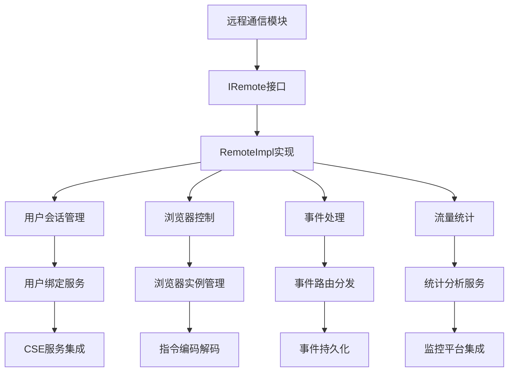
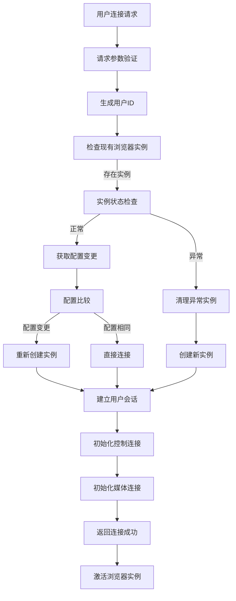
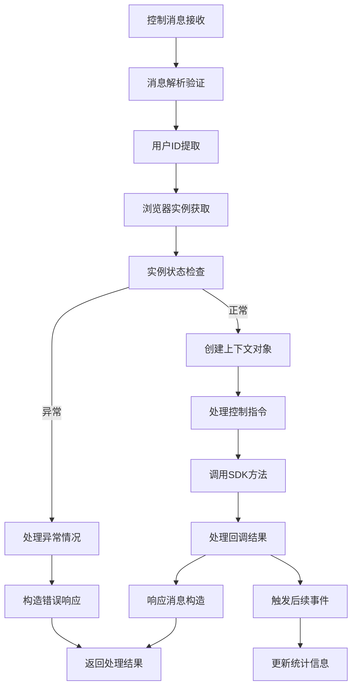
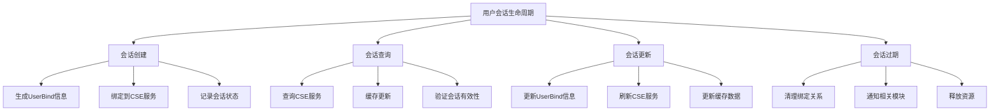

# 远程通信模块设计文档 (IRemote)

## 文档信息

| 模块名称 | 远程通信模块 |
|---------|--------------|
| 文档类型 | 模块设计文档 |
| 版本 | 1.0 |
| 日期 | 2026-02-14 |
| 所属系统 | BrowserGateway |
| 模块标识 | Remote |

---

## 1. 模块概述

### 1.1 模块职责

远程通信模块是BrowserGateway系统的核心业务模块，负责系统与外部服务的所有通信交互。模块通过IRemote接口对外提供丰富的通信服务，主要职责包括：

- **用户会话管理**：处理用户绑定信息的获取、更新和管理
- **浏览器控制**：接收客户端指令，分发给浏览器实例进行处理
- **事件处理**：统一处理系统事件和用户操作事件
- **流量统计**：收集并上报控制流和媒体流的流量数据
- **数据上报**：向监控平台报送会话数据和性能指标

### 1.2 设计目标

- **高可靠性**：99.99%的通信可用性
- **低延迟**：端到端响应时间<100ms
- **高吞吐量**：支持10万+并发连接
- **数据一致性**：确保用户会话状态的准确同步
- **异常恢复**：具备完善的异常处理和重试机制

### 1.3 技术架构



---

## 2. 接口设计

### 2.1 IRemote核心接口

#### 接口定义
```java
/**
 * 远程通信服务接口，负责与外部系统的所有通信交互
 */
public interface IRemote {
    
    /**
     * 创建浏览器实例并建立连接
     * 
     * @param receivedControlPackets 控制数据包
     * @param parsedParams 解析后的参数
     * @param consumer 完成回调，可为null(预开场景)
     */
    void createChrome(byte[] receivedControlPackets, InitBrowserRequest parsedParams, Consumer<Object> consumer);
    
    /**
     * 获取用户绑定信息
     * 
     * @param sessionID 会话ID
     * @return UserBind 用户绑定信息
     */
    UserBind getUserBind(String sessionID);
    
    /**
     * 更新用户绑定信息
     * 
     * @param sessionID 会话ID
     * @return UserBind 更新后的用户绑定信息
     */
    UserBind updateUserBind(String sessionID);
    
    /**
     * 过期用户绑定信息
     * 
     * @param sessionID 会话ID
     */
    void expiredUserBind(String sessionID);
    
    /**
     * 处理浏览器事件
     * 
     * @param receivedControlPackets 控制数据包
     * @param userId 用户ID
     */
    void handleEvent(byte[] receivedControlPackets, String userId);
    
    /**
     * 回退页面
     * 
     * @param sessionID 会话ID
     */
    void fallback(String sessionID);
    
    /**
     * 错误回退
     * 
     * @param sessionId 会话ID
     */
    void fallbackByError(String sessionId);
    
    /**
     * 上报媒体流量统计
     * 
     * @param dataJson 统计数据JSON
     */
    void sendTrafficMedia(String dataJson);
    
    /**
     * 上报控制流量统计
     * 
     * @param dataJson 统计数据JSON
     */
    void sendTrafficControl(String dataJson);
    
    /**
     * 上报会话数据
     * 
     * @param dataJson 会话数据JSON
     */
    void sendSession(String dataJson);
    
    /**
     * 上报自定义事件
     * 
     * @param event 事件信息
     */
    <T> void reportEvent(EventInfo<T> event);
}
```

#### 异常设计
```java
/**
 * 远程通信相关异常
 */
public class RemoteException extends RuntimeException {
    public RemoteException(String message);
    public RemoteException(String message, Throwable cause);
    
    /**
     * 会话管理异常
     */
    public static class SessionException extends RemoteException {
        public SessionException(String sessionID, String message);
    }
    
    /**
     * 浏览器创建异常
     */
    public static class BrowserCreateException extends RemoteException {
        public BrowserCreateException(String message, Throwable cause);
    }
    
    /**
     * 网络通信异常
     */
    public static class CommunicationException extends RemoteException {
        public CommunicationException(String target, String operation);
    }
    
    /**
     * 数据上报异常
     */
    public static class ReportException extends RemoteException {
        public ReportException(String endpoint, String message);
    }
}
```

### 2.2 数据对象设计

#### UserBind - 用户绑定信息

#### 数据结构
```
UserBind数据模型字段：
- sessionId: String - 会话ID
- browserInstance: String - 浏览器实例标识
- controlEndpoint: String - 控制端点
- mediaEndpoint: String - 媒体端点
- controlTlsEndpoint: String - TLS控制端点
- mediaTlsEndpoint: String - TLS媒体端点
- innerMediaEndpoint: String - 内部媒体端点
- innerBrowserEndpoint: String - 内部浏览器端点
- createTime: long - 创建时间戳
- updateTime: long - 更新时间戳
```

#### 核心方法
```
UserBind类包含以下关键方法：

getEffectiveControlEndpoint(): String
- 功能：获取有效的控制端点
- 逻辑：如果TLS控制端点不为空，则优先返回TLS端点，否则返回普通控制端点

getEffectiveMediaEndpoint(): String
- 功能：获取有效的媒体端点
- 逻辑：如果TLS媒体端点不为空，则优先返回TLS端点，否则返回普通媒体端点

updateTime(): void
- 功能：更新时间戳
- 逻辑：将updateTime字段设置为当前系统时间

isExpired(long timeoutMillis): boolean
- 功能：判断会话是否过期
- 逻辑：比较当前时间与updateTime的差值是否超过timeoutMillis
```

#### EventInfo - 事件信息

#### 数据结构
```
EventInfo数据模型字段：
- eventCode: String - 事件编码
- eventType: String - 事件类型
- userId: String - 用户ID
- sessionId: String - 会话ID
- eventData: T - 事件数据（泛型）
- timestamp: long - 事件时间戳
- level: String - 事件级别
- source: String - 事件来源
- tags: Map<String, Object> - 事件标签
```

#### 核心方法
```
EventInfo类包含以下关键方法：

create(String eventCode, String eventType, T data): EventInfo<T>
- 功能：创建基础事件对象
- 逻辑：初始化所有必填字段，设置默认级别INFO，来源BrowserGateway，创建空tags集合
- 返回构造完成的事件对象

addTag(String key, Object value): void
- 功能：向事件添加标签
- 逻辑：如果tags为null则先创建Map，然后put键值对

toJsonString(): String
- 功能：转换为JSON字符串
- 逻辑：使用JSON工具类将对象序列化为JSON字符串并返回
```

#### InitBrowserRequest - 浏览器初始化请求

#### 数据结构
```
InitBrowserRequest数据模型字段：
- imei: String - 设备IMEI
- imsi: String - 设备IMSI
- appType: Integer - 应用类型
- innerMediaEndpoint: String - 内部媒体端点
- userData: String - 用户数据路径（可选）
- params: Map<String, Object> - 扩展参数（可选）
```

#### 核心方法
```
InitBrowserRequest类包含以下关键方法：

validate(): void
- 功能：验证请求参数
- 逻辑：检查IMEI、IMSI非空，appType为非负值，不满足抛出IllegalArgumentException

buildBrowserOptions(String userDataPath, Config config): BrowserOptions
- 功能：构建浏览器选项配置对象
- 步骤：
  1. 调用validate()验证参数
  2. 创建BrowserOptions实例
  3. 如果userDataPath非空，设置用户数据路径
  4. 设置扩展页面URL
  5. 从params中提取并添加扩展路径
  6. 从params中提取并添加扩展ID
  7. 从params中提取并应用其他browser.开头的配置
  8. 返回配置完整的BrowserOptions对象

generateSignature(String secret): String
- 功能：生成签名
- 逻辑：拼接imei + imsi + appType + secret字符串，然后计算MD5哈希值并返回
```

---

## 3. 核心流程设计

### 3.1 用户连接建立流程



#### 详细步骤说明

1. **请求验证**
   - 验证IMEI和IMSI参数有效性
   - 验证签名数据完整性
   - 检查用户会话是否存在

2. **用户标识生成**
   - 基于IMEI+IMSI生成用户唯一标识
   - 确保全局唯一性和一致性

3. **实例检查与处理**
   - 获取用户的现有浏览器实例
   - 检查实例状态是否正常
   - 评估配置是否需要变更

4. **浏览器实例创建/恢复**
   - 如果存在配置变更，重新创建实例
   - 如果实例异常，清理后重建
   - 预创建流程不需要完成回调

5. **连接初始化**
   - 建立TCP控制连接
   - 建立WebSocket媒体连接
   - 同步连接状态信息

6. **激活与状态同步**
   - 通知用户连接成功
   - 同步浏览器实例状态
   - 开始心跳监控

### 3.2 事件处理流程



#### 详细步骤说明

1. **消息处理入口**
   - 接收客户端发送的控制数据包
   - 验证数据包格式和完整性
   - 提取用户ID等关键信息

2. **目标实例定位**
   - 根据用户ID获取浏览器实例
   - 检查实例是否存在且状态正常
   - 异常情况进入错误处理流程

3. **SDK方法调用**
   - 构造HWContext上下文对象
   - 调用MuenDriver的Handle方法
   - 处理SDK回调返回的结果

4. **响应返回**
   - 构造标准的响应数据格式
   - 通过控制连接返回客户端
   - 记录处理日志和性能指标

5. **事件处理扩展**
   - 根据处理结果触发后续事件
   - 更新系统统计数据
   - 可能触发告警或监控上报

### 3.3 用户会话管理流程



#### 详细步骤说明

1. **会话创建**
   - 生成完整UserBind信息
   - 调用CSE API注册用户绑定
   - 缓存会话信息供后续查询

2. **会话查询**
   - 优先从缓存获取会话信息
   - 缓存未命中则查询CSE服务
   - 验证会话信息的有效性

3. **会话更新**
   - 更新UserBind中的端点信息
   - 同步更新CSE绑定的数据
   - 刷新本地缓存中的信息

4. **会话过期处理**
   - 清理CSE中的绑定关系
   - 通知相关模块会话已过期
   - 释放与会话相关的资源

---

## 4. 通信协议设计

### 4.1 HTTP通信协议

#### 外部服务调用协议逻辑

**HTTP客户端封装类逻辑：**

核心方法：`request(String endpoint, String method, Object requestBody, Class<T> responseType)`

处理流程：
1. 构造请求实体：生成唯一的请求ID，设置请求头部，包括Content-Type和X-Request-ID
2. 执行HTTP请求：使用RestTemplate.exchange()发送请求，指定HTTP方法、端点、请求体和响应类型
3. 检查响应状态：验证响应状态码是否为HTTP 200
4. 处理异常：检查响应状态转换异常，网络超时异常等
5. 返回结果：返回响应体数据，失败时抛出CommunicationException

辅助方法：
- `buildRequestEntity(Object body, String contentType)`: 构造HTTP请求实体
- `generateRequestId()`: 生成UUID格式的请求ID

#### 用户绑定服务协议逻辑

**UserBindServiceImpl类逻辑：**

核心方法一：`getUserBind(String sessionID)`
处理流程：
1. 构造查询URL：拼接CSE端点基础地址和用户ID
2. 发送HTTP GET请求：调用HttpUtil.request获取用户绑定信息
3. 返回结果：解析响应的UserBind对象并返回

核心方法二：`updateUserBind(String sessionID)`
处理流程：
1. 创建UserBind对象：设置SessionId、浏览器实例、所有端点信息
2. 更新时间戳：调用updateTime()标记更新时间
3. 转换为JSON：使用JSON工具序列化为字符串
4. 发送HTTP POST/PUT请求：向CSE服务提交绑定信息
5. 返回结果：返回更新后的UserBind对象

核心方法三：`expiredUserBind(String sessionID)`
处理流程：
1. 构造过期URL：拼接CSE端点和用户ID
2. 发送HTTP PUT请求：通知CSE服务该会话已过期

### 4.2 流量统计协议

#### 流量数据构造逻辑

**TrafficStatisticsService类逻辑：**

核心方法一：`buildMediaTrafficData(String userId, long bytesSent, long bytesReceived, long duration, String quality)`
处理流程：
1. 创建JSONObject对象
2. 填充媒体流量字段：用户ID、时间戳、发送字节数、接收字节数、持续时间、质量、方向
3. 转换为JSON字符串并返回

核心方法二：`buildControlTrafficData(String userId, long bytesSent, long bytesReceived, int messageCount, String endpoint)`
处理流程：
1. 创建JSONObject对象
2. 填充控制流量字段：用户ID、时间戳、发送字节数、接收字节数、消息数、端点、方向
3. 转换为JSON字符串并返回

核心方法三：`reportMediaTraffic(String trafficJson)`
处理流程：
1. 构造上报URL：拼接CSE统计服务端点
2. 发送HTTP POST请求：上报媒体流量JSON数据
3. 异常处理：捕获所有异常并记录日志，不抛出异常避免影响主业务流程

### 4.3 异步上报机制

#### 事件异步上报逻辑

**AsyncEventHandler类逻辑：**

核心组件：
- 事件队列：使用BlockingQueue<String>，容量限制10000
- 线程池：固定大小5个线程的ExecutorService
- 初始化：@PostConstruct方法启动5个异步处理线程

核心方法一：`asyncReportEvent(EventInfo<?> event)`
处理流程：
1. 将事件对象转换为JSON字符串
2. 尝试将JSON字符串放入事件队列，超时时间1秒
3. 如果队列已满，记录警告日志并丢弃事件
4. 捕获中断异常，记录错误日志

核心方法二：`processEventQueue()`
处理流程：
1. 无限循环从事件队列中take()事件
2. 捕获中断异常退出循环
3. 调用processSingleEvent处理单个事件
4. 捕获事件处理异常并记录，继续处理下一个事件

核心方法三：`processSingleEvent(String eventJson)`
处理流程：
1. 将JSON字符串反序列化为EventInfo对象
2. 根据事件类型分发处理：BROWSER_CREATE、USER_SESSION、SYSTEM_ERROR等
3. 调用对应的上报方法：reportBrowserCreateEvent、reportUserSessionEvent、reportSystemErrorEvent等

---

## 5. 异常处理与重试机制

### 5.1 网络异常处理

#### 通信异常自动重试逻辑

**RetryConfig配置类逻辑：**

核心方法：`httpRetryTemplate()` 配置HTTP重试模板

处理流程：
1. 创建RetryTemplate实例
2. 配置指数退避策略：
   - 初始间隔：100ms（第一次失败等待后修改为1s）
   - 增长倍数：2.0
   - 最大间隔：5000ms（5秒）
3. 配置简单重试策略：
   - 最大重试次数：3次
   - 可重试异常：HttpClientErrorException、HttpServerErrorException、ConnectTimeoutException、SocketTimeoutException
4. 注册重试监听器：记录每次重试的尝试次数和错误信息
5. 返回配置好的RetryTemplate对象

#### 异步任务重试逻辑

**AsyncTaskExecutor类逻辑：**

核心方法：`executeWithRetry(String taskName, Runnable task, long initialDelay, long period, TimeUnit timeUnit)`
处理流程：
1. 使用ScheduledExecutorService.scheduleAtFixedRate定时任务
2. 在任务执行中使用RetryTemplate：
   - execute方法执行实际任务
   - recover方法处理重试失败后的逻辑（返回false表示不重新安排）
3. 捕获执行过程中的异常并记录日志

### 5.2 数据一致性保障

#### 会话一致性操作逻辑

**SessionManagementService类逻辑：**

核心组件：
- 本地缓存：ConcurrentHashMap实现
- 缓存超时时间：5分钟
- CSE服务集成：远程数据同步

核心方法：`manageSession(String sessionID, SessionOperation operation)`
处理流程：
1. 根据SessionOperation.Type判断操作类型（CREATE/UPDATE/EXPIRE）
2. 处理CREATE操作：
   - 验证Session ID非空
   - 创建UserBind对象
   - 放入本地缓存
   - 同步到CSE服务
3. 处理UPDATE操作：
   - 从CSE获取最新数据
   - 如果不存在抛出SessionException
   - 更新UserBind数据
   - 同步回CSE服务
   - 更新本地缓存
4. 处理EXPIRE操作：
   - 调用CSE服务标记数据过期
   - 更新本地缓存的UserBind时间戳
5. 事务管理：使用@Transactional确保数据一致性
6. 异常处理：捕获异常记录日志，抛出异常供上层处理

---

## 6. 性能优化设计

### 6.1 连接池优化

#### HTTP连接池配置逻辑

**HttpClientConfig配置类逻辑：**

核心方法：`restTemplate()` 配置RestTemplate Bean

处理流程：
1. 创建HttpClientBuilder配置连接池：
   - 最大连接数：200
   - 每个路由最大连接数：50
   - 连接存活时间：30秒
   - 禁用Cookie管理
2. 配置连接超时参数：
   - 连接超时：5000ms（5秒）
   - Socket超时：10000ms（10秒）
   - 请求连接超时：3000ms（3秒）
3. 创建CloseableHttpClient实例
4. 创建RestTemplate并设置连接工厂
5. 配置消息转换器：
   - StringHttpMessageConverter (UTF-8)
   - FormHttpMessageConverter
   - MappingJackson2HttpMessageConverter
6. 返回配置好的RestTemplate

#### WebSocket连接优化逻辑

**WebSocketManager类逻辑：**

核心组件：
- 会话映射：ConcurrentHashMap<String, Session>
- 健康检查执行器：ScheduledExecutorService

核心方法一：`addSession(String userId, Session session)`
处理流程：
1. 将会话放入sessionMap
2. 设置会话关闭时的回调：从sessionMap中移除会话
3. 注册二进制消息处理器：handleBinaryMessage

核心方法二：`checkWebSocketHealth()`
处理流程：
1. 遍历所有WebSocket会话
2. 发送心跳消息：session.sendText("ping")
3. 检查会话是否打开：session.isOpen()
4. 将过期会话放入Set中
5. 调用removeSession清理过期会话

### 6.2 缓存优化设计

#### 本地多层缓存逻辑

**CacheManager类逻辑：**

核心组件：
- 本地内存缓存：Caffeine cache
  - 最大容量：10_000
  - 写入过期时间：5分钟

核心方法：`getCachedUserBind(String sessionID)`
处理流程：
1. 尝试从localCache获取数据
2. 检查缓存是否过期：!cached.isExpired()
3. 如果缓存命中且未过期，返回缓存数据
4. 如果缓存未命中或已过期，从CSE获取最新UserBind
5. 将UserBind包装为CachedData放入缓存
6. 返回UserBind数据

辅助类：`CachedData`
- 数据字段：UserBind
- 过期时间字段：long expiryTime
- 过期检查：比较当前时间与expiryTime

---

## 7. 配置参数

### 7.1 通信配置

#### HTTP客户端配置
```yaml
# HTTP客户端配置
http:
  # 连接池配置
  pool:
    max-connections: 200
    max-connections-per-route: 50
    connection-timeout: 5000
    socket-timeout: 10000
    request-timeout: 3000
    connection-ttl: 30000
  
  # 重试配置
  retry:
    max-attempts: 3
    initial-interval: 1000
    multiplier: 2.0
    max-interval: 5000
  
  # 异步配置
  async:
    core-pool-size: 10
    max-pool-size: 50
    queue-capacity: 10000
```

#### WebSocket配置
```yaml
# WebSocket配置
websocket:
  # 媒体WebSocket
  media:
    port: 8095
    buffer-size: 1048576
    idle-timeout: 300000
    max-message-size: 1048576
    max-frames: 100000
  
  # 扩展WebSocket
  extension:
    port: 8096
    buffer-size: 524288
    idle-timeout: 300000
```

#### 流量统计配置
```yaml
# 流量统计配置
traffic:
  # 数据收集
  collection:
    interval: 10000
    history-size: 1000
    buffer-size: 1000
  
  # 上报配置
  reporting:
    async: true
    batch-size: 100
    timeout: 5000
    retry-count: 3
  
  # 存储配置
  storage:
    retention-period: 7d
    compression: true
    encryption: false
```

### 7.2 会话管理配置

#### 会话参数配置
```yaml
# 会话管理配置
session:
  # 基础配置
  timeout: 1800000
  keep-alive-interval: 180000
  
  # 绑定配置
  binding:
    refresh-interval: 300000
    cache-size: 10000
  
  # 过期处理
  expiry:
    check-interval: 60000
    cleanup-delay: 5000
```

#### 性能调优参数
```yaml
# 性能调优配置
performance:
  # 线程池配置
  thread-pool:
    core-size: 20
    max-size: 50
    queue-capacity: 10000
    keep-alive: 60000
  
  # 异步处理配置
  async:
    enabled: true
    task-queue-size: 5000
    rejection-policy: CALLER_RUNS
  
  # 缓存配置
  cache:
    user-bind-size: 10000
    event-queue-size: 10000
    statistics-size: 1000
```

---

## 8. 监控与指标

### 8.1 通信指标

#### HTTP请求监控逻辑

**HttpMetrics类逻辑：**

核心方法一：`recordHttpRequest(String endpoint, String method, int statusCode, long duration)`
处理流程：
1. 记录请求计数：meterRegistry.counter("http.request", tags).increment()
2. 记录响应时间：创建Timer.Sample，停止并记录到meterRegistry
3. Tag标签：endpoint, method, status

核心方法二：`recordHttpError(String endpoint, String method, int statusCode)`
处理流程：
1. 记录错误计数：meterRegistry.counter("http.error", tags).increment()
2. Tag标签：endpoint, method, status

核心方法三：`recordRetry(String endpoint, String method, int retryCount)`
处理流程：
1. 记录重试计数：meterRegistry.counter("http.retry", tags).increment(retryCount)
2. Tag标签：endpoint, method

#### WebSocket连接监控逻辑

**WebSocketMetrics类逻辑：**

核心组件：
- activeConnections计数器：AtomicLong

核心方法一：`registerConnection(String type)`
处理流程：
1. 原子增加连接数：activeConnections.incrementAndGet()
2. 记录到监控：meterRegistry.gauge("websocket.connections.active", Tags, count)

核心方法二：`recordMessage(String type, String direction, long bytes)`
处理流程：
1. 记录消息流量：meterRegistry.counter("websocket.message.bytes", tags).increment(bytes)
2. Tag标签：type, direction

### 8.2 业务指标

#### 会话管理监控逻辑

**SessionMetrics类逻辑：**

核心组件：
- totalSessions计数器：AtomicLong
- activeSessions计数器：AtomicLong

核心方法一：`createSession()`
处理流程：
1. totalSessions.incrementAndGet()
2. activeSessions.incrementAndGet()

核心方法二：`updateMetrics()`
处理流程：
1. 更新总会话数：meterRegistry.gauge("session.total", total)
2. 更新活跃会话数：meterRegistry.gauge("session.active", active)
3. 计算活跃率：active / total，更新到meterRegistry

#### 流量统计监控逻辑

**TrafficMetrics类逻辑：**

核心组件：
- media相关字节数统计：AtomicLong
- control相关字节数统计：AtomicLong

核心方法一：`accumulateMediaTraffic(long bytesSent, long bytesReceived)`
处理流程：
1. mediaBytesSent.addAndGet(bytesSent)
2. mediaBytesReceived.addAndGet(bytesReceived)

核心方法二：`updateMetrics()` (定时执行)
处理流程：
1. 更新媒体流量指标到meterRegistry
2. 更新控制流量指标到meterRegistry
3. 计算流量总和并更新

### 8.3 告警规则

#### 通信告警规则
```yaml
# 通信告警规则
alerts:
  communication:
    # HTTP错误率过高
    - name: http_error_rate
      condition: > rate(http_error[5m]) / rate(http_request_total[5m]) > 0.05
      duration: 5m
      severity: warning
    
    # 响应时间过长
    - name: slow_response
      condition: > histogram_quantile(0.95, rate(http_request_duration_bucket[5m])) > 5000
      duration: 5m
      severity: critical
    
    # WebSocket连接数过多
    - name: too_many_websockets
      condition: > websocket_connections_active > 2000
      duration: 5m
      severity: warning
    
    # 会话失败率过高
    - name: session_failure_rate
      condition: > rate(session_failure[5m]) / rate(session_total[5m]) > 0.1
      duration: 5m
      severity: critical
```

#### 业务告警规则
```yaml
# 业务告警规则
business_alerts:
  # 用户连接数过多
  - name: too_many_users
    condition: > session_active > 1000
    duration: 5m
    severity: critical
  
  # 流量异常
  - name: abnormal_traffic
    condition: > rate(increase(traffic_total[5m])) > 1000000000
    duration: 5m
    severity: warning
  
  # 上报失败
  - name: report_failure
    condition: > rate(report_failed[5m]) > 10
    duration: 5m
    severity: warning
```

---

本远程通信模块设计文档提供了完整的接口定义、通信协议、异常处理和性能优化方案。基于此文档开发团队可以准确实现IRemote模块，确保系统与外部服务的高效可靠通信，满足高并发、低延迟的业务需求。