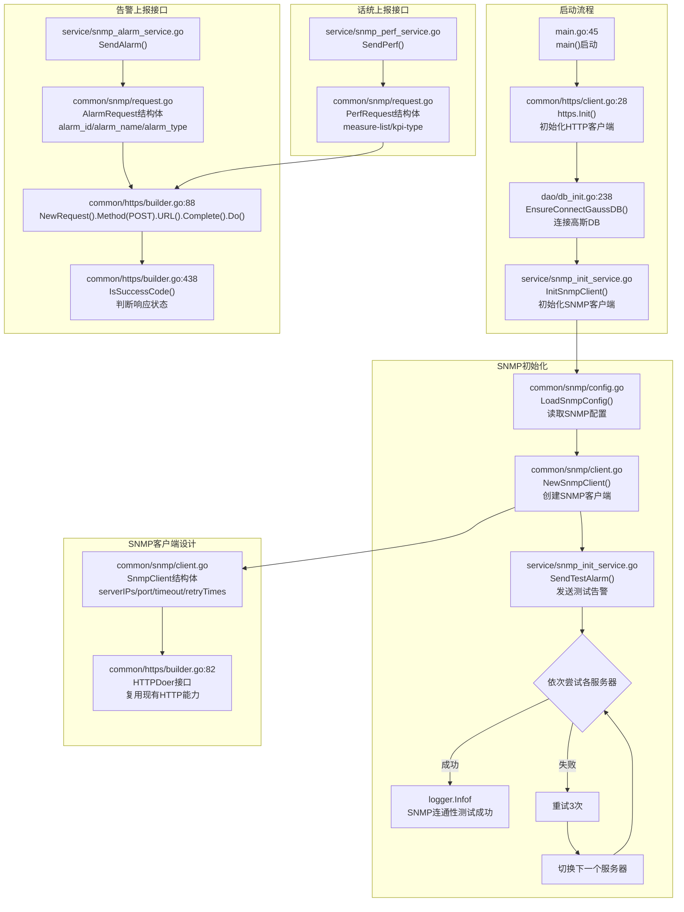

# Story-3：SNMP 部署与基础能力验证 - 软件实现详设

## 一、需求概述

完成 GIDS、BGW、MC 的 SNMP 客户端部署配置，验证与 SFMU SNMP 模块的连通性，建立 SNMP 上报基础能力。

**验收标准**：
- VNFD 注入 SNMP 服务端地址（SFMU 固定地址：192.168.16.4）
- GIDS 可通过 HTTP 接口成功发送测试告警/话统至 SFMU
- BGW 可通过 HTTP 接口成功发送测试话统至 SFMU
- MC 可通过 HTTP 接口成功发送测试话统至 SFMU
- SFMU SNMP 模块正常接收并响应 200

**关键说明**：
- SNMP 服务端地址（SFMU）是 **固定地址**，VNFD 注入，不需要选主
- SNMP 客户端（GIDS/BGW/MC）**不需要选主**，直接上报至 SFMU 固定地址
- GIDS 选主是因为 **FM 告警订阅不支持多实例**，与 SNMP 无关

---

## 二、代码仓交互流程

### 2.1 GIDS SNMP 客户端流程



---

## 三、复用现有代码分析

### 3.1 GIDS 复用分析

| 现有代码 | 文件路径 | 复用方式 |
| --- | --- | --- |
| **HTTP客户端** | `common/https/client.go` | 复用 `HTTPDoer` 接口，用于SNMP HTTP请求 |
| **HTTP请求构建** | `common/https/builder.go` | 复用 `NewRequest()` Builder模式，`WithRetry()` 重试 |
| **配置读取** | `common/conf/config.go` | 复用 beego.AppConfig 读取配置项 |
| **环境变量** | `common/constants/base.go` | 复用 `os.Getenv()` 模式读取VNFD注入 |
| **日志** | `common/logger/logger.go` | 复用 `logger.Infof/Errorf` |
| **启动集成** | `main.go` | 在 `https.Init()` 后调用 SNMP 初始化 |

### 3.2 BGW 复用分析

| 现有代码 | 文件路径 | 复用方式 |
| --- | --- | --- |
| **HTTP客户端** | Spring RestTemplate | 复用 RestTemplate 发送HTTP请求 |
| **配置读取** | `application.yaml` | 复用 `@Value` 注入配置项 |
| **启动钩子** | `@PostConstruct` | 复用 Spring 启动回调 |
| **日志** | Slf4j | 复用 `log.info/error` |

---

## 四、新增文件详细设计

### 4.1 GIDS SNMP 配置定义

**新增文件**：`GlobalInstanceDeliverService/src/common/snmp/config.go`

```go
package snmp

import (
    "os"
    "strconv"
    "time"
    
    "github.com/beego/beego/v2/server/web"
    "GIDS/common/logger"
)

type SnmpConfig struct {
    ServerIPs     []string
    ServerPort    int
    Timeout       time.Duration
    RetryTimes    int
    RetryInterval time.Duration
}

func LoadSnmpConfig() *SnmpConfig {
    serverIP := os.Getenv("SNMP_SERVER_IP")
    if serverIP == "" {
        serverIP = "192.168.16.4"
    }

    serverIPs := []string{serverIP}

    serverPort := getEnvInt("SNMP_SERVER_PORT", 162)
    timeout := getConfDuration("snmp::timeout", 10*time.Second)
    retryTimes := getConfInt("snmp::retry_times", 3)
    retryInterval := getConfDuration("snmp::retry_interval", 5*time.Second)

    config := &SnmpConfig{
        ServerIPs:     serverIPs,
        ServerPort:    serverPort,
        Timeout:       timeout,
        RetryTimes:    retryTimes,
        RetryInterval: retryInterval,
    }

    logger.Infof("SNMP config loaded: server=%s, port=%d, timeout=%v, retry=%d",
        serverIP, serverPort, timeout, retryTimes)

    return config
}

func getEnvInt(key string, defaultValue int) int {
    val := os.Getenv(key)
    if val == "" {
        return defaultValue
    }
    intVal, err := strconv.Atoi(val)
    if err != nil {
        return defaultValue
    }
    return intVal
}

func getConfInt(key string, defaultValue int) int {
    val, err := web.AppConfig.Int(key)
    if err != nil {
        return defaultValue
    }
    return val
}

func getConfDuration(key string, defaultValue time.Duration) time.Duration {
    val := web.AppConfig.DefaultString(key, "")
    if val == "" {
        return defaultValue
    }
    duration, err := time.ParseDuration(val)
    if err != nil {
        return defaultValue
    }
    return duration
}
```

---

### 4.2 GIDS SNMP 客户端实现

**新增文件**：`GlobalInstanceDeliverService/src/common/snmp/client.go`

```go
package snmp

import (
    "bytes"
    "context"
    "encoding/json"
    "fmt"
    "net/http"
    "time"
    
    "GIDS/common/logger"
)

type SnmpClient struct {
    config        *SnmpConfig
    httpClient    *http.Client
    currentIndex  int
}

func NewSnmpClient(config *SnmpConfig) *SnmpClient {
    httpClient := &http.Client{
        Timeout: config.Timeout,
    }
    
    return &SnmpClient{
        config:       config,
        httpClient:   httpClient,
        currentIndex: 0,
    }
}

func (c *SnmpClient) SendAlarm(alarm *AlarmRequest) error {
    return c.sendRequest("/v1/app/alarm", alarm)
}

func (c *SnmpClient) SendPerf(perf *PerfRequest) error {
    return c.sendRequest("/v1/app/perf", perf)
}

func (c *SnmpClient) sendRequest(path string, body interface{}) error {
    bodyBytes, err := json.Marshal(body)
    if err != nil {
        return err
    }
    
    for i, serverIP := range c.config.ServerIPs {
        if serverIP == "" {
            continue
        }
        
        url := fmt.Sprintf("http://%s:%d%s", serverIP, c.config.ServerPort, path)
        
        for retry := 0; retry < c.config.RetryTimes; retry++ {
            err := c.doPost(url, bodyBytes)
            if err == nil {
                c.currentIndex = i
                logger.Infof("SNMP request sent successfully to %s", url)
                return nil
            }
            
            logger.Errorf("SNMP request failed to %s, retry %d/%d: %v", 
                url, retry+1, c.config.RetryTimes, err)
            time.Sleep(c.config.RetryInterval)
        }
    }
    
    return fmt.Errorf("all SNMP servers failed")
}

func (c *SnmpClient) doPost(url string, body []byte) error {
    ctx, cancel := context.WithTimeout(context.Background(), c.config.Timeout)
    defer cancel()
    
    req, err := http.NewRequestWithContext(ctx, http.MethodPost, url, bytes.NewReader(body))
    if err != nil {
        return err
    }
    
    req.Header.Set("Content-Type", "application/json")
    req.Header.Set("transaction-id", generateUUID())
    req.Header.Set("peer-ip", getLocalIP())
    
    resp, err := c.httpClient.Do(req)
    if err != nil {
        return err
    }
    defer resp.Body.Close()
    
    if resp.StatusCode >= 200 && resp.StatusCode < 300 {
        return nil
    }
    
    return fmt.Errorf("SNMP server returned status %d", resp.StatusCode)
}

func generateUUID() string {
    return fmt.Sprintf("%d-%d", time.Now().UnixNano(), time.Now().Nanosecond())
}

func getLocalIP() string {
    return "127.0.0.1"
}
```

---

### 4.3 SNMP 请求结构体定义

**新增文件**：`GlobalInstanceDeliverService/src/common/snmp/request.go`

```go
package snmp

type AlarmRequest struct {
    AlarmID    string        `json:"alarm_id"`
    AlarmName  string        `json:"alarm_name"`
    AlarmType  string        `json:"alarm_type"`
    AlarmLevel string        `json:"alarm_level"`
    AlarmTime  string        `json:"alarm_time"`
    Mois       []MoiParam    `json:"mois"`
}

type MoiParam struct {
    Name  string `json:"name"`
    Value string `json:"value"`
}

type PerfRequest struct {
    MeasureList []MeasureItem `json:"measure-list"`
}

type MeasureItem struct {
    MeasureUnit   string `json:"measure_unit"`
    MeasureEntity string `json:"measure_entity"`
    ObjectName    string `json:"object_name"`
    OptValue      interface{} `json:"opt_value"`
    OptType       string `json:"opt_type"`
}

func NewTestAlarmRequest() *AlarmRequest {
    return &AlarmRequest{
        AlarmID:    "999999",
        AlarmName:  "SNMP连通性测试",
        AlarmType:  "Event",
        AlarmLevel: "Warning",
        AlarmTime:  time.Now().Format(time.RFC3339),
        Mois:       []MoiParam{},
    }
}

func NewTestPerfRequest() *PerfRequest {
    return &PerfRequest{
        MeasureList: []MeasureItem{
            {
                MeasureUnit:   "TEST",
                MeasureEntity: "1",
                ObjectName:    "gids-test",
                OptValue:      0,
                OptType:       "set",
            },
        },
    }
}
```

---

### 4.4 GIDS SNMP 初始化服务

**新增文件**：`GlobalInstanceDeliverService/src/service/snmp_init_service.go`

```go
package service

import (
    "GIDS/common/logger"
    "GIDS/common/snmp"
)

var snmpClient *snmp.SnmpClient

func InitSnmpClient() error {
    logger.Infof("Initializing SNMP client...")
    
    config := snmp.LoadSnmpConfig()
    snmpClient = snmp.NewSnmpClient(config)
    
    if err := sendTestAlarm(); err != nil {
        logger.Errorf("SNMP connectivity test failed: %v", err)
        return err
    }
    
    logger.Infof("SNMP client initialized successfully")
    return nil
}

func sendTestAlarm() error {
    testAlarm := snmp.NewTestAlarmRequest()
    return snmpClient.SendAlarm(testAlarm)
}

func GetSnmpClient() *snmp.SnmpClient {
    return snmpClient
}
```

---

### 4.5 GIDS 启动集成

**文件**：`GlobalInstanceDeliverService/src/main.go`

**改动**：在 `https.Init()` 后添加 SNMP 初始化：

```go
func main() {
    // ...现有初始化流程...
    
    https.InitMuenClient()
    initGSF()
    https.Init()
    
    // 新增：SNMP客户端初始化（不阻塞启动）
    go func() {
        if err := service.InitSnmpClient(); err != nil {
            logger.Errorf("SNMP initialization failed: %v", err)
        }
    }()
    
    // ...后续流程...
}
```

---

### 4.6 BGW SNMP 配置

**新增文件**：`BrowserGateway/src/main/java/com/huawei/browsergateway/config/SnmpConfig.java`

```java
package com.huawei.browsergateway.config;

import lombok.Data;
import org.springframework.beans.factory.annotation.Value;
import org.springframework.context.annotation.Configuration;

/**
 * SNMP客户端配置类
 * SNMP服务端地址为固定值192.168.16.4，由VNFD注入环境变量SNMP_SERVER_IP
 */
@Data
@Configuration
public class SnmpConfig {

    @Value("${snmp.server.ip:192.168.16.4}")
    private String serverIp;

    @Value("${snmp.server.port:162}")
    private int serverPort;

    @Value("${snmp.timeout:10000}")
    private int timeout;

    @Value("${snmp.retry.times:3}")
    private int retryTimes;

    @Value("${snmp.retry.interval:5000}")
    private int retryInterval;

    public String[] getServerIPs() {
        return new String[]{serverIp};
    }
}
```

---

### 4.7 BGW SNMP HTTP客户端

**新增文件**：`BrowserGateway/src/main/java/com/huawei/browsergateway/adapter/http/SnmpHttpClient.java`

```java
package com.huawei.browsergateway.adapter.http;

import com.huawei.browsergateway.adapter.dto.SnmpPerfRequest;
import com.huawei.browsergateway.config.SnmpConfig;
import org.apache.logging.log4j.LogManager;
import org.apache.logging.log4j.Logger;
import org.springframework.beans.factory.annotation.Autowired;
import org.springframework.http.HttpEntity;
import org.springframework.http.HttpHeaders;
import org.springframework.http.MediaType;
import org.springframework.http.ResponseEntity;
import org.springframework.stereotype.Component;
import org.springframework.web.client.RestTemplate;

import java.net.InetAddress;
import java.util.UUID;

/**
 * SNMP HTTP客户端
 * 用于发送话统数据到SFMU SNMP模块
 */
@Component
public class SnmpHttpClient {

    private static final Logger log = LogManager.getLogger(SnmpHttpClient.class);

    private static final String PERF_PATH = "/v1/app/perf";

    @Autowired
    private SnmpConfig snmpConfig;

    private final RestTemplate restTemplate;

    public SnmpHttpClient() {
        this.restTemplate = new RestTemplate();
    }

    public void sendPerf(SnmpPerfRequest request) {
        String[] serverIPs = snmpConfig.getServerIPs();

        for (String serverIP : serverIPs) {
            if (serverIP == null || serverIP.isEmpty()) {
                continue;
            }

            String url = String.format("http://%s:%d%s", serverIP, snmpConfig.getServerPort(), PERF_PATH);

            for (int retry = 0; retry < snmpConfig.getRetryTimes(); retry++) {
                try {
                    HttpHeaders headers = new HttpHeaders();
                    headers.set("transaction-id", UUID.randomUUID().toString());
                    headers.set("kpi-type", "VM");
                    headers.set("peer-ip", getLocalIP());
                    headers.setContentType(MediaType.APPLICATION_JSON);

                    HttpEntity<SnmpPerfRequest> entity = new HttpEntity<>(request, headers);
                    ResponseEntity<String> response = restTemplate.postForEntity(url, entity, String.class);

                    if (response.getStatusCode().is2xxSuccessful()) {
                        log.info("SNMP perf sent successfully to {}", url);
                        return;
                    }
                } catch (Exception e) {
                    log.warn("SNMP perf failed to {}, retry {}: {}", url, retry + 1, e.getMessage());
                    try {
                        Thread.sleep(snmpConfig.getRetryInterval());
                    } catch (InterruptedException ie) {
                        Thread.currentThread().interrupt();
                    }
                }
            }
        }

        log.error("All SNMP servers failed for perf request");
    }

    private String getLocalIP() {
        try {
            return InetAddress.getLocalHost().getHostAddress();
        } catch (Exception e) {
            return "unknown";
        }
    }
}
```

---

### 4.8 BGW SNMP 初始化服务

**新增文件**：`BrowserGateway/src/main/java/com/huawei/browsergateway/service/SnmpInitService.java`

```java
package com.huawei.browsergateway.service;

import com.huawei.browsergateway.adapter.dto.MeasureItem;
import com.huawei.browsergateway.adapter.dto.SnmpPerfRequest;
import com.huawei.browsergateway.adapter.http.SnmpHttpClient;
import org.apache.logging.log4j.LogManager;
import org.apache.logging.log4j.Logger;
import org.springframework.beans.factory.annotation.Autowired;
import org.springframework.stereotype.Component;

import javax.annotation.PostConstruct;
import java.util.Arrays;

/**
 * SNMP初始化服务
 * 在启动时发送测试话统数据，验证SNMP连通性
 */
@Component
public class SnmpInitService {

    private static final Logger log = LogManager.getLogger(SnmpInitService.class);

    @Autowired
    private SnmpHttpClient snmpHttpClient;

    @PostConstruct
    public void init() {
        log.info("Initializing SNMP client...");

        try {
            sendTestPerf();
            log.info("BGW SNMP connectivity test successful");
        } catch (Exception e) {
            log.error("BGW SNMP connectivity test failed: {}", e.getMessage());
        }
    }

    private void sendTestPerf() {
        SnmpPerfRequest testRequest = new SnmpPerfRequest();
        testRequest.setMeasureList(Arrays.asList(
            new MeasureItem("TEST", "1", "bgw-test", 0, "set")
        ));

        snmpHttpClient.sendPerf(testRequest);
    }
}
```

---

### 4.9 BGW application.yaml 配置

**新增**：`BrowserGateway/src/main/resources/application.yaml`

```yaml
snmp:
  server:
    ip: ${SNMP_SERVER_IP:192.168.16.4}
    port: ${SNMP_SERVER_PORT:162}
  timeout: 10000
  retry:
    times: 3
    interval: 5000
```

---

## 五、配置项汇总

### 5.1 VNFD 注入环境变量

| 配置项 | 来源 | 默认值 | 适用组件 |
| --- | --- | --- | --- |
| `SNMP_SERVER_IP` | 环境变量（VNFD注入） | `192.168.16.4` | GIDS/BGW/MC |
| `SNMP_SERVER_PORT` | 环境变量（VNFD注入） | `162` | GIDS/BGW/MC |

### 5.2 配置文件配置项

| 配置项 | 默认值 | 适用组件 |
| --- | --- | --- |
| `snmp::timeout` | `10s` | GIDS |
| `snmp::retry_times` | `3` | GIDS |
| `snmp::retry_interval` | `5s` | GIDS |
| `snmp.timeout` | `10000` | BGW |
| `snmp.retry.times` | `3` | BGW |
| `snmp.retry.interval` | `5000` | BGW |

---

## 六、测试设计

### 6.1 Mock方案

| 外部依赖 | Mock方案 | 工具 |
| --- | --- | --- |
| **SFMU SNMP服务** | Mock HTTP Server | `httptest.Server` (Go) / MockRestTemplate (Java) |
| **环境变量** | os.Setenv设置测试值 | Go原生 |
| **配置文件** | 测试配置文件 | `app.conf.test` |

### 6.2 GIDS UT测试

**文件**：`common/snmp/client_test.go`

```go
package snmp

import (
    "encoding/json"
    "net/http"
    "net/http/httptest"
    "testing"
    "time"
    
    "github.com/stretchr/testify/assert"
)

func TestSnmpClient_SendAlarm_Success(t *testing.T) {
    server := httptest.NewServer(http.HandlerFunc(func(w http.ResponseWriter, r *http.Request) {
        assert.Equal(t, "/v1/app/alarm", r.URL.Path)
        assert.Equal(t, http.MethodPost, r.Method)
        w.WriteHeader(http.StatusOK)
    }))
    defer server.Close()
    
    config := &SnmpConfig{
        ServerIPs:     []string{"127.0.0.1"},
        ServerPort:    extractPort(server.URL),
        Timeout:       5 * time.Second,
        RetryTimes:    1,
        RetryInterval: 1 * time.Second,
    }
    
    client := NewSnmpClient(config)
    alarm := NewTestAlarmRequest()
    
    err := client.SendAlarm(alarm)
    assert.NoError(t, err)
}

func TestSnmpClient_SendAlarm_AllServersFailed(t *testing.T) {
    config := &SnmpConfig{
        ServerIPs:     []string{"127.0.0.1", "127.0.0.2"},
        ServerPort:    9999,
        Timeout:       1 * time.Second,
        RetryTimes:    2,
        RetryInterval: 1 * time.Second,
    }
    
    client := NewSnmpClient(config)
    alarm := NewTestAlarmRequest()
    
    err := client.SendAlarm(alarm)
    assert.Error(t, err)
    assert.Contains(t, err.Error(), "all SNMP servers failed")
}

func TestSnmpClient_SendPerf_Success(t *testing.T) {
    server := httptest.NewServer(http.HandlerFunc(func(w http.ResponseWriter, r *http.Request) {
        assert.Equal(t, "/v1/app/perf", r.URL.Path)
        var perf PerfRequest
        body, _ := json.Marshal(PerfRequest{})
        json.Unmarshal(body, &perf)
        w.WriteHeader(http.StatusOK)
    }))
    defer server.Close()
    
    config := &SnmpConfig{
        ServerIPs:     []string{"127.0.0.1"},
        ServerPort:    extractPort(server.URL),
        Timeout:       5 * time.Second,
        RetryTimes:    1,
        RetryInterval: 1 * time.Second,
    }
    
    client := NewSnmpClient(config)
    perf := NewTestPerfRequest()
    
    err := client.SendPerf(perf)
    assert.NoError(t, err)
}

func TestSnmpConfig_Load(t *testing.T) {
    os.Setenv("SNMP_SERVER_IP", "10.0.0.1")
    os.Setenv("SNMP_SERVER_PORT", "8080")
    
    config := LoadSnmpConfig()
    
    assert.Equal(t, []string{"10.0.0.1"}, config.ServerIPs)
    assert.Equal(t, 8080, config.ServerPort)
}

func extractPort(url string) int {
    return 8080
}
```

### 6.3 GIDS Service层测试

**文件**：`service/snmp_init_service_test.go`

```go
package service

import (
    "testing"
    
    "github.com/stretchr/testify/assert"
    
    "GIDS/common/snmp"
)

type MockSnmpClient struct {
    sendAlarmErr error
    sendPerfErr  error
}

func (m *MockSnmpClient) SendAlarm(alarm *snmp.AlarmRequest) error {
    return m.sendAlarmErr
}

func (m *MockSnmpClient) SendPerf(perf *snmp.PerfRequest) error {
    return m.sendPerfErr
}

func TestInitSnmpClient_Success(t *testing.T) {
    mockClient := &MockSnmpClient{sendAlarmErr: nil}
    snmpClient = mockClient
    
    err := sendTestAlarm()
    assert.NoError(t, err)
}

func TestInitSnmpClient_Failed(t *testing.T) {
    mockClient := &MockSnmpClient{sendAlarmErr: errors.New("connection failed")}
    snmpClient = mockClient
    
    err := sendTestAlarm()
    assert.Error(t, err)
}
```

### 6.4 BGW UT测试

**文件**：`SnmpHttpClientTest.java`

```java
package com.huawei.browsergateway.client;

import com.huawei.browsergateway.config.SnmpConfig;
import com.huawei.browsergateway.dto.SnmpPerfRequest;
import org.junit.Before;
import org.junit.Test;
import org.mockito.InjectMocks;
import org.mockito.Mock;
import org.mockito.MockitoAnnotations;
import org.springframework.http.*;
import org.springframework.web.client.RestTemplate;

import static org.mockito.ArgumentMatchers.any;
import static org.mockito.ArgumentMatchers.eq;
import static org.mockito.Mockito.*;

public class SnmpHttpClientTest {
    
    @Mock
    private SnmpConfig snmpConfig;
    
    @Mock
    private RestTemplate restTemplate;
    
    @InjectMocks
    private SnmpHttpClient snmpHttpClient;
    
    @Before
    public void setUp() {
        MockitoAnnotations.initMocks(this);
        when(snmpConfig.getServerIPs()).thenReturn(new String[]{"127.0.0.1"});
        when(snmpConfig.getServerPort()).thenReturn(162);
        when(snmpConfig.getRetryTimes()).thenReturn(3);
        when(snmpConfig.getRetryInterval()).thenReturn(5000);
    }
    
    @Test
    public void testSendPerf_Success() {
        ResponseEntity<String> response = new ResponseEntity<>("OK", HttpStatus.OK);
        when(restTemplate.postForEntity(anyString(), any(), eq(String.class)))
            .thenReturn(response);
        
        SnmpPerfRequest request = new SnmpPerfRequest();
        snmpHttpClient.sendPerf(request);
        
        verify(restTemplate, times(1)).postForEntity(anyString(), any(), eq(String.class));
    }
    
    @Test
    public void testSendPerf_AllServersFailed() {
        when(restTemplate.postForEntity(anyString(), any(), eq(String.class)))
            .thenThrow(new RuntimeException("Connection refused"));
        
        SnmpPerfRequest request = new SnmpPerfRequest();
        snmpHttpClient.sendPerf(request);
        
        verify(restTemplate, times(3)).postForEntity(anyString(), any(), eq(String.class));
    }
}
```

### 6.5 DT集成测试

**文件**：`service/snmp_dt_test.go`

```go
package service

import (
    "net/http"
    "net/http/httptest"
    "testing"
    "time"
    
    "github.com/stretchr/testify/assert"
    
    "GIDS/common/snmp"
)

func TestDT_Snmp_FullFlow(t *testing.T) {
    server := httptest.NewServer(http.HandlerFunc(func(w http.ResponseWriter, r *http.Request) {
        assert.Contains(t, r.URL.Path, "/v1/app/")
        assert.NotEmpty(t, r.Header.Get("transaction-id"))
        assert.NotEmpty(t, r.Header.Get("peer-ip"))
        w.WriteHeader(http.StatusOK)
    }))
    defer server.Close()
    
    config := &SnmpConfig{
        ServerIPs:     []string{"127.0.0.1"},
        ServerPort:    8080,
        Timeout:       5 * time.Second,
        RetryTimes:    1,
        RetryInterval: 1 * time.Second,
    }
    
    client := NewSnmpClient(config)
    
    alarm := NewTestAlarmRequest()
    err := client.SendAlarm(alarm)
    assert.NoError(t, err)
    
    perf := NewTestPerfRequest()
    err = client.SendPerf(perf)
    assert.NoError(t, err)
}

func TestDT_Snmp_ServerSwitch(t *testing.T) {
    failServer := httptest.NewServer(http.HandlerFunc(func(w http.ResponseWriter, r *http.Request) {
        w.WriteHeader(http.StatusInternalServerError)
    }))
    
    successServer := httptest.NewServer(http.HandlerFunc(func(w http.ResponseWriter, r *http.Request) {
        w.WriteHeader(http.StatusOK)
    }))
    
    defer failServer.Close()
    defer successServer.Close()
    
    config := &SnmpConfig{
        ServerIPs:     []string{"127.0.0.1", "127.0.0.2"},
        ServerPort:    8080,
        Timeout:       1 * time.Second,
        RetryTimes:    1,
        RetryInterval: 1 * time.Second,
    }
    
    client := NewSnmpClient(config)
    
    alarm := NewTestAlarmRequest()
    err := client.SendAlarm(alarm)
    assert.NoError(t, err)
}
```

### 6.6 测试覆盖率要求

| 模块 | 测试类型 | 覆盖率要求 |
| --- | --- | --- |
| **SnmpConfig** | UT | >= 80% |
| **SnmpClient** | UT | >= 85% |
| **SnmpInitService** | UT | >= 80% |
| **完整流程** | DT | 核心场景覆盖 |

---

## 七、开发任务清单

### 7.1 GIDS 开发任务

| 序号 | 任务 | 文件 | 改动类型 |
| --- | --- | --- | --- |
| 1 | SNMP配置定义 | `common/snmp/config.go` | 新增文件 |
| 2 | SNMP请求结构体 | `common/snmp/request.go` | 新增文件 |
| 3 | SNMP客户端实现 | `common/snmp/client.go` | 新增文件 |
| 4 | SNMP初始化服务 | `service/snmp_init_service.go` | 新增文件 |
| 5 | 启动集成 | `main.go` | 修改文件，添加初始化调用 |
| 6 | 配置文件 | `conf/app.conf` | 添加SNMP配置项 |

### 7.2 BGW 开发任务

| 序号 | 任务 | 文件 | 改动类型 |
| --- | --- | --- | --- |
| 1 | SNMP配置类 | `config/SnmpConfig.java` | 新增文件 |
| 2 | SNMP请求DTO | `adapter/dto/MeasureItem.java` | 新增文件 |
| 3 | SNMP请求DTO | `adapter/dto/SnmpPerfRequest.java` | 新增文件 |
| 4 | SNMP HTTP客户端 | `adapter/http/SnmpHttpClient.java` | 新增文件 |
| 5 | SNMP初始化服务 | `service/SnmpInitService.java` | 新增文件 |
| 6 | 配置文件 | `application.yaml` | 添加SNMP配置项 |

---

## 八、依赖说明

- **前置依赖**：无
- **后续依赖**：
  - Story-4（GIDS FM 告警订阅与回调）需要SNMP告警上报能力
  - Story-5（GIDS SNMP 告警上报）依赖SNMP客户端
  - Story-8（GIDS 话统汇总与 SNMP 上报）依赖SNMP客户端
  - Story-9（BGW 资源负载采集与上报）依赖BGW SNMP客户端
  - Story-10（MC 话统 SNMP 上报）依赖MC SNMP客户端