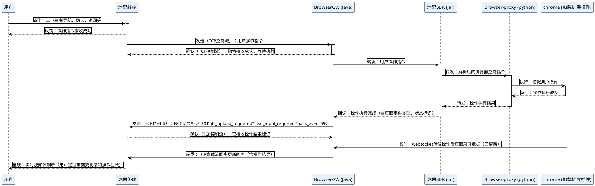

```plantuml
@startuml
skinparam sequenceMessageAlign center
skinparam sequence {
    ArrowColor #000000
    ArrowThickness 2
    ParticipantBorderColor #000000
    ParticipantBackgroundColor #E6F3FF
    ParticipantFontName 微软雅黑
    ParticipantFontSize 14
    ParticipantFontColor #000000
    ActorBorderColor #000000
    ActorBackgroundColor #E6F3FF
    ActorFontName 微软雅黑
    ActorFontSize 14
    ActorFontColor #000000
    MessageBorderColor #000000
    MessageBackgroundColor #FFFFFF
    MessageFontName 微软雅黑
    MessageFontSize 12
    MessageFontColor #000000
    NoteBorderColor #000000
    NoteBackgroundColor #FFFFFF
    NoteFontName 微软雅黑
    NoteFontSize 12
    NoteFontColor #000000
}

participant "用户" as User
participant "沐恩终端" as Terminal
participant "BrowserGW (Java)" as BrowserGW
participant "沐恩SDK (jar)" as SDK
participant "Browser-proxy (python)" as Proxy
participant "chrome (加载扩展插件)" as Chrome

User -> Terminal : 操作：上下左右导航、确认、返回等
activate Terminal
Terminal --> User : 反馈：操作指令接收成功
deactivate Terminal

Terminal -> BrowserGW : 发送（TCP控制流）：用户操作指令
activate BrowserGW
BrowserGW --> Terminal : 确认（TCP控制流）：指令接收成功，等待执行
deactivate BrowserGW

BrowserGW -> SDK : 转发：用户操作指令
activate SDK
SDK -> Proxy : 转发：解析后的浏览器控制指令
activate Proxy
Proxy -> Chrome : 执行：模拟用户操作
activate Chrome
Chrome --> Proxy : 返回：操作执行成功
deactivate Chrome
Proxy --> SDK : 转发：操作执行结果
deactivate Proxy
SDK --> BrowserGW : 回调：操作执行完成（含页面事件类型、状态标识）
deactivate SDK

BrowserGW -> Terminal : 发送（TCP控制流）：操作结果标记（如“file_upload_triggered”“text_input_required”“back_event”等）
activate Terminal
Terminal --> BrowserGW : 确认（TCP控制流）：已接收操作结果标记
deactivate Terminal

Chrome -> BrowserGW : 实时：websocket传输操作后页面录屏数据（已更新）
BrowserGW -> Terminal : 转发：TCP媒体流同步更新画面（含操作结果）
Terminal --> User : 呈现：实时视频流刷新（用户通过画面变化感知操作生效）
deactivate BrowserGW
deactivate Chrome
deactivate Proxy
deactivate SDK
deactivate Terminal

@enduml

```