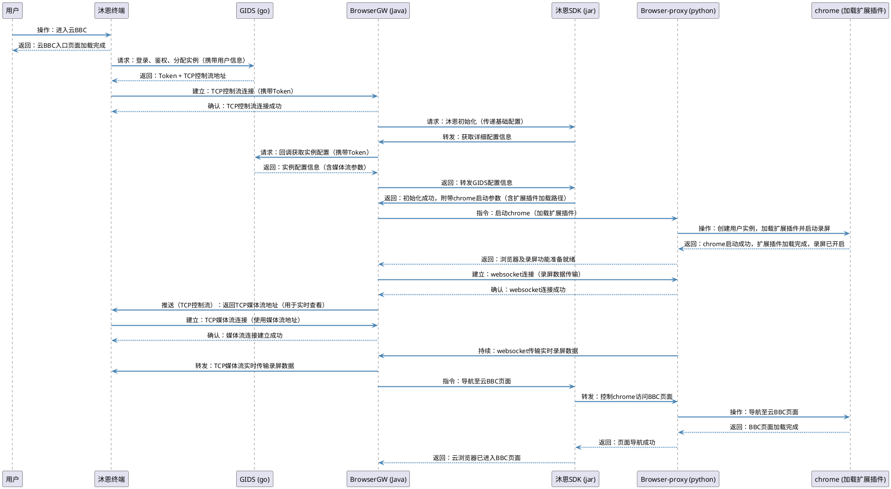

```plantuml
@startuml
skinparam sequenceMessageAlign center
skinparam sequenceNodeColor #F0F8FF
skinparam sequenceArrowColor #4682B4
skinparam sequenceArrowThickness 2
skinparam sequenceNodeBorderColor #4682B4
skinparam sequenceNodeBorderThickness 1
skinparam sequenceNodeBackgroundColor #F0F8FF
skinparam sequenceNodeFontColor #000000
skinparam sequenceNodeFontName Arial
skinparam sequenceNodeFontSize 12

participant "用户" as User
participant "沐恩终端" as Client
participant "GIDS (go)" as GIDS
participant "BrowserGW (Java)" as BrowserGW
participant "沐恩SDK (jar)" as SDK
participant "Browser-proxy (python)" as Proxy
participant "chrome (加载扩展插件)" as Chrome

User -> Client : 操作：进入云BBC
Client --> User : 返回：云BBC入口页面加载完成

Client -> GIDS : 请求：登录、鉴权、分配实例（携带用户信息）
GIDS --> Client : 返回：Token + TCP控制流地址

Client -> BrowserGW : 建立：TCP控制流连接（携带Token）
BrowserGW --> Client : 确认：TCP控制流连接成功

BrowserGW -> SDK : 请求：沐恩初始化（传递基础配置）
SDK -> BrowserGW : 转发：获取详细配置信息

BrowserGW -> GIDS : 请求：回调获取实例配置（携带Token）
GIDS --> BrowserGW : 返回：实例配置信息（含媒体流参数）

BrowserGW -> SDK : 返回：转发GIDS配置信息
SDK -> BrowserGW : 返回：初始化成功，附带chrome启动参数（含扩展插件加载路径）

BrowserGW -> Proxy : 指令：启动chrome（加载扩展插件）
Proxy -> Chrome : 操作：创建用户实例，加载扩展插件并启动录屏
Chrome --> Proxy : 返回：chrome启动成功，扩展插件加载完成，录屏已开启

Proxy --> BrowserGW : 返回：浏览器及录屏功能准备就绪

BrowserGW -> Proxy : 建立：websocket连接（录屏数据传输）
Proxy --> BrowserGW : 确认：websocket连接成功

BrowserGW -> Client : 推送（TCP控制流）：返回TCP媒体流地址（用于实时查看）
Client -> BrowserGW : 建立：TCP媒体流连接（使用媒体流地址）
BrowserGW --> Client : 确认：媒体流连接建立成功

Proxy -> BrowserGW : 持续：websocket传输实时录屏数据
BrowserGW -> Client : 转发：TCP媒体流实时传输录屏数据

BrowserGW -> SDK : 指令：导航至云BBC页面
SDK -> Proxy : 转发：控制chrome访问BBC页面
Proxy -> Chrome : 操作：导航至云BBC页面
Chrome --> Proxy : 返回：BBC页面加载完成
Proxy --> SDK : 返回：页面导航成功
SDK --> BrowserGW : 返回：云浏览器已进入BBC页面

@enduml
```